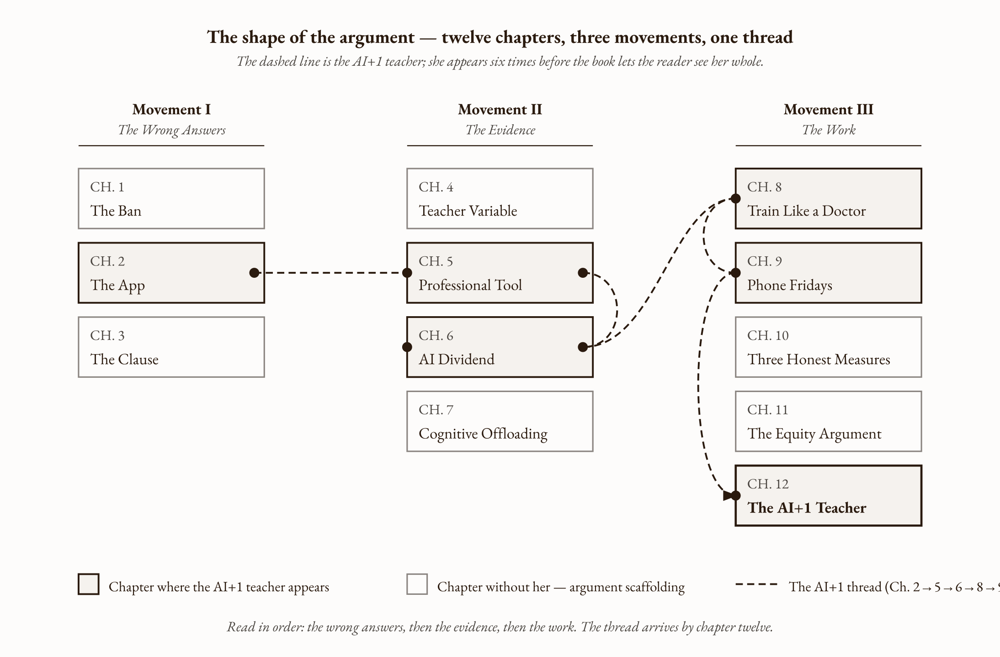

# Introduction

## What This Book Argues, and How You Should Read It

---

<!-- FACT-CHECK FLAG: Multiple problems in this opening paragraph. (1) "Spring of 2024" + "across the United States" conflicts with the back-matter citation to Roschelle et al. 2016 (Maine middle schools, conducted 2012-2014). Either a 2024 follow-up trial needs citation, or the dates/geography need correction. (2) The $46/student figure is CONTRADICTED in precise form (Ch. 2 fact-check) — publicly available cost summaries report "less than $100/student" with no precise WestEd $46 figure surfaced. See factchecks/00-introduction-assertions.md CRITICAL #1. -->

In the spring of 2024, a research team at WestEd ran a randomized controlled trial in middle school mathematics classrooms across the United States. The intervention they tested was not an AI tutor. It was not a frontier platform. It was ASSISTments — a free piece of software, twenty years old, designed by a professor at Worcester Polytechnic Institute and given away to any school that wants it. The students used school-owned devices the schools already had. The total per-student cost of the trial was forty-six dollars, and all of it went to teacher professional development. None to hardware. None to licensing. None to the software.

The teachers in the treatment group received structured training on how to read the data ASSISTments produced about their students' mistakes, how to use those data to plan the next day's lesson, and how to talk with individual students about the specific errors the software had surfaced. The teachers in the control group received the software with no training.

After one academic year, the trained-teacher classrooms produced statistically significant gains on the state mathematics assessment. The untrained-teacher classrooms produced no measurable difference from doing nothing.

The platform was free. The investment was the teacher.

This is the entire book in one trial.

---

This book is about the gap between what we have learned about teachers and technology and what we are still doing about it. The gap is not new. What is new is that the cost of the gap, in the era of generative AI, has become impossible to absorb.

### The argument

A great teacher trained in artificial intelligence will outperform any expensive educational technology platform. This is not a romantic statement. It is the prediction the evidence supports, the prediction the Bastani PNAS finding from June 2025 confirmed in negative form (students using AI without trained-teacher mediation scored seventeen percent below their peers who used no AI at all), and the prediction the Tutor CoPilot Stanford RCT confirmed in positive form (tutors with AI assistance produced gains that were largest for tutors with the least experience — the tool levels the floor by extending the trained human, not by replacing her).

The book argues, against the dominant policy and procurement instincts of the moment, that the variable determining whether educational technology works is teacher training, that the variable we systematically refuse to invest in is teacher training, that the implementation gap which has defined American educational technology for sixty years is the gap between purchased platforms and trained professionals to operate them, and that closing the gap is not a technical problem or a vendor problem but a workforce problem we have consistently chosen not to solve.

You can disagree with this argument. You should be able to specify what evidence would change your mind. Each chapter ends with that specification — what would change my mind, and what I still do not understand.

### Who this book is for

You are a school principal, a district leader, an instructional coach, an education policymaker, a state board member, a foundation program officer, or one of the increasingly rare commentators on American education who still reads books rather than only tweets. You are responsible for decisions that affect how technology will land in classrooms over the next decade. You have noticed that the conversation about those decisions is not equal to the stakes. You suspect, correctly, that something is missing from how the country is currently thinking about phones, apps, AI, and teachers.

This is that policymaker's book. It is also the principal's book, the superintendent's book, and — though it was not written primarily for them — the teacher's book. Teachers will recognize the arguments. They have been making most of them for years. What this book offers teachers is the consolidated research backing for what they already know.

### What this book is

This book is twelve chapters of evidence, structured as an argument. It covers the policy backdrop (the smartphone bans, the educational exemption, the EdTech industry), the research evidence (what predicts learning, what professional training accomplishes, what the AI dividend looks like, what cognitive offloading does to students given AI without scaffolding), and the work that remains (how to train teachers in AI the way medicine trains doctors, how to govern technology through professional discretion rather than statute, how to evaluate teachers honestly, what equity requires, and what the AI-trained classroom looks like when the conditions are met).

The vocabulary the book teaches: *implementation gap*, *cognitive offloading*, *the fluency trap*, *the AI dividend*, *the within-thirty argument*, *the educational exemption*, *the AI+1 teacher*, *the three honest measures*. These are the terms a serious conversation about AI in schools requires. Most of them are not in the current policy vocabulary. They need to be.

### What this book is not

It is not a how-to manual. It does not recommend specific platforms. It does not provide implementation checklists for a specific district. The argument is that those decisions belong to trained professionals in specific contexts, and prescribing them centrally would contradict the book.

It is not a comprehensive review of educational neuroscience. Chapters that touch on neuroscience — particularly Chapter 7 on cognitive offloading — limit their claims to mechanisms with strong empirical support. They do not speculate about brain function beyond what the evidence carries.

It is not about higher education. The arguments transfer in part — the SET research in Chapter 10 is largely university research — but the policy stakes, the equity stakes, the workforce stakes are most acute in K-12. The book stays there.

It is not about AI safety, AI alignment, AI x-risk, or the existential debates. Those debates matter. They are not this book.

### A central concept that runs throughout

Watch for one move the book makes repeatedly, in different chapters and against different opponents. The move is this: every empirical finding that the ban-everything camp wields against educational technology — the PISA correlation, the screen-vs-paper reading inferiority, the handwriting mode effect, the unguided-AI cognitive offloading, the average meta-analytic effect sizes that fall below thresholds — is a finding about what happens when nobody is making the call. The findings are real. The blanket conclusions drawn from them ("ban screens," "ban AI," "ban phones") are wrong because they presume there is no skilled human in the loop to adjust deployment for the classroom and the learner in front of her. The findings are evidence that someone has to be making the call. The book is about who.

I will name this move when it appears. Once you see it, you cannot un-see it, and the entire current debate about AI in schools rearranges itself.

### A running thread

Watch for the *AI+1 teacher* — the figure the book is building across all twelve chapters. She is composite, but she is not invented. The fragments of her exist. She appears as the WestEd ASSISTments teacher in Chapter 2, as the trained Tutor CoPilot tutor in Chapter 5, as the EEF lesson-prep teacher in Chapter 6, as the Finnish DigiErko in Chapter 8, as the Phone Fridays teacher in Chapter 9, and finally as the named subject of Chapter 12. By the end of the book the question is whether she can be built at scale. The book's claim is that the conditions are not mysterious; they are funded coaching cycles, protected planning time, evaluation that sees the work, training that respects the subject and the grade and the room. The argument is for the infrastructure. The argument is for her.

### How this book is organized

The twelve chapters move through three movements.

*Figure 0.1 — The shape of the argument: three movements, twelve chapters, one thread*

**Movement I — The Wrong Answers (Chapters 1–3).** What we did instead of investing in teachers, and why it didn't work.

- **Chapter 1: The Ban.** Why removing the phone was right, what removing the phone alone cannot do, and who pays when we stop there.
- **Chapter 2: The App.** What the EdTech industry got right, what it got wrong, and the finding nobody is advertising.
- **Chapter 3: The Clause That Runs the Country.** Four words in every phone ban law — *except for educational purposes* — and why no one has finished writing them.

**Movement II — The Evidence (Chapters 4–7).** What the research actually shows about teachers, tools, and learning.

- **Chapter 4: The Teacher Variable.** What forty years of education research shows about the one thing that actually predicts whether students learn.
- **Chapter 5: The Professional Tool.** What surgeons, farmers, scientists, and artists can teach us about what happens when trained professionals get the right instruments.
- **Chapter 6: The AI Dividend.** Six weeks per year, and what trained teachers do with the time.
- **Chapter 7: The Cognitive Offloading Problem.** What happens when students get the tool without the teacher.

**Movement III — The Work (Chapters 8–12).** What trusting teachers actually requires.

- **Chapter 8: Train Like a Doctor.** What medicine built for continuous professional development, and how to build it for teaching.
- **Chapter 9: Phone Fridays and the Room the Teacher Runs.** What teacher discretion over technology actually looks like, and the infrastructure that makes it possible.
- **Chapter 10: Three Honest Measures.** Why student satisfaction is not enough, and a framework that could actually work.
- **Chapter 11: The Equity Argument.** Why every problem in this book lands hardest on the students who can least afford it.
- **Chapter 12: The Teacher This Book Is Arguing For.** What the AI+1 classroom looks like, who is responsible for building it, and the work that remains.

### How to read this book

The chapters are designed to be read in order. The arguments compound — the equity chapter (11) reads differently if you have not yet read the AI dividend chapter (6); the capstone (12) is the sum of the eleven that precede it. But each chapter is also written to stand on its own. A district leader who needs to walk into a school board meeting tomorrow on phone policy can read Chapter 1 and Chapter 3 and have what she needs. An assistant superintendent revising the teacher evaluation framework can start at Chapter 10 and work backward.

Every chapter ends with three sections. *What would change my mind* names the specific evidence or argument that would force the chapter's central claim to revise. *Still puzzling* names the open questions the chapter raises but does not resolve. Movement III chapters add a *What this means Monday morning* section — a 500-word, actionable, specific note addressed to a school or district leader who wants to do something with what she just read.

Every contestable factual claim carries an inline link to a primary source. Footnotes and full references are in the back matter. Where a finding is contested in the literature, the chapter says so. Where the evidence does not yet settle a question, the chapter says so.

The book takes about five hours to read end-to-end. The references behind it took eighteen months to read.

### A note about AI

This book was written with the assistance of generative AI tools. Pretending otherwise would be both dishonest and bad pedagogy. What follows is what the use looked like, why I made it, and what it does not change.

I used AI for three things: synthesizing the research literature (more than two thousand peer-reviewed papers, meta-analyses, NBER working papers, and policy reports), drafting the connective tissue between argument moves I had already worked out, and stress-testing the argument against the strongest available counter-positions. I did not use AI to invent claims, to write whole chapters from scratch, or to substitute for the reading. Every contestable factual claim in this book was checked against primary sources by me. Every inline citation was verified by me. Where the AI suggested a framing I judged wrong, I rejected it. Where it surfaced a citation I had missed, I read the underlying paper before deciding whether the citation belonged.

This is the same use pattern the book argues for in classrooms. The AI handles the work it handles well — synthesis, draft generation, organization across volumes of source material, surfacing connections a single reader would miss. The human handles the work only the human can — judgment about what matters, calibration of confidence, decisions about what stays in and what gets cut, responsibility for what is on the page.

This is not the use pattern most students currently default to. Most students default to letting the AI do the thinking. The empirical evidence in Chapter 7 makes clear what happens when they do. The case for the trained teacher is partly the case for the only person in the room who can help the student learn the difference.

The book is also not afraid to argue against AI in the contexts where the evidence is against it. The cognitive offloading findings are real. The equity risks of unguided AI deployment in under-resourced schools are real. The Bastani trial showed a measurable harm. The book does not soft-pedal any of this.

What it argues is that the answer to the documented harms is not the elimination of the tool but the cultivation of the judgment that can use it well. That judgment lives in the trained human. Most often, it lives in the teacher.

### Closing return

<!-- FACT-CHECK FLAG: Both $46/student and $600,000 aggregate require sourcing. $46 × 2,700 students (the Roschelle 2016 Maine sample) ≈ $124K, not $600K. The aggregate implies a roughly 13,000-student implementation. Either the trial is larger than the cited paper, or one of the figures is wrong. See factchecks/00-introduction-assertions.md CRITICAL #1. -->

The WestEd ASSISTments trial cost forty-six dollars per student. Six hundred thousand dollars across the participating districts. A trivial fraction of what the same districts had spent that year on technology that did less. The platform was free. The investment was the teacher.

What the trial demonstrated, in twelve months, with software older than its users, is what this book is asking American education to do at scale. The evidence is in. The methods are known. The cost is knowable. The question is whether we are going to do the work or whether we are going to keep buying software and pretending it is something else.

Let's begin.

---

**Tags:** AI in education, teacher training, EdTech, AI+1, K-12 policy, phone bans, generative AI, professional development, education research, evidence-based policy

---

## References

(Introduction sources verified or flagged in this fact-check. See full fact-check report at `factchecks/00-introduction-assertions.md`.)

1. Roschelle, J., Feng, M., Murphy, R. F., & Mason, C. A. (2016). "Online Mathematics Homework Increases Student Achievement." *AERA Open* 2(4). https://journals.sagepub.com/doi/10.1177/2332858416673968
2. WestEd, "Efficacy of ASSISTments Online Homework Support for Middle School Mathematics Learning." https://www.wested.org/support/efficacy-of-assistments-online-homework-support-for-middle-school-mathematics-learning/
3. The ASSISTments Foundation. https://www.assistments.org
4. Bastani, H., et al. (2025). "Generative AI without guardrails can harm learning." *PNAS* 122(26): e2422633122. https://www.pnas.org/doi/10.1073/pnas.2422633122
5. Wang, R. E., Ribeiro, A. T., Robinson, C. D., Loeb, S., & Demszky, D. (2024). "Tutor CoPilot: A Human-AI Approach for Scaling Real-Time Expertise." arXiv:2410.03017. https://arxiv.org/abs/2410.03017
6. Cuban, L. (1986). *Teachers and Machines: The Classroom Use of Technology Since 1920*. Teachers College Press.

---

## Prompts

Use these prompts with Claude to generate interactive D3 v7 versions of the figures in this chapter. Each produces a standalone HTML file you can open in a browser and modify freely.

**Prerequisites:** Load `brutalist/CLAUDE.md` and `brutalist/DESIGN.md` into your Claude project context before using these prompts. They define the stack, naming conventions, color system, and typography the figures use.

---

### Figure 0.1 — The shape of the argument

Build a single-figure book map in D3 v7 that lays out the book's twelve chapters in three vertical columns labelled Movement I (The Wrong Answers, Ch. 1–3), Movement II (The Evidence, Ch. 4–7), and Movement III (The Work, Ch. 8–12). Each chapter is a card with chapter number, chapter title, and a one-sentence blurb available on hover. Highlight chapters 2, 5, 6, 8, 9, and 12 as "on the AI+1 teacher thread" with a heavier border; render chapter 12 as the capstone with the heaviest border and bold title. Draw a dashed connector line through those six chapters in the order 2 → 5 → 6 → 8 → 9 → 12, with a small dot at each connection point. Include a legend below the cards distinguishing thread chapters, scaffolding chapters, and the thread line itself. Cards are keyboard-focusable; tooltip on hover and focus shows the blurb. Standalone HTML, D3 v7 from the pinned CDN, inline CSS/JS, accessible markup (role, title, desc, aria-label), responsive via ResizeObserver, dark-mode aware, prefers-reduced-motion respected.

> Reference implementation: `d3/00-introduction-fig-01.html`
