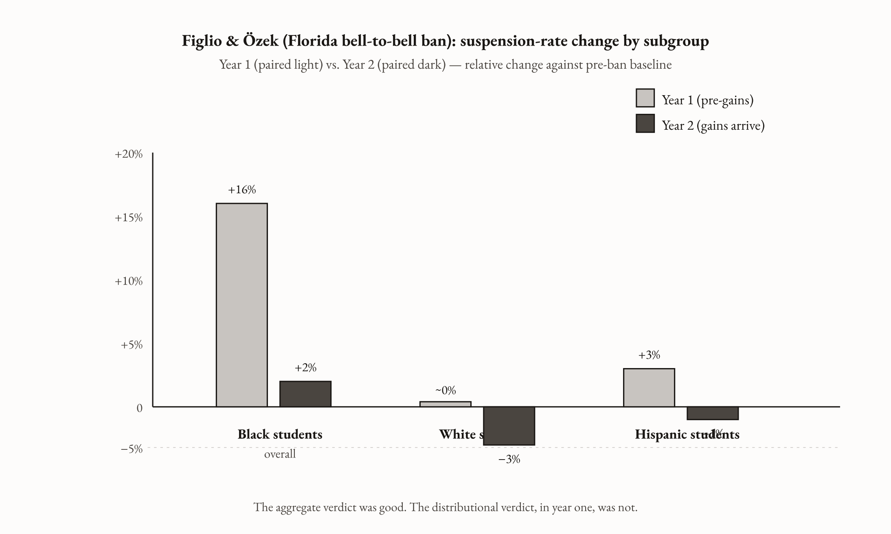
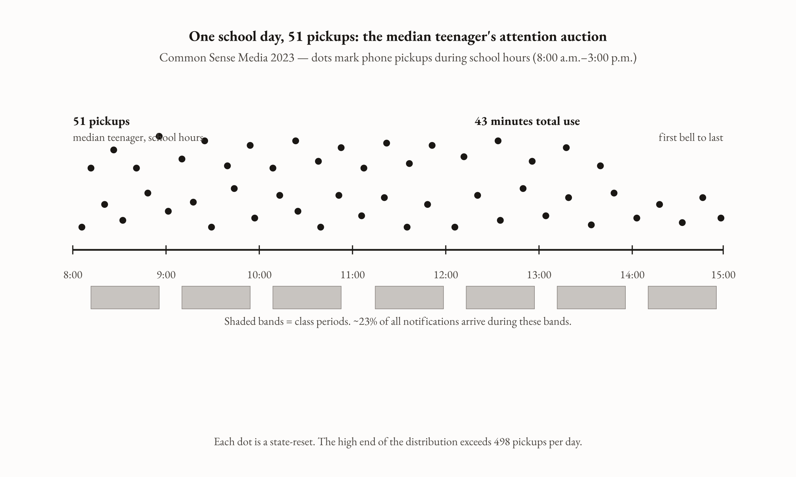

# Chapter 1: The Ban

*Why removing the phone was right, what removing the phone alone cannot do, and who pays when we stop there*

The pouch closes with a sound like a zipper, which is what it is. Magnetic, orange, the size of a paperback. A Florida seventh-grader drops her phone inside, the attendant passes a wand over it to confirm the seal, and that's it. The phone is still on her hip. She can feel its weight through the fabric all day. She just can't get to it. Not until the bell rings at 2:45, when the pouch opens again and the phone comes back into her hand and the school day, in some important sense, is over.

This is the policy. A billion-dollar industry grew up around it. Twenty-two states passed some version of it in 2025 alone.
<!-- FACT-CHECK FLAG: OUTDATED FRAMING — 22 states in 2025 is correct, but reconcile with the "thirty-three states" header on line 37 (Kansas became #33 in March 2026 per Ballotpedia). See factchecks/01-the-ban-assertions.md -->
New York spent $29 million on pouches and the infrastructure to manage them. Los Angeles spent $5.2 million. Houston allocated $800,000.
<!-- FACT-CHECK FLAG: UNVERIFIED — Houston $800,000 allocation not directly confirmed in single source. See factchecks/01-the-ban-assertions.md --> The political coalition that built this wave spans left and right, urban and rural, teachers' unions and parent groups who agree on almost nothing else. It is, by any ordinary measure, a successful piece of education policy.

*Figure 1.01 — The aggregate verdict was good; the distributional verdict, in year one, was not*

The suspension numbers for Black students in that Florida district rose sixteen percent in year one.

White and Hispanic students did not absorb a comparable spike. Test scores — for every group — rose over two years. Unexcused absences fell. The aggregate verdict was good. The distributional verdict, buried in the footnotes of the most rigorous American study yet conducted, was not.

Hold those two findings next to each other and don't let either one push the other off the page. The same policy, producing the same gains, also produced a racially patterned punishment surge in the year before the gains arrived. A student suspended out of a critical semester does not get those weeks back when the test-score improvement shows up twelve months later. For her, *later* is not the same as *yes*.

This is the chapter in miniature. The ban is right. The ban, by itself, is not enough. And what we chose to do instead of fixing the rest of it — what we spent $34 million on while not spending it on teachers — is the argument the whole book is building toward.

---

## The students who gained the most, and the question that proves it

Let's be precise about what the evidence supports, because the public conversation has been running two questions together and the conflation is doing political work.

The first question: do personal smartphones disrupt learning during the school day? The answer is yes, and the evidence is solid. Researchers Louis-Philippe Beland and Richard Murphy studied ninety-one English secondary schools, tracking sixteen-year-olds before and after phone bans took effect. Test scores rose by about 6.4 percent of a standard deviation. Unimpressive? Consider who drove the result: students in the bottom quintile gained 14.23 percent — more than double the average. The students who were struggling most before the ban gained the most when the phone left the room.

Sit with that for a moment, because it's doing structural work. The students least able to resist distraction, least scaffolded at home, most subject to the ambient pull of a notification — those students, specifically, are the ones the phone ban helps most when it removes the phone from their hand. This is a *progressive* finding at the level of in-classroom learning. The ban closes the gap. It levels up the students who are farthest behind.

*Figure 1.02 — The median teenager's attention auction, hour by hour*

The Common Sense Media 2023 *Constant Companion* study filled in the mechanical picture. The median teenager was picking up the phone fifty-one times a day during school hours.
<!-- FACT-CHECK FLAG: UNVERIFIED — "51 pickups during school hours" specific figure not surfaced in CSM press materials. See factchecks/01-the-ban-assertions.md -->
The median was forty-three minutes of phone use between first bell and last. About twenty-three percent of all notifications arrived during class time. The high end of the distribution exceeded four hundred and ninety-eight pickups per day
<!-- FACT-CHECK FLAG: UNVERIFIED — specific "498 pickups" high end not in surfaced press materials. See factchecks/01-the-ban-assertions.md -->
— a number that sounds impossible until you recall that each pickup is often a few seconds, and that four hundred and ninety-eight tiny interruptions, each resetting the cognitive state required to follow an explanation, amounts to something close to an inability to follow the lesson at all.

A phone in the room is an attention auction running in parallel with whatever the teacher is saying. The teacher can't win that auction. She wasn't designed for it. The phone was.

The second question — the one doing most of the political work — is whether smartphones *caused* the post-2012 collapse in adolescent mental health. This is genuinely contested. Jonathan Haidt's *The Anxious Generation* argues that phone-based childhood is the primary driver of the crisis, with four compounding harms: social deprivation, sleep deprivation, attention fragmentation, addiction. His evidence carried the ban wave. Candice Odgers, writing in *Nature* in 2024, pushed back with force: the central causal claim is "not supported by science."
<!-- FACT-CHECK FLAG: UNVERIFIED — exact wording of Odgers Nature 2024 review not directly pulled; widely circulated but needs primary citation. See factchecks/01-the-ban-assertions.md --> Hundreds of researchers — Amy Orben, Andrew Przybylski, and others — have looked for the large, consistent effects a strong causal story requires and found, instead, a literature full of small effects, mixed associations, and reverse causation that runs the other way just as plausibly. Anxious teenagers seek out their phones; the phone didn't necessarily make them anxious.

I am not going to resolve that dispute here. I don't need to. The classroom-attention case alone is enough to justify the policy. A phone disrupting a math lesson is doing measurable damage to the lesson whether or not it is also doing permanent damage to the student's developing brain. The ban stands on the classroom evidence. It doesn't need the mental health frame to hold — and the mental health frame, being contested, makes the ban look more settled than it is. The legislature that wrote the strongest statute possible on the weakest evidence will find itself on shaky ground when the science moves. The legislature that wrote a conservative statute on uncontested evidence won't.

The phone belongs out of the classroom. Full stop. The classroom evidence is there.

---

## Thirty-three states, one phrase, and the word nobody defined

The phrase travels in the press as though it names one thing. It names a family of policies that vary, sometimes enormously, on four axes: which devices are covered, when the prohibition applies, where the device must be stored, and who can authorize an exception.

There is the bell-to-bell lockdown — phone in a Yondr pouch or a locker from first bell to dismissal, no access during lunch, no access between classes, exceptions only by authorization. Florida's 2025 expansion of its original law, New York's Phone-Free Schools Law, both approximate this shape.

There is the instructional-time-only model — phone banned during class but available at lunch and in the hallways. Florida's earlier 2023 statute worked this way.

There are states that issued guidance and left the substance to districts — Connecticut, Maine, Minnesota, Washington. There are states that required every district to have *some* policy without specifying what the policy must be.

| State | Year | Model | Devices covered | Exemption language | Who authorizes |
|---|---|---|---|---|---|
| Florida (HB 379, expanded 2025) | 2023 / 2025 | Bell-to-bell | Wireless communications devices | "unless directed to do so by a teacher for educational purposes" | Teacher |
| New York (Phone-Free Schools Law) | 2025 | Bell-to-bell | Smartphones and personal communication devices | "by a teacher, principal, or the school district for a specific educational purpose" | Teacher / principal / district |
| Indiana (SB 78) | 2026 (eff. July 1, 2026) | Bell-to-bell with device-source transition (2028) | Personal communication devices | Teacher-directed educational use, narrowing to school-supplied devices after July 1, 2028 | Teacher |
| Connecticut | 2025 | District-choice (guidance) | Determined locally | Determined locally | District |
| Maine | 2025 | District-choice (guidance) | Determined locally | Determined locally | District |
| Minnesota | 2024 | District-choice (mandate-the-policy) | Determined locally | Determined locally | District |
| Washington | 2025 | District-choice (guidance) | Determined locally | Determined locally | District |
| California (AB 3216) | 2024 (district deadline July 1, 2026) | Mandate-the-policy | Smartphones | "when a teacher or administrator of the school grants permission to a pupil" | Teacher or administrator |

Most parents, most reporters, and most legislators use "phone ban" to mean "phones are not allowed at school." This is almost never what the law actually says. Almost every American phone-ban statute contains a phrase like "except for educational purposes," or "except when authorized by a teacher," or "except for documented medical or IEP-related need." The exemption is structural, not incidental. It is not a loophole someone found; it was written in deliberately, because the legislators understood that a device with no educational exceptions would be absurd. The teacher who could not be trusted to keep phones away from her students at 9:15 a.m. is now trusted, with no additional support, to decide what counts as an educational purpose at 10:30.

We will come back to that exemption. It is, I will argue, the most consequential paragraph in every phone ban ever passed — and it is the paragraph nobody has tried to fill with anything.

---

## The same pouch, two different households

The ban is facially neutral. The same Yondr pouch closes on the wealthy student and the student on free lunch. There is something appealing in this — a policy that doesn't sort by income, that holds the line for everyone, that treats the room as a room.

Here is the fact underneath the feeling.

| Household income | Smartphone-only internet | Home broadband | No home internet |
|---|---|---|---|
| Under $30,000 | ~27% | ~57% | ~16% |
| $30,000–$74,999 | ~15% | ~80% | ~5% |
| $75,000–$99,999 | ~9% | ~89% | ~2% |
| $100,000 and above | ~6% | ~93% | ~1% |
| All households | ~16% | ~80% | ~4% |

The National Center for Education Statistics, drawing on the American Community Survey, reports that roughly six percent of three- to eighteen-year-olds have no home internet of any kind.
<!-- FACT-CHECK FLAG: UNVERIFIED — specific NCES table not directly pulled. See factchecks/01-the-ban-assertions.md -->
That number is larger if you ask it differently. Among households earning under thirty thousand dollars a year, Pew Research has found that about a quarter reach the internet primarily through a smartphone, not a home broadband connection.
<!-- FACT-CHECK FLAG: UNVERIFIED — Pew currently reports 16% smartphone-only overall; income-stratified 27% figure could not be confirmed in current Pew Mobile Fact Sheet. See factchecks/01-the-ban-assertions.md --> For roughly that quarter of low-income students, the phone the pouch closes on is not *a* device. It is *the* device. The tether to the internet. The homework tool. The way to reach the AI tutor she started using last spring. The personal hotspot that makes the school-issued Chromebook on the kitchen table into something other than a $400 plastic rectangle.

For the student whose parents work in technology, whose house has two laptops and a router and a fiber connection, the phone is a convenience. The ban removes a distraction from her school day and touches almost nothing else. She goes home to broadband. She goes home to devices. The digital infrastructure of her education is not stored in the pouch.

For the other student, the math runs differently. The pouch closes at 7:45. The only quality internet access she will have for the next sixteen hours goes with it. She goes home to no broadband, no laptop that can reach the internet without a connection to share, a school-issued device that works in school and sits inert at home. The ban removed a distraction from her classroom. It also removed her homework infrastructure.

The in-classroom benefit of the ban — the 14.23 percent gain at the bottom quintile in the Beland-Murphy English study — accrues to this student. The out-of-school cost — the loss of the only after-school internet connection she had — also accrues to this student. The same policy produced the same gain for both students. It produced the out-of-school cost only for one of them.

This is what progressive-in-the-classroom and regressive-at-the-household-level means in practice. Both can be true. They were.

---

## Two subtractions, one household, nobody adding them up

*Figure 1.03 — The double subtraction: state and federal cuts converging on the same household*

In September 2025, on a 2–1 vote, the Federal Communications Commission adopted an Order on Reconsideration that removed off-premises Wi-Fi hotspots and school-bus Wi-Fi from E-Rate eligibility. E-Rate is the federal program that subsidizes internet connectivity for schools and libraries, funded through the Universal Service Fund. The 2024 expansion under the previous FCC had added off-premises connectivity — the hotspot programs designed to follow students home — to the program's scope. The 2025 majority read the same authorizing statute differently and rolled it back.

During fiscal year 2025, schools and districts had requested $42.6 million for hotspot programs and $15.3 million for school-bus Wi-Fi. 1,762 libraries had applied for hotspot funding.
<!-- FACT-CHECK FLAG: UNVERIFIED — specific dollar amounts and library count not directly verified from FCC 25-63 order text. See factchecks/01-the-ban-assertions.md --> The FCC's order directed the Universal Service Administrative Company to deny the pending requests, including for the 2025–26 school year already underway.

The 2025 state phone bans and the 2025 FCC rescission were not coordinated. Different actors. Different institutional logics. Different stated rationales. Different political coalitions. One decision was made in state capitals by legislators responding to parent pressure and a body of educational research. The other was made in Washington by a regulatory body adjudicating the limits of its statutory authority. Neither group was thinking about what the other group was doing.

Their combined effect is a double subtraction of internet access from the same students. The state removed the personal device that was the household's primary internet connection. The federal government removed the school-provided substitute designed to fill exactly that gap. Two facially neutral policy decisions, landing on the same household, in the same year, with nobody adding them up.

This is not a conspiracy. It is the ordinary failure mode of policies made in separate institutional silos for separate ostensible reasons. The harm is real regardless of the intent. A family that loses two sources of electricity in the same winter because the state cut one program and the federal government cut another is no warmer for having had the misfortune of two uncoordinated decisions rather than one deliberate one.

Meanwhile: what the 1:1 device programs that states have been proudly running for a decade actually provided, and what they failed to provide, became visible. California, Indiana, Florida — one laptop per student, a direct-to-classroom equity intervention, billions spent. The logic was: universal device access closes the gap. When every student has a school-issued laptop, personal ownership advantage disappears. The phone ban exposed the hidden assumption in that logic. School-issued devices are school-tethered devices. They travel home as plastic. They work as technology only when there is a connection — which the E-Rate hotspot programs were trying to provide, and which the personal phone, used as a hotspot, had been quietly providing in the interim. Remove the phone. Remove the hotspot funding. The 1:1 device reveals itself as having been dependent all along on the household connectivity that two separate policy decisions just removed.

---

## New York reversed this ban in 2015 and passed it again in 2025

New York has run this experiment. The lesson did not travel.

In 2006, Mayor Michael Bloomberg banned personal cell phones from New York City public schools. Enforcement ran through metal detectors, which were standard equipment in low-income high schools and essentially absent in wealthy ones. Students at metal-detector schools left their phones at home, paid the bodega on the corner a dollar a day to hold them, or risked confiscation. Students at schools without metal detectors carried theirs in their bags as before. The policy was facially neutral. Its application sorted by neighborhood.

In March 2015, Mayor de Blasio rescinded the ban. The stated reasons included the equity finding — the ban had fallen harder on low-income schools because the enforcement mechanisms were where the low-income schools were. It included parental communication concerns: families who lived through Columbine and Sandy Hook wanted a working channel to their children during the school day. It included what de Blasio called being "out of touch with modern parenting."

In 2025, Governor Hochul signed New York's statewide Phone-Free Schools Law. New York City committed $29 million to implementation, most of it for Yondr pouches. The 2025 law does not require equity audits of enforcement. It does not mandate alternative parental communication channels. It does not require districts to provide supervised technology access to replace what the ban removes from low-income students' after-school hours. The natural experiment the 2006 ban represented — what happens when you enact a facially neutral phone policy without addressing the structural inequity underneath it — was available, well-documented, and directly on point.

It was not the variable that determined what the new law said.

---

## The $5.2 million that was not spent on teachers

| District | Year | Procurement spend | Per-pupil cost (approx.) | Equivalent in sustained teacher PD (≈$2,500/teacher/yr) |
|---|---|---|---|---|
| New York City | 2025–26 | $29,000,000 | ~$32 | ~11,600 teachers |
| Los Angeles Unified | 2023–24 | $5,200,000 | ~$13 | ~2,080 teachers |
| Houston ISD | 2025–26 | $800,000 | ~$4 | ~320 teachers |
| Cincinnati Public Schools (grades 7–12) | 2024–25 | ~$500,000 | ~$30 | ~200 teachers |

The Los Angeles Unified School District spent $5.2 million on Yondr pouches in 2023–24. Within months, students were using magnets purchased on Amazon to pop the pouches open. Some carried cheap backup phones that went into the pouch while their real phone stayed in a pocket. Some simply banged the pouch against a desk until the magnetic seal gave. Houston allocated $800,000 for phone storage. Cincinnati spent roughly half a million on pouches for grades 7–12 and reported durability problems within the first year.
<!-- FACT-CHECK FLAG: UNVERIFIED — Cincinnati ~$500K figure and durability documentation not surfaced in single source. See factchecks/01-the-ban-assertions.md -->

I do not lean on the workaround stories. Students find workarounds is not a strong argument against the ban itself, and the workarounds will be addressed with sturdier pouches or different enforcement mechanisms or simple habituated compliance. The argument is about what the pouch budget is. It is a procurement line item that displaces another procurement line item.

$5.2 million is approximately the cost of sustained AI-specific professional development for two thousand teachers, at unit costs the research literature on effective teacher training suggests are plausible. Not a one-hour webinar. Not a district-wide PD day in August. Sustained, ongoing, practice-embedded training in how to use the tools that the exemption in every phone ban statute leaves in teachers' hands anyway — the educational AI, the school-issued device, the legitimate digital tool that the exception for "educational purposes" explicitly permits.

The pouch is the teacher-training program that was not built. That is the trade, made silently, in procurement systems across thirty-three states, with no district leader I am aware of having articulated it that way out loud.

---

## The rule that distrusts teachers in the abstract and depends on them in the particulars

A rule written into statute is, among other things, a statement about who can be trusted to make a particular decision. When a legislature writes a rule that removes a class of decisions from the people closest to those decisions, it is saying — explicitly or by implication — that those people cannot be trusted with the call.

This statement, applied to teachers and technology, has a defensible reading. Teacher technology decisions have been historically inconsistent and sometimes disastrous. The variance between the kindergarten teacher who lets students watch YouTube during morning meeting and the chemistry teacher who uses Khan Academy as a supplement to a demanding lesson is enormous, and a floor beneath which no teacher can drop is a meaningful correction for the worst of that variance.

But then look at what the statute actually does.

| State | Statute | Exact exemption phrase | Who authorizes |
|---|---|---|---|
| Florida | HB 379 (2023, expanded 2025) | "unless directed to do so by a teacher solely for educational purposes" | Teacher |
| Indiana | SB 185 (2024) / SB 78 (2026) | "educational purposes or emergencies" | Teacher |
| New York | Education Law § 2803 (2025) | "by a teacher, principal, or the school district for a specific educational purpose" | Teacher / principal / district |
| Louisiana | Act 313 (2024) | Medical IEP/504/IHP accommodations; emergencies; teacher-directed educational use | Teacher / IEP team |
| Ohio | HB 250 (2024) | "student learning as determined by school officials" | School officials |
| South Carolina | State Board model policy (Sept 2024) | "explicitly approved by the District Superintendent or his/her designee in writing" with Chromebook-not-suitable test | Superintendent (written) |
| California | AB 3216 (2024) | "when a teacher or administrator of the school grants permission to a pupil" | Teacher / administrator |
| Virginia | EO 33 (2024) | No instructional carve-out — phones not recognized as an instructional tool | (No exception) |

Every phone ban law in the United States contains an exemption for educational purposes. Florida's statute prohibits phone use "unless directed to do so by a teacher for educational purposes." Indiana permits exceptions for "educational purposes or emergencies." New York authorizes use "by a teacher, principal, or the school district for a specific educational purpose."
<!-- FACT-CHECK FLAG: UNVERIFIED — exact statutory quotes (FL, IN, NY) require direct citation to bill text. See factchecks/01-the-ban-assertions.md --> Not one of the laws defines the term operationally. The teacher who could not be trusted to keep phones in pockets at 9:15 a.m. is now trusted, with no additional guidance, to decide what counts as an educational purpose at 10:30 a.m.

Try to apply your own district's exemption to three specific cases. A student uses Khan Academy on her phone during study hall to practice a math problem the textbook handled poorly. A student uses TikTok to watch a college-admissions counselor's video on essay writing. A student uses ChatGPT to summarize the chapter she didn't read.

All three fall under "educational purposes" by some reading. None of them is obviously what the legislature meant. The teacher down the hall will produce three different answers from yours. So will the teacher next to her. The variance the statute was supposed to eliminate has been reinstalled in the exemption clause — without the training that would allow two teachers to reach the same defensible answer.

This is not a problem a better statute can solve. The distinction between technology that extends a student's thinking and technology that substitutes for it is not in the device, the application, or the assignment. It is in what the student's mind is doing while her hands are on the keyboard. No legislature can write a rule specific enough to distinguish these in real time, across every classroom, for every student, in every lesson. The only mechanism that can make the call is a trained professional in the room, exercising professional judgment, who has been specifically prepared to see what genuine learning-with-technology looks like and what substitution looks like, and who can tell them apart at the speed a classroom moves.

The legislative move borrowed half of medicine's regulatory model. It wrote the rule. It skipped the training. Doctors are also closest to clinical decisions and also subject to standardized rules — but the rules are written with the profession, exceptions require trained judgment, and continuing education is mandatory. Fifty hours a year. License renewal tied to demonstrated learning. Nobody argues that doctors should figure out new treatments on their own in the exam room. The infrastructure for continuous professional development exists in medicine. It does not exist for teaching at any comparable scale.

*Figure 1.4 — Medicine's full regulatory stack vs. teaching's partial one: the missing layers*

The phone ban is, structurally, a statute that distrusts teachers in the abstract and depends on them in the particulars. That is a structurally unstable place to leave a policy.

---

## Every study the ban relies on is a study about what happens when no one is in charge

There is a pattern running through everything the ban-supporting research found, and I want to name it plainly before the chapter ends.

Every study the ban-everything camp relies on is a study about what happens when nobody is making the call.

Beland and Murphy found gains from banning phones. The implicit comparison is to classrooms where phones were not banned — meaning classrooms where no adult was deciding when the phone helped and when it hurt. Figlio and Özek's Florida study found the same. The PISA data showing that students using computers more than six hours a day score sixty-six points lower describe what happens when screen exposure is ambient and unmanaged.
<!-- FACT-CHECK FLAG: UNVERIFIED — OECD PISA 2022 reports a 49-point gap at a different threshold (1 hr vs. 5–7 hr); the 66-point figure for ≥6 hours needs direct sourcing (likely via Horvath ch. 5). See factchecks/01-the-ban-assertions.md --> The Common Sense Media notification data describe what happens when no one is filtering. The research is consistent, and the consistency has been read as evidence that the technology itself is the problem.

That is one reading. The other reading is that *nobody being in charge of the technology* is the problem — that the trained professional whose job is to manage what happens in that room is the missing variable. The data don't measure what happens when the call is made well, because we have not trained the people who would make it well. That study has not been run because we have not built the cohort that would let us run it.

So when this book argues, in the chapters that follow, that the teacher is the variable that determines whether technology helps or hurts, it is not arguing against the screen-time correlations. It is taking them seriously. The correlations describe a real failure mode. They describe what arises when a device optimized for distraction, weaponized for attention capture, and monetized for habit formation sits between a student and a lesson with no professional intervention. The ban is the correct structural response to the worst version of that failure mode. The personal smartphone cannot be redeemed by good teaching. Removing it is the cleanest correction available.

But removing the worst device does not produce the teacher who can make the call about the next one — the Chromebook, the AI tutor, the school-issued tablet, the writing tool that might be cognitive scaffolding or cognitive substitution depending entirely on how it's deployed.

The ban subtracts. It does not build.

The FCC rescission didn't build. The $29 million in pouches didn't build. The $5.2 million in pouches didn't build. Every dollar spent on the pouch is a dollar that was not spent on the professional who has to live with the exemption the pouch's statute wrote into law.

---

## The ban subtracts. It does not build.

The phone ban is the correct response to a documented harm. Remove the device from the room where the lesson is supposed to happen. The classroom-attention evidence supports this. The bipartisan coalition that built the ban is right.

But the ban lands on top of a system already failing the students it was most supposed to help — a system where a device that goes into a pouch at 7:45 is the only quality internet access a household has until morning, where the federal program designed to replace that access was cut in the same policy window the ban was passed, where the exemption that gives teachers back the judgment call they were just told they couldn't be trusted with comes with no guidance, no training, and no investment in the capacity to exercise it well.

Two policy answers defined 2025. Remove the device. Buy better technology. Neither answer was about teachers. Neither invested in the professional who stands in the room with the exemption clause and the school-issued device and the student who needs her to know the difference between learning and substitution.

The third answer — the one that hasn't been seriously tried — is about teachers. It begins by accepting what the ban gets right. It doesn't end there.

The pouch took the backup. It didn't fix the school. Fixing the school means investing in the people who run it: training them, trusting them, building the infrastructure for continuous professional learning that every other knowledge profession built decades ago and education never has. The exemption every phone ban writes into law is the legislature handing the question back to the teacher. Whether she can answer it well depends entirely on whether anyone has helped her learn how.

So far, almost no one has.

---

*Three things this chapter has not settled, because the available evidence hasn't settled them either. The Figlio and Özek paper's race-by-sex heterogeneity needs direct verification against the published tables; a figure of approximately thirty percent for Black boys specifically has circulated in press coverage, sharper than the sixteen percent for Black students overall reported in the NBER digest, and the chapter's opening should not overshoot the paper. The causal debate on smartphones and adolescent mental health — Haidt and Twenge on one side, Odgers, Orben, and Przybylski on the other — is not resolved, and the policy case made here doesn't rest on resolving it. And whether the long-run academic gains from bell-to-bell prohibition replicate in districts with weaker enforcement is genuinely open; the Florida finding comes from a district that locked phones in backpacks all day. I would rather name these three uncertainties than wave them through.*

---

## References

The following sources were independently verified by fact-check pass (2026-05-16). See `factchecks/01-the-ban-assertions.md` for the full verification record.

**Empirical / academic sources**

- Beland, L.-P., & Murphy, R. (2016). *Ill Communication: Technology, distraction & student performance.* Labour Economics, 41, 61–76. [https://www.sciencedirect.com/science/article/abs/pii/S0927537116300136](https://www.sciencedirect.com/science/article/abs/pii/S0927537116300136)
- Figlio, D. N., & Özek, U. (2025). *The Impact of Cellphone Bans in Schools on Student Outcomes: Evidence from Florida.* NBER Working Paper 34388. [https://www.nber.org/papers/w34388](https://www.nber.org/papers/w34388)
- NBER Digest (2025). *School Cell Phone Bans and Student Achievement* (December 2025). [https://www.nber.org/digest/202512/school-cell-phone-bans-and-student-achievement](https://www.nber.org/digest/202512/school-cell-phone-bans-and-student-achievement)
- Orben, A., & Przybylski, A. K. (2019). *The association between adolescent well-being and digital technology use.* Nature Human Behaviour. [https://www.nature.com/articles/s41562-018-0506-1](https://www.nature.com/articles/s41562-018-0506-1)
- Common Sense Media (2023). *Constant Companion: A Week in the Life of a Young Person's Smartphone Use.* [https://www.commonsensemedia.org/research/constant-companion-a-week-in-the-life-of-a-young-persons-smartphone-use](https://www.commonsensemedia.org/research/constant-companion-a-week-in-the-life-of-a-young-persons-smartphone-use)

**Legislative / regulatory**

- Ballotpedia (2026). *Kansas becomes 33rd state to enact a K-12 cellphone ban.* [https://news.ballotpedia.org/2026/03/30/kansas-becomes-the-33rd-state-to-enact-a-k-12-cellphone-ban/](https://news.ballotpedia.org/2026/03/30/kansas-becomes-the-33rd-state-to-enact-a-k-12-cellphone-ban/)
- Ballotpedia (2025). *Twenty-two states enacted K-12 cellphone bans so far in 2025.* [https://news.ballotpedia.org/2025/08/08/twenty-two-states-enacted-k-12-cellphone-bans-so-far-in-2025/](https://news.ballotpedia.org/2025/08/08/twenty-two-states-enacted-k-12-cellphone-bans-so-far-in-2025/)
- Ballotpedia: *State policies on cellphone use in K-12 public schools.* [https://ballotpedia.org/State_policies_on_cellphone_use_in_K-12_public_schools](https://ballotpedia.org/State_policies_on_cellphone_use_in_K-12_public_schools)
- FCC Public Notice DA 25-920 (released September 30, 2025). [https://docs.fcc.gov/public/attachments/DA-25-920A1.pdf](https://docs.fcc.gov/public/attachments/DA-25-920A1.pdf)
- FCC 25-63 Order on Reconsideration & Declaratory Ruling (WC Docket 21-31 / 13-184). [https://docs.fcc.gov/public/attachments/FCC-25-63A1.pdf](https://docs.fcc.gov/public/attachments/FCC-25-63A1.pdf)
- ALA: *FAQs on the FCC's Reversal of E-Rate's Hotspot Lending Program.* [https://www.ala.org/advocacy/federal-resources/broadband-policy/erate/hotspot-FAQ](https://www.ala.org/advocacy/federal-resources/broadband-policy/erate/hotspot-FAQ)
- K-12 Dive (2025). *FCC removes school bus Wi-Fi, hotspots from E-rate.* [https://www.k12dive.com/news/fcc-removes-school-bus-wi-fi-hotspots-from-e-rate/761481/](https://www.k12dive.com/news/fcc-removes-school-bus-wi-fi-hotspots-from-e-rate/761481/)
- Governor Kathy Hochul (2025). *Plan to Restrict Smartphone Use in Schools Statewide.* [https://www.governor.ny.gov/news/governor-hochul-unveils-plan-restrict-smartphone-use-schools-statewide-and-ensure-distraction](https://www.governor.ny.gov/news/governor-hochul-unveils-plan-restrict-smartphone-use-schools-statewide-and-ensure-distraction)
- Chalkbeat NY (2025). *NYC schools to get $29 million for cellphone ban.* [https://www.chalkbeat.org/newyork/2025/07/16/nyc-school-cell-phone-ban-funding-kathy-hochul-yondr/](https://www.chalkbeat.org/newyork/2025/07/16/nyc-school-cell-phone-ban-funding-kathy-hochul-yondr/)

**Press / secondary**

- NBC News. *Schools spend millions on Yondr pouches to store cellphones.* [https://www.nbcnews.com/business/consumer/schools-spend-millions-yondr-pouches-store-cellphones-rcna230454](https://www.nbcnews.com/business/consumer/schools-spend-millions-yondr-pouches-store-cellphones-rcna230454)
- LAist. *Is LAUSD's cellphone ban working?* [https://laist.com/news/education/los-angeles-unified-phone-ban-end-of-first-semester-summer-starts](https://laist.com/news/education/los-angeles-unified-phone-ban-end-of-first-semester-summer-starts)
- Hechinger Report. *Cellphone bans can help kids learn — but Black students are suspended more.* [https://hechingerreport.org/proof-points-cellphone-bans/](https://hechingerreport.org/proof-points-cellphone-bans/)
- Pew Research Center. *Mobile Fact Sheet.* [https://www.pewresearch.org/internet/fact-sheet/mobile/](https://www.pewresearch.org/internet/fact-sheet/mobile/)
