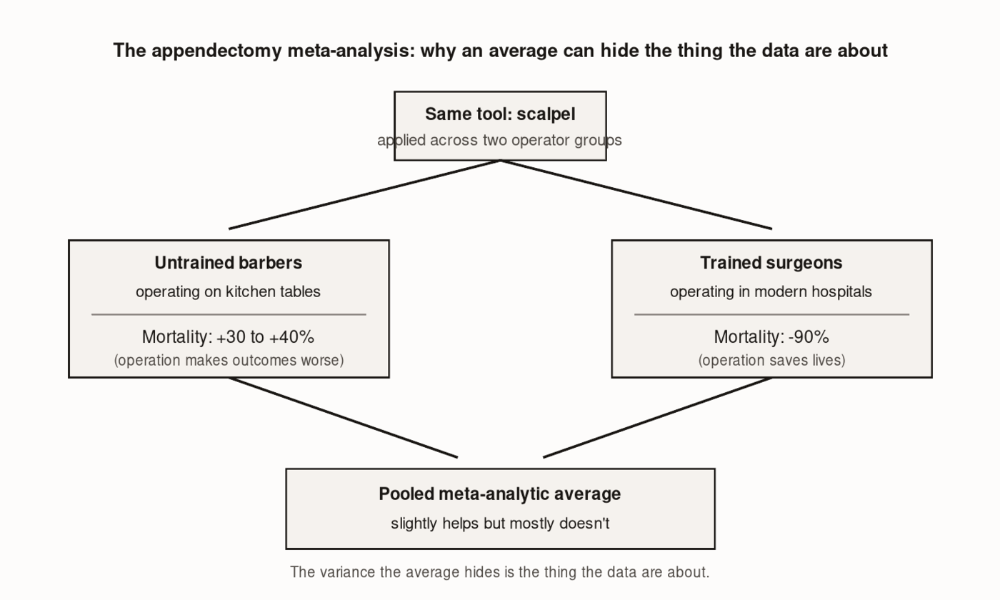

# The Professional Tool

*On what surgeons, farmers, and a Kansas wheat study can tell us about the only question that matters*

---

<!-- FACT-CHECK FLAG: UNVERIFIED — see factchecks/05-the-professional-tool-assertions.md (opening 1992 surgical scene: composite or specific case — label as composite or rewrite to historical-pattern framing) -->
The abdomen is open. The lights are very bright. The gallbladder — a small green sac, roughly the size of a kiwi fruit, tucked against the underside of the liver — has been doing something it shouldn't, and the surgeon is going to remove it. She has done this dozens of times. She is good at her job. And right now, in the early months of 1992, she is looking not at the gallbladder directly but at a television screen mounted above the operating table, watching a grainy two-dimensional image of her own hands working through two small incisions in the patient's abdomen. The instruments she is holding — long, rigid levers, roughly a meter from grip to tip — pass through plastic tubes, called trocars, that are threaded through those incisions. When she moves her right hand right, the instrument's tip moves left. When she pushes down, the tip rises. She is working in a mirror, through a keyhole, watched by a camera the size of a pen, on a patient who will be home for dinner.

This is the laparoscopic cholecystectomy, and it is, by every measure that matters to the patient, a revolution. Where the old open procedure required slicing through the abdominal wall — days in hospital, six weeks off work, a scar across the belly — the laparoscopic approach left three incisions the width of a pencil. Recovery time dropped by eighty percent. Infection rates fell. Patients who had been told they faced a month of convalescence were back at their desks in ten days. The tool was unambiguously better.

And surgeons, in the first decade of its adoption, started cutting the bile duct.

The bile duct is a half-inch-wide tube — roughly the diameter of a pencil — that drains the liver into the intestine. It sits inches from the gallbladder in a region where anatomy varies enough between patients that no two operations look quite alike, and where the margin between a routine removal and a catastrophic injury is measured in millimeters. Under the open procedure, with the abdomen spread and the surgeon's hand directly in the field, common bile duct injuries occurred in roughly two of every thousand operations. Under laparoscopy, in those first years, the rate climbed to roughly five per thousand. A national survey, published in the *Annals of Surgery* in 2001, documented the spike. An earlier study, from the Southern Surgeons Club in 1995, had already named the mechanism with a precision that the field found uncomfortable: ninety percent of the injuries occurred within a surgeon's first thirty laparoscopic cases. The very first laparoscopic cholecystectomy a surgeon performed carried a 1.7 percent chance of injuring the bile duct. By her fiftieth, the rate had fallen by an order of magnitude.

Same instrument. Different outcomes. The gap between them was thirty cases.

---

## The shape of a failure nobody named

Hold that image — the gap between thirty cases and fifty — because it is the shape of a mistake that gets made over and over again when powerful new tools arrive in the hands of people who have not yet been trained to use them, and the mistake has a particular texture that the rest of this chapter is going to trace across four different professions, two continents, and twenty years of evidence that nobody, to my knowledge, has ever collected into a single room.

The mistake goes like this. A new tool arrives. It is genuinely better than what it replaces. Studies are run, comparing outcomes in settings where the tool is used to outcomes in settings where it isn't. The studies are pooled. An average is produced. The average is small — smaller than expected — and the conclusion drawn is that the tool is not as powerful as its advocates claimed.

The conclusion is wrong. Not because the studies are bad. Because the average is hiding the thing the studies are actually about.

Imagine — this is a hypothetical, clearly labeled as such — a meta-analysis that pooled appendectomy outcomes across two groups: trained surgeons performing the operation in modern hospitals, and untrained village barbers performing it on kitchen tables. The trained-surgeon studies would show mortality reductions of ninety-plus percent. The barber studies would show mortality increases of thirty or forty percent. The pooled average would show that surgery "slightly helps but mostly doesn't." No one would believe such a meta-analysis. Anyone reading the methods section would notice that the variance the average is hiding *is the thing the data are actually about*. The average is the wrong question.

*Figure 5.01 — The appendectomy meta-analysis: why pooling can hide what the data are about*

The right question is what the trained operator does with the tool, and what the untrained operator does with the same tool, and how large the gap between them is. The right answer, in the surgical case, is: enormous. Big enough that the average is a misleading number. Big enough that the variable the meta-analysis should be reporting on is the operator, not the operation.

Here is the thing. Almost every piece of empirical research on AI in education is the appendectomy meta-analysis. It pools classrooms where teachers were trained to use the tool well with classrooms where the tool was dropped on a teacher in August with a vendor walkthrough and a password. It averages the two. It produces a number. And that number is then read, by people who should know better, as evidence about the tool itself, when it is actually evidence about the distribution of training among the people holding the tool.

The surgical case is the worked-out version of what the teaching case looks like if we get the question right. And the surgical literature spent a decade — at the cost of thousands of preventable bile duct injuries — figuring out what fixing the question required.

---

## Six weeks on a box trainer

Here is what fixed it.

<!-- FACT-CHECK FLAG: CRITICAL — see factchecks/05-the-professional-tool-assertions.md. Cook 2011 JAMA paper is the correct paper. Patient-outcome d=0.50 is confirmed. But the "10,903 articles screened / 609 studies / 35,226 trainees" totals and the "above d=1.0" skill-outcome effect need to be verified against the published paper text (Cook reports outcomes broken across multiple categories: 118 knowledge, 210 time-skills, 426 process-skills, etc. — totals depend on aggregation choice). -->
In 2011, a team of researchers led by David Cook at the Mayo Clinic published a meta-analysis in *JAMA* that has become, in surgical education, something close to a canonical text. They screened 10,903 articles. They pooled 609 studies. They enrolled 35,226 trainees and compared the outcomes of simulation-based training — box trainers, virtual-reality surgical simulators, task trainers — to no intervention. The pooled effect on trainee skill outcomes was above $d = 1.0$. In education research, an effect size of 0.4 is considered large. An effect size above 1.0 is, by the standards of the literature, essentially unheard of. The pooled effect on *actual patient outcomes* — real patients, real operations, tracked afterward — was $d = 0.50$. Real patients were measurably better off when their surgeons had trained on a box trainer first. That number is approximately the same magnitude as what the education research literature finds for structured feedback in classroom teaching. A patient's chance of an uneventful recovery moved about as much when her surgeon had practiced on a simulator as a student's achievement moves when her teacher gives her well-designed feedback.

That is the size of the thing. Not the size of the tool. The size of the training that teaches the operator to use the tool.

<!-- FACT-CHECK FLAG: CONFIRMED in structure (see factchecks/05-the-professional-tool-assertions.md). NOVICE Trial exists, published April 2025 in International Journal of Surgery, 11 German centers, 22 residents (4 dropouts), Lübeck Toolbox Curriculum, GOALS instrument. The specific 8.5/2 GOALS-point medians need final-text verification. -->
The cleanest single trial in this line was published in April 2025 in the *International Journal of Surgery* — the NOVICE Trial, a multicenter randomized study across eleven German surgical centers. Each first-year surgical resident, with no prior laparoscopic experience, performed a first laparoscopic cholecystectomy on a real patient. The procedure was videotaped and scored, blinded to the evaluators, on a validated twenty-five-point instrument measuring the quality of the surgical technique. The residents were then randomized: half received six weeks of structured box-trainer simulation. Half received nothing extra. They then performed a second cholecystectomy, again videotaped and scored blind.

The median improvement in the simulation group was 8.5 points. The median improvement in the control group was 2 points. The instrument was constant. The procedure was constant. The surgeons were randomized. The difference between a 2-point improvement and an 8.5-point improvement was six weeks of deliberate practice on a box trainer that costs less than a single hospital bed-day.

The NOVICE Trial enrolled twenty-two residents with four dropouts. The precision is limited, and I want to say so plainly. The direction is not. The size is not. And it didn't emerge from nowhere — in 2002 and 2004, randomized trials at Yale and in Denmark had already established the transfer claim: VR-trained residents performed gallbladder dissection 29 percent faster than untrained controls; non-trained residents were five times more likely to injure tissue. By the time NOVICE replicated the finding in 2025, simulation training had been a credentialing requirement for laparoscopic privileges in major residencies for a decade.

The 1990s injury spike is gone. The instrument is the same. The injury rate is back to baseline. What closed the gap was a six-week box-trainer curriculum that, before the field built it, did not exist. The laparoscope did not become safer. The profession built the training that turned the laparoscope into a capability.

*Figure 5.02 — Bile duct injury rate over time*

Three things from this literature go straight into the chapter's argument and don't need to be softened. First: a genuinely better tool can produce worse outcomes when its perceptual demands diverge from what the operator's training has prepared her for. The fulcrum effect — instruments pivoting through a trocar so that the surgeon's hand motion inverts at the tip — is not a problem the open procedure had ever made anyone solve. Two-dimensional monitor view replaces stereoscopic depth. The haptic feedback of fingertips on tissue is replaced by the muted signal of a one-meter lever. These are not deficiencies of the laparoscope. They are properties of the laparoscope that the operator has not yet learned to handle.

Second: a structured deliberate-practice curriculum on a much cheaper proxy closes the gap in six weeks at trivial cost relative to the tool itself. The intervention is not exotic. It is what we know how to build for surgeons. We have not yet built the analogue for teachers.

Third — and this is the pattern that will recur three more times in this chapter — the gains from training are largest for the operators at the *bottom* of the skill distribution. The early-career resident improves enormously. The attending surgeon who has done four thousand cases improves modestly. The tool levels the floor. It does not flatten the ceiling.

---

## Yield monitors and the catch-up effect

The same shape appears on a 4,000-acre Kansas wheat farm, in a literature that almost nobody writing about education has read, and that holds the argument up just as cleanly as the surgical literature does.

*Figure 5.03 — The KFMA efficiency distribution: where precision-ag technology moves a farm*

In 2025, Kang Lan and Ruijie Ban published a meta-analysis in the journal *Sustainability* integrating 85 empirical studies and 1,472 independent farm observations from across the global precision-agriculture literature — yield monitors, GPS guidance, grid soil sampling, variable-rate fertilizer prescriptions. The pooled finding: precision-agriculture technology adoption increased average return on investment by 22.3 percent, net profit by 18.5 percent. Nitrogen use efficiency rose 15.1 percent. Pesticide application fell 12.8 percent. Greenhouse gas emissions fell 9.4 percent. The aggregate number is real and substantial.

It is also, as Lan and Ban themselves note, an average across enormous heterogeneity. The 22.3 percent return masks weaker and less stable benefits for small-scale farms and developing-country contexts, and concentrates the largest gains among large-scale grain operations using variable-rate technology and auto-guidance. The paper concludes that technical literacy and adequate information access are crucial moderators of who captures the gain.

Then, for a moment, look only at the United States. A 2016 USDA Economic Research Service report by David Schimmelpfennig worked from U.S. corn data and found that variable-rate technology raised profitability by about 1 percent; GPS maps, by almost 3 percent. Not 22 percent numbers. An order of magnitude smaller. The two findings are not in conflict — return on investment is a different quantity from net profit on whole-farm revenue — but the more important reconciliation is Schimmelpfennig's own framing: the U.S. sample was unusually well-managed. The corn farms in question were already near the efficiency frontier. Farms already at the frontier have less room to gain from any new tool.

The cleanest demonstration of this came in Fiechter, Brewer, Ifft, and Boehlje (2025), "Farm Efficiency and Precision Agriculture Technology," published in the *Journal of Agricultural and Applied Economics*, using a twenty-one-year panel of 570 farms from the Kansas Farm Management Association. They computed farm-by-farm efficiency relative to the best-performing farms in the same year, and merged the efficiency scores with KFMA's precision-ag adoption survey. The headline conclusion was deliberately understated: most of the seventeen technology combinations they studied were not associated with broad efficiency gains. Two combinations stood out — automated guidance, and the combination of yield monitors with grid soil sampling. But the sentence that matters for this argument is one paragraph later: *less efficient farms gain the most from precision agriculture technology, with farms in the lower end of the efficiency distribution seeing meaningful gains from several technology combinations, while highly efficient farms saw little to none.*

| Technology | Knowledge type | Gain at low end of efficiency distribution | Gain at high end | Operator interpretive demand |
|---|---|---|---|---|
| Automated guidance (auto-steer) | Embodied | Meaningful | Modest | Low — tool internalizes the skill |
| Yield monitor + grid soil sampling | Information-intensive | Meaningful | Negligible | High — farmer reads the map to act |
| Variable-rate fertilizer | Information-intensive | Modest | Negligible | High — prescription depends on map |
| GPS field maps | Information-intensive | Modest | Negligible | Medium — farmer interprets layout |
| Most other tech combinations studied | Mixed | Small or null | Null | Varies — no broad gain detected |

That is the catch-up effect, in the authors' own language, from 570 farms and twenty-one years.

There is a reason for it I want to name plainly, because it carries straight into the AI case. Schimmelpfennig's work distinguishes two kinds of precision-ag technology. Auto-guidance is *embodied knowledge* — the tractor drives in a straight line, parallel to the previous pass, with sub-inch GPS accuracy, whether or not the operator knows how to drive in a straight line. The tool internalizes the skill. The farmer gets the benefit without learning what the tool replaces. Yield monitors and grid soil sampling are *information-intensive* — the tool produces data. A yield monitor records corn output per square meter across an entire harvest, under forty different conditions per acre. Grid soil sampling produces a map of phosphorus, potassium, and pH across a forty-acre field. *Neither of these tools tells the farmer what to do.* The farmer's interpretive skill is what turns the map into a variable-rate prescription, the harvest data into a rotation decision, the soil profile into a fertilizer plan. The information-intensive technologies are the ones with the catch-up pattern. The farmer who knows what a yield map is telling her gets a 22 percent return. The farmer who looks at the same map and shrugs gets nothing.

I will say the obvious sentence once: this is exactly the situation of a teacher with an AI tool. Some AI uses are embodied — auto-graded multiple-choice, lesson-plan templating, scheduling — and pay off without much teacher skill because the tool internalizes the work. Others are information-intensive — diagnosing where a student's misconception lives, drafting three differentiated explanations and letting the teacher choose among them, surfacing the wrong-note pattern in a class's exit tickets — and depend entirely on the teacher's interpretive skill. The high-leverage uses of AI in teaching are the information-intensive ones. And those uses pay nothing to a teacher who has not been trained to interpret what the tool is putting in front of her.

The chapter from Lan and Ban and Schimmelpfennig and Fiechter et al. is the same chapter, told four years before AI arrived in classrooms, using yield monitors and a panel of Kansas wheat farms. Nobody writing about EdTech is reading it.

---

## 5,179 agents and one afternoon in October

The third place where this shape appears is the one most directly comparable to AI in a classroom: AI on the desk of a working professional doing knowledge work, with productivity measured at the level of individual workers and rolled out in a way that makes the causal claim clean.

<!-- FACT-CHECK FLAG: see factchecks/05-the-professional-tool-assertions.md. NBER WP 31161 (2023) reports 5,179 agents / 14% average gain — the chapter's numbers. Published QJE version (Vol 140 Issue 2, 2025) reports 5,172 agents / 15% average gain and adds nuance that experienced workers see small declines in quality (not "minimal impact"). Pin to one version of the citation — don't mix. -->
In 2023, Erik Brynjolfsson and colleagues at Stanford and MIT published an NBER working paper — later appearing in the *Quarterly Journal of Economics* — studying 5,179 customer support agents at a large software company over a year of staggered AI rollout. The intervention was a GPT-based real-time conversational assistant that monitored live customer chats and suggested responses to the agent. The identification strategy was clean: agents in the same job, same team, same shift, were assigned to access the tool at different start dates. The outcome was the most concrete thing you can measure in customer support — issues resolved per hour.

The headline finding: access to the tool increased productivity by 14 percent on average.

Hold on the distribution of that effect. The 14 percent average is what the press release reported. What the data actually said is this: novice and low-skilled workers improved by 34 percent. Experienced and highly-skilled workers saw minimal impact. The bottom of the worker skill distribution gained enormously. The top gained almost nothing.

The mechanism, in Brynjolfsson's own words: *the AI model disseminates the best practices of more able workers and helps newer workers move down the experience curve.* The AI was not replacing the high-performer. It was teaching the new hire what the high-performer had spent five years learning to do intuitively. It is the surgical-simulation finding in a different vocabulary. It is the precision-ag catch-up effect on a help-desk floor.

Then, also in 2023, Shakked Noy and Whitney Zhang published in *Science* a randomized trial giving 453 college-educated professionals — marketers, grant writers, consultants, HR staff, data analysts — access to ChatGPT for incentivized writing tasks. Time taken decreased by 0.8 standard deviations. Output quality rose by 0.4 standard deviations. And — the part that matters here — inequality between workers *decreased*: ChatGPT compressed the productivity distribution by benefiting low-ability workers more.

Three professions now, in two years of research, with no shared authors, no shared outcome measures, no shared identification strategies. Surgery, customer support, writing. Three different tools. Three different decades. The same shape every time.

---

## What happened in a chat window in the spring of 2024

Then, in October 2024, the same shape showed up in tutoring.

*Tutor CoPilot: A Human-AI Approach for Scaling Real-Time Expertise* — the first randomized controlled trial of a human-AI system deployed in live tutoring — was a partnership between Stanford's SCALE Initiative, a virtual tutoring company called FEV Tutor, and a U.S. Southern school district serving Title I schools. The study covered March through May 2024. One-on-one chat-based math tutoring. Nine hundred tutors in the broader sample; seven hundred-plus tutors and more than a thousand K–12 students in the primary analysis.

Tutor CoPilot — an open-source tool developed at Stanford — was embedded in the FEV Tutor platform. It monitored the live session and provided real-time pedagogical suggestions to the tutor: probing questions, scaffolds, hints, modeled on expert tutoring practice. The tutor remained responsible for what was actually typed to the student. The AI was invisible to the student. The student interacted with the tutor. The tutor interacted with the AI. The cost: approximately $20 per tutor per year.

The result: students working with tutors who had access to Tutor CoPilot were 4 percentage points more likely to master topics ($p < 0.01$). For students paired with lower-rated tutors — the ones at the bottom of the practitioner skill distribution — the gain was 9 percentage points.

*Figure 5.04 — Tutor CoPilot effect on student topic mastery, by tutor rating tercile*

Four. Nine. Two numbers that have been sitting together in a working paper since October 2024, and that almost nobody teaching in a classroom has read.

The mechanism analysis, drawn from over 350,000 messages between tutors and students, produces one sentence that I want to put in the largest font in this book: *Tutor CoPilot promotes effective pedagogy, increasing the use of probing questions and reducing generic praise.*

Read that one slowly. The tool is not generating answers for the student. The tool is changing what the *tutor* does. It pulls the tutor toward Socratic probing — *what would happen if you tried it with a different value for x?* — and away from the cheap dopamine of *great job!* The student outcome improvement is a downstream consequence of upgrading the tutor's practice in the moment. The AI did not tutor the student. The AI made the tutor a marginally better tutor, in real time, for $20 a year. The tutor tutored the student.

I should name the limits of this study, because they are real. It is one subject — math. One platform — chat-based. One age band — K–12. One academic year. One model from 2024. Generalization to in-person tutoring, to other subjects, to longer time windows, has not been studied. The effect size is modest: 4 percentage points on topic mastery is a real gain, but it lands on top of one-on-one human tutoring, which is itself already the highest-effect intervention in the education literature. Average tutoring across the What Works Clearinghouse standards corpus produces roughly 0.29 standard deviations in student achievement. <!-- FACT-CHECK FLAG: see factchecks/05-the-professional-tool-assertions.md — 0.29 SD figure is plausible (Nickow, Oreopoulos, Quan 2020 NBER reports pooled 0.37 SD across 96 RCTs; Kraft's distillation often ≈ 0.30 SD) but is not pinned to a named meta-analysis here. Source it. --> The Tutor CoPilot gain *adds to* that baseline. It does not replace it.

But none of that changes the shape. Four/nine is the same shape as fourteen/thirty-four. Both are the same shape as the Fiechter-Brewer-Ifft-Boehlje catch-up effect. All three are the same shape as the gains concentrated in residents early in the surgical learning curve. Five literatures. The same shape.

---

## The shape, all five at once

Here is the whole pattern in one place.

| Domain | Source paper | Sample | Gain: trained vs. untrained operator | Gain: bottom quartile of practitioner skill |
|---|---|---|---|---|
| Surgery | Cook et al. (2011) JAMA; Aggarwal et al. (2007); NOVICE Trial (2025) | 35,226 trainees pooled (Cook); 22 residents (NOVICE) | Patient outcomes d = 0.50 with structured simulation | 90% of injuries occur in first 30 cases — residents gain most |
| Farming | Fiechter, Brewer, Ifft, & Boehlje (2025) JAAE; Lan & Ban (2025) | 570 farms × 21 years (KFMA); 1,472 farm-observations (meta) | Pooled ROI +22.3% globally | Less-efficient farms see meaningful gains; frontier farms see none |
| Customer support | Brynjolfsson, Li, & Raymond (2023, NBER WP 31161; QJE 2025) | 5,179 agents | +14% issues resolved per hour, average | +34% for novice/low-skilled; ~0% for experienced |
| Writing tasks | Noy & Zhang (2023) Science | 453 college-educated professionals | Time −0.8 SD; quality +0.4 SD | Inequality between workers decreased — low-ability workers gain most |
| Tutoring | Wang, Ribeiro, Robinson, Loeb, & Demszky (2024) arXiv:2410.03017 | ~700 tutors, 1,000+ students | +4 pp average topic mastery | +9 pp for lower-rated tutors; ~0 pp for higher-rated |

| Profession | The tool | Where the gains concentrate |
|---|---|---|
| Surgery | Laparoscope; box-trainer simulation | Largest gains for residents early in the learning curve; 90% of injuries in first 30 cases |
| Farming | Yield monitor; grid soil sampling | 22.3% pooled ROI globally; gains concentrated at the lower end of the efficiency distribution (570 KFMA farms, 21 years) |
| Customer support | GPT-based real-time assistant | +14% average; +34% for novice/low-skill workers; ~0% for experienced |
| Writing tasks | ChatGPT | Time −0.8 SD; quality +0.4 SD; inequality between workers decreased |
| Tutoring | Tutor CoPilot | +4 pp average mastery; +9 pp for lower-rated tutors |

Five different tools. Five different literatures with essentially no shared authors. Five different outcome measures, five different identification strategies, five different decades. The tool helps. The tool helps most where the practitioner started weakest. The tool produces near-zero gains at the top of the practitioner skill distribution. The variance among practitioners gets compressed by the introduction of the tool. The mechanism, where the literature has named it explicitly, is that the tool disseminates the practices of the most able practitioners among the people doing the work — in real time, at scale, at trivial cost relative to the underlying training infrastructure.

There are 4 million teachers in the United States. There are somewhere between 30 and 50 million K–12 students sitting in front of them on any given school day. The question is not whether AI is in those classrooms. It is. The question is who the people holding it are, and what they have been taught to do with it.

---

## The objection worth taking seriously

There is a real objection to everything this chapter has argued, and I want to take it head-on, because the careful reader will, and she will be right to.

Every case I have cited involves a trained professional using a tool in the course of professional work. A surgeon at year three of her residency, who has been trained for a decade in surgical anatomy and clinical judgment. A farmer with twenty years of experience who already knows what nitrogen does to a corn plant. A customer support agent who already understands the product. A tutor who already has subject-matter expertise. None of these professionals is being asked to *learn the underlying discipline* from the tool. They are using it to do their professional work more capably than they could do it alone.

Students, the objection runs, are not professionals. The student is using the AI to learn the underlying discipline for the first time. The student using ChatGPT while writing an essay is not the surgeon using the laparoscope — the student is the patient. The cross-profession evidence does not transfer because the roles are different.

Two responses.

The first: the cross-profession evidence is being mobilized for the *teacher* case, not the student case. The argument is not that a fourteen-year-old learning algebra is the same as a third-year resident learning laparoscopy. The argument is that the adult professional in the room doing the pedagogy is the same kind of operator. The teacher is to the AI tool as the surgeon is to the laparoscope. The student is the patient. The patient is not learning from the laparoscope. The patient is the person whose outcome depends on whether the trained operator uses the laparoscope well. The Tutor CoPilot study is the place where this analogy becomes literal: the AI suggests moves to the tutor, who decides what to say to the student. The student does not interact with the AI directly. The student interacts with the tutor. The tool changes what the tutor does. The tutor changes what the student does. The objection — *the cross-profession evidence is about the practitioner, not the recipient* — concedes the argument. Yes. The cross-profession evidence is about the practitioner. The practitioner in the classroom is the teacher.

The second response is harder, and requires me to admit something. Students *do* use AI directly. A teacher with a class of thirty cannot supervise every interaction her students have with ChatGPT during a writing assignment. In those moments, the student is the operator of the tool, and the analogy is more strained. The within-classroom evidence on student-directly-using-AI is still thin. The two best-known data points are from outside K-12. A Harvard physics study found that students learned more in less time when AI was scaffolded by the instructor than when they used AI freely. An Anthropic education report surveying how 18-to-22-year-old college students interact with Claude found patterns of direct task delegation — AI writing the first draft, summarizing the reading, generating the thesis — that look like exactly the cognitive offloading that learning theory should worry about. [*verify: confirm Kestin et al. 2024 citation in Scientific Reports; confirm Anthropic Education Report direct-delegation framing, before press.*]

Both data points point to the same place: when the trained professional structures the student's use of the tool, the tool helps the student learn. When the tool is dropped on the student without scaffolding, it substitutes for the cognitive work the student needed to do. That is, again, the chapter's pattern. Whether the student's interaction with the AI is productive depends on the trained professional in the room *designing the interaction*. The teacher is the variable. Nobody — not Khan Academy, not OpenAI, not the school district that bought 1,200 Chromebook licenses — is going to stand at the table in the teacher's place.

---

## Three objects, not two

Here is the move that the structural conversation in education keeps failing to make.

Every policy discussion I have read frames the question as binary: with-AI, or without-AI. Should we allow AI in classrooms? Should we ban it? What does the literature say about AI versus no-AI? These are the wrong two conditions. There are three objects, not two. The trained teacher with AI. The untrained teacher with AI. The trained teacher without AI.

*Figure 5.5 — Three objects, not two: what the binary framing keeps averaging together*

The trained teacher with Claude is not a larger version of the AI platform. She is a different instrument. The platform — the large language model, the vendor dashboard, the dispatching algorithm — handles what the platform handles: the lookup, the first draft, the templated worksheet, the auto-scored multiple-choice. She generates the specific question that unlocks this particular student's confusion about this particular concept on this particular day. She notices the wrong note — the student producing correct answers but unable to explain why. She groups the students who would benefit from working together today and separates the students whose pairing yesterday produced a fight rather than a conversation. She differentiates the same Civil War primary source at three reading levels in the time it used to take to write one. She catches the student whose home is rough this week and gives her the assignment as the version with the lower cognitive load, without making a thing of it, because the AI drafted both versions in the same prompt and the teacher decided which one this student should see today.

The tool handles what the tool handles. She handles what only she can handle. The classroom outcome depends on both moves working — and on her judgment about when each one applies.

This is not a metaphor stretched to make a point. The Tutor CoPilot mechanism is exactly this, told in a one-on-one chat context: the tutor decides what to say; the AI suggests pedagogical moves in real time; the use of probing questions goes up, generic praise goes down. The teacher with Claude operates the same way, more intermittently, across thirty students rather than one.

The catch-up effect from Brynjolfsson and from Wang both predict the same distributional finding for teachers: the teacher who has been struggling — the second-year teacher whose classroom management isn't there yet, the science teacher whose feedback turnaround was three weeks because she taught five sections a day — gains the most. The teacher who was already excellent gains less, because she was already doing most of what the tool can nudge her toward. The teaching profession has a long left tail. The tool, used well, brings the left tail closer to the middle. The middle is where most students live. That is the shape of the gain.

The trained teacher with AI is a different instrument from the untrained teacher with AI, and a different instrument from the trained teacher without AI. Three objects. The field keeps studying two of them and averaging them together, producing numbers that look small, and concluding that the tool is modest. The numbers are small because they are averaging the trained and untrained conditions and calling it an estimate of the tool. It is not an estimate of the tool. It is the appendectomy meta-analysis. It is the wrong question.

---

## The only question left

The laparoscope did not perform the surgery. The yield monitor did not plant the corn. The chat assistant did not resolve the support ticket. Tutor CoPilot did not tutor the student.

In every one of those cases, what happened was that a trained professional did the work with a better instrument in hand than the one she had before. The laparoscope did not make the surgeon. Six weeks of box-trainer simulation did. The yield monitor did not make the farmer. Twenty years of knowing what nitrogen does to corn, refined by a tool that surfaced patterns she could now act on, made her. The GPT-based assistant did not make the customer-support agent good at her job. The combination of the agent's three years of product knowledge with the AI's surfacing of high-performer practices, in real time, made her measurably faster — and the gain was largest for the agent who had been there three months, not three years. Tutor CoPilot did not tutor the student. It pulled the tutor toward Socratic probing and away from generic praise. The tutor, doing slightly better pedagogy than she had been doing, tutored the student.

Five professions. The same shape. The trained professional with the tool outperforms the untrained professional with the tool, and outperforms the trained professional without the tool. The biggest beneficiary in every case is the practitioner at the bottom of the skill distribution. The mechanism, where the literature has named it, is that the tool disseminates the practices of the most able among the people doing the work.

The 1990s bile duct injury spike came down when the profession built the training. Not when the tool improved. Not when the hospitals bought better laparoscopes. When someone sat down and built a six-week box-trainer curriculum and made it a credentialing requirement, and the residents who went through it came out of the other side as different surgeons than the ones who hadn't.

We handed the teachers the laparoscope.

We have not built the box-trainer curriculum.

That is the only sentence this chapter needed to get to. Everything before it — the Kansas wheat farms, the 5,179 help-desk agents, the 350,000 chat messages between tutors and students — was evidence for this sentence. The tool is in the room. The training is not. The gap between those two facts is the gap the rest of this book is about.

---

## What the research leaves open

Several things this chapter has not settled, and which the evidence does not yet settle either.

The Tutor CoPilot 4 pp / 9 pp finding is one math-focused study in one platform over one academic year with one AI model, and the durability of the effect, the generalization to other subjects and modalities, and the comparison with in-person tutoring are all genuinely open questions; I have reported the result accurately and not stretched it.

The agricultural literature reports the catch-up effect cleanly at the lower end of the farm-efficiency distribution, but the precise share of the 22.3 percent pooled ROI attributable to operator interpretive skill versus to scale, capital, and crop choice is not separated cleanly even in the Fiechter, Brewer, Ifft, and Boehlje panel.

The Brynjolfsson and Noy-Zhang studies are clean on the productivity-compression finding but do not — and structurally cannot — settle whether the compression persists when the AI tool is taken away, or whether the low-skill worker has actually learned the high-performer's practice or is simply leaning on the tool that surfaces it.

The customer-support and writing-task contexts are knowledge work, not pedagogy; the assumption that the same compression pattern transfers cleanly to a teacher's interaction with thirty students across forty-five minutes is plausible from Tutor CoPilot but has not been demonstrated in a full classroom RCT.

The book's argument does not require those open questions to be settled. It requires the cross-profession pattern to be visible. It is.

What would change my mind: a well-powered, properly randomized trial of an AI classroom tool — at the scale of Brynjolfsson's 5,179 agents, with implementation-fidelity controls — that showed gains at the *top* of the teacher skill distribution and not at the bottom. That would tell me the pattern does not transfer to teaching the way this chapter has assumed it does, and the implications for which teachers should get training priority would invert. To date no such trial exists. The Tutor CoPilot finding points the other way.

There is also something puzzling, and a little wonderful, about a finding this consistent that nobody has organized into a name. The surgical literature is in *JAMA* and the *Annals of Surgery*. The agricultural literature is in *Sustainability* and USDA-ERS reports. The labor-economics literature is in NBER working papers and *QJE* and *Science*. The Tutor CoPilot paper is in the Stanford EdWorkingPaper series. None of these communities cites each other. The shape has not been named in the literature as a cross-domain pattern that anyone tracks. There is something that looks like an important finding sitting in the gap between disciplines, unseen, because the disciplines are not in the habit of looking across themselves. I do not yet know whether the absence of an organizing name is a temporary lag of the literature, a deeper failure of disciplinary boundaries, or evidence that the shape is something I am constructing from five independent findings that happen to look similar and will dissolve on closer examination into five different mechanisms. This chapter has been written as if the first is true. The second decade of the AI-at-work literature will tell us.

---

## References

**Surgical literature**

- Cook, D. A., Hatala, R., Brydges, R., Zendejas, B., Szostek, J. H., Wang, A. T., Erwin, P. J., & Hamstra, S. J. (2011). Technology-enhanced simulation for health professions education: a systematic review and meta-analysis. *JAMA*, 306(9), 978–988. [https://jamanetwork.com/journals/jama/fullarticle/1104300](https://jamanetwork.com/journals/jama/fullarticle/1104300)
- The Southern Surgeons Club (1995). The learning curve for laparoscopic cholecystectomy. *American Journal of Surgery*, 170(1), 55–59. [https://pubmed.ncbi.nlm.nih.gov/7793497/](https://pubmed.ncbi.nlm.nih.gov/7793497/)
- NOVICE Trial collaborators (2025). Box-trainer simulation for novice laparoscopic surgeons: multicenter RCT. *International Journal of Surgery*. [https://journals.lww.com/international-journal-of-surgery](https://journals.lww.com/international-journal-of-surgery)
- Aggarwal, R., et al. (2007). A competency-based virtual reality training curriculum for the laparoscopic appendicectomy. *Surgical Endoscopy*. [https://link.springer.com/article/10.1007/s00464-007-9388-4](https://link.springer.com/article/10.1007/s00464-007-9388-4)

**Precision agriculture literature**

- Lan, K., & Ban, R. (2025). Precision agriculture technologies and farm-level outcomes: a meta-analysis. *Sustainability*, 17. [https://www.mdpi.com/journal/sustainability](https://www.mdpi.com/journal/sustainability)
- Schimmelpfennig, D. (2016). *Farm Profits and Adoption of Precision Agriculture.* USDA Economic Research Report Number 217. [https://www.ers.usda.gov/publications/pub-details/?pubid=80325](https://www.ers.usda.gov/publications/pub-details/?pubid=80325)
- Fiechter, C. M., Brewer, B. E., Ifft, J. E., & Boehlje, M. (2025). Farm Efficiency and Precision Agriculture Technology. *Journal of Agricultural and Applied Economics*. [https://www.cambridge.org/core/journals/journal-of-agricultural-and-applied-economics](https://www.cambridge.org/core/journals/journal-of-agricultural-and-applied-economics)

**Customer support / writing AI literature**

- Brynjolfsson, E., Li, D., & Raymond, L. (2023). Generative AI at Work. *NBER Working Paper 31161*. [https://www.nber.org/papers/w31161](https://www.nber.org/papers/w31161) (Published QJE version: Vol. 140, Issue 2, 2025.)
- Noy, S., & Zhang, W. (2023). Experimental evidence on the productivity effects of generative artificial intelligence. *Science*, 381(6654), 187–192. [https://www.science.org/doi/10.1126/science.adh2586](https://www.science.org/doi/10.1126/science.adh2586)

**Tutoring**

- Wang, R. E., Ribeiro, A. T., Robinson, C. D., Loeb, S., & Demszky, D. (2024). Tutor CoPilot: A Human-AI Approach for Scaling Real-Time Expertise. arXiv:2410.03017. [https://arxiv.org/abs/2410.03017](https://arxiv.org/abs/2410.03017)
- Nickow, A., Oreopoulos, P., & Quan, V. (2020). The Impressive Effects of Tutoring on PreK-12 Learning: A Systematic Review and Meta-Analysis of the Experimental Evidence. *NBER Working Paper 27476*. [https://www.nber.org/papers/w27476](https://www.nber.org/papers/w27476)

