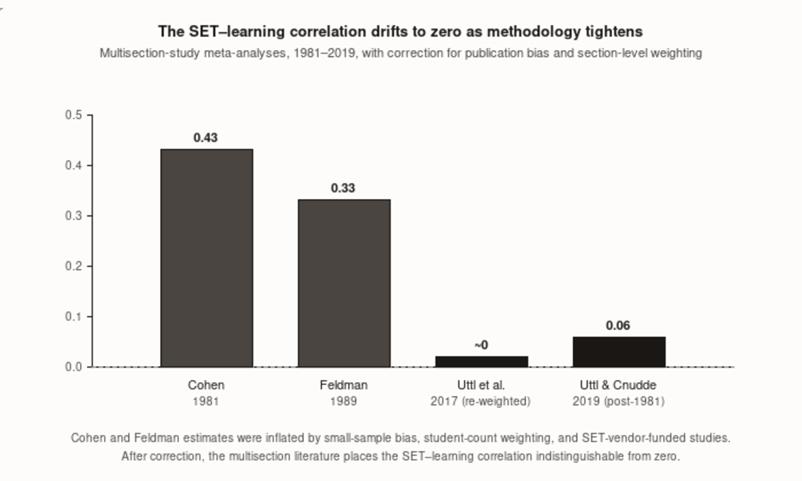
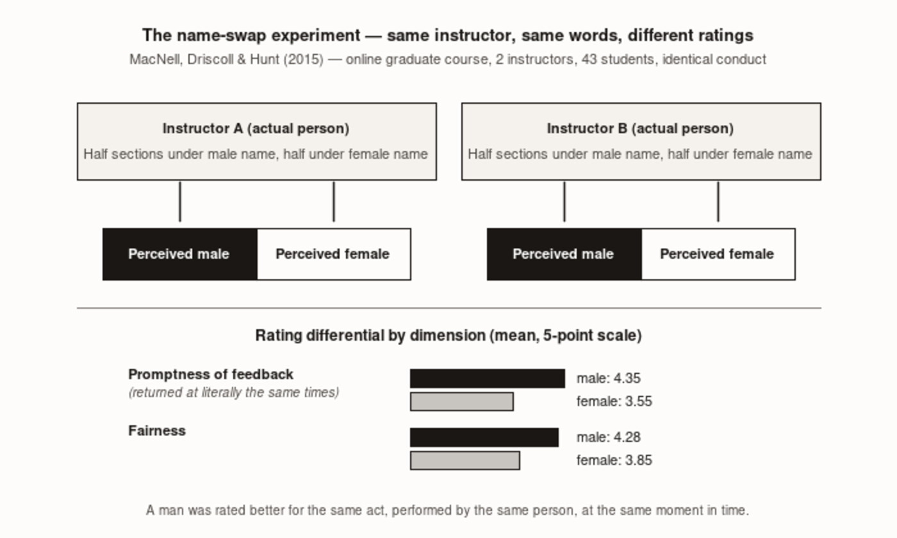

# Three Honest Measures

*On the instrument American universities use to make tenure decisions, why it measures the wrong thing, and what to replace it with*

---

[*verify: opening anecdote — composite or real? §6 voice rule requires either naming the university/instructor or labeling as composite ("Imagine...").*] In the spring of a recent academic year, a professor at a large public university received her annual teaching evaluation results. She had taught two sections of introductory statistics. In the first, she had pushed. Homework sets that required students to generate hypotheses before they ran the tests. Problem types that changed each week so that no drill sequence could substitute for understanding. The kind of exam where you can get partial credit for showing how you thought, and lose full credit for showing that you didn't. End-of-semester ratings: 3.6 out of 5. Comments included "unnecessarily hard," "expected us to figure things out ourselves," and "didn't feel supported."

The second section, taught with more scaffolding, more worked examples, more explicit framing of exactly what would appear on the test, ended with a 4.4.

Her department's minimum for contract renewal was 4.0.

One of those sections produced students who passed the follow-on methods course at a higher rate than any section she had taught. The other produced students who outperformed their peers for one semester. The instrument that determined whether she kept her job could not tell them apart. The instrument could not tell them apart because the instrument was measuring the wrong thing, and the field that adopted it has known this, from its own literature, for roughly forty years — and has not stopped using it.

---

## What the instrument actually measures

The single most consequential measurement decision American higher education has institutionalized in the last half-century is the student evaluation of teaching. Every university uses it. Most use it as the primary basis for contract renewal, salary review, and tenure. The literature on what it measures is now, at the methodological frontier, clear: it measures student satisfaction with the course at the moment the course ended. It does not, in any defensible sense, measure how much students learned.

The correlation between student ratings and student learning, properly estimated, is approximately zero.

That number comes from a 2017 meta-analysis in *Studies in Educational Evaluation* by Boris Uttl, Carolin White, and Daniela Gonzalez Morales — the most methodologically careful synthesis of the student-evaluation literature ever published. They screened the existing meta-analyses, went back to the ninety-seven multisection studies in the underlying corpus, re-extracted effect sizes directly, weighted studies by the number of sections rather than by the number of students, and tested for publication bias. Each of those steps matters; together they reverse forty years of accumulated conventional wisdom. The corrected synthesis explains approximately one percent of the variance in student learning outcomes — a correlation indistinguishable from zero at the scales that matter.

The gold-standard design for answering the SET-and-learning question is the multisection study. One course — say, introductory calculus — taught by many instructors in the same semester. Common syllabus, common textbook, common final exam graded blind. Students assigned quasi-randomly through registration timing, so that the average ability in each section is roughly equivalent. You correlate the section's mean evaluation score with the section's mean exam score. If high-rated sections also score higher on the common exam, the evaluation is partly tracking learning. The earlier meta-analyses — Cohen in 1981, Feldman in 1989 — used this design and reported correlations in the range of $r = 0.30$ to $r = 0.47$. For four decades, those numbers were cited as the empirical foundation for using student evaluations to judge teaching.

Uttl and colleagues found three problems. The small-sample studies had the largest reported correlations — the textbook signature of publication bias, where the studies that find what researchers hoped to find are the ones that get published. The correlations in large studies, which are more reliable, were near zero. Second, prior meta-analyses had sometimes weighted by student count rather than by section count, which inappropriately dominated the composite with large-lecture sections. Third, some of the numbers Cohen and Feldman reported were transcription errors or non-standard effect-size choices; re-extraction from the original studies reduced them.

After proper weighting, bias correction, and re-extraction: the SET-learning correlation in the multisection literature is approximately zero. Student evaluations explain at most one percent of the variance in student learning outcomes. After controlling for the well-documented effect of expected grade on ratings, the correlation tips slightly negative.

*Figure 10.01 — The SET–learning correlation drifts to zero as methodology tightens*

The defenders' rebuttals have each been examined. A 2019 follow-up by Uttl and Cnudde, published in *PeerJ*, looked at the same literature for conflicts of interest. The pattern is visible in the data, following exactly the pattern of pharmaceutical-funded drug trials. Studies with identifiable ties to SET vendors reported large positive correlations. Studies without them reported correlations near zero. Research published before 1981 — when the vendors were establishing their market — showed correlations around $r = 0.31$. Research published after, as independent replication accumulated, showed correlations near $r = 0.06$. The historical evidence that student evaluations measure learning was, in substantial part, produced by the people selling the instruments. This is the pharmaceutical-funder effect, ported into educational measurement, never named as such by the field that adopted the result.

The instrument does not fail because it is poorly engineered. The IDEA instrument developed at Kansas State, the ETS SIR II — these are psychometrically defensible at what they actually measure, which is whether the student was satisfied, whether they felt respected, whether they liked the course at the moment it ended. The well-engineered versions of this instrument measure satisfaction reliably. The problem is not engineering. The problem is that satisfaction and learning are different things, that the institution is using the first as a proxy for the second, and that the literature now tells us the proxy is broken.

---

## The reversal

Then there is the study that should be required reading for every tenure committee in America.

In 2010, Scott Carrell and James West published in the *Journal of Political Economy* the results of a natural experiment at the U.S. Air Force Academy that no researcher could have designed deliberately. The Academy randomly assigns incoming cadets to sections of introductory calculus. Every cadet then takes the full sequence of follow-on courses — Calc II, Calc III, the engineering courses that depend on calculus — on a common curriculum with common final exams not graded by the original instructor. Random assignment. Common downstream measurement. Thousands of students over multiple years.

The finding inverts forty years of conventional wisdom in one sentence.

Students taught introductory calculus by less-experienced instructors got *higher grades in the first course* — and *lower grades in everything that came after.* Students taught by experienced PhD-holding faculty got *lower grades in the first course* — and *higher grades in the subsequent sequence.*

The student evaluation ratings tracked the first-course grades, not the downstream performance. The instructors with the worse evaluations were producing the better long-run learning.

*Figure 10.3 — The Carrell-West reversal: evaluations track the first-course grade, not downstream learning*

The mechanism is one any honest teacher will recognize. Less-experienced instructors taught to the test of *this* course. They drilled the specific problem types that would appear on the final and produced students who could execute those types — fluently, quickly, successfully — but without the foundational understanding that transfers when you encounter calculus in a new context in a different course. Experienced instructors taught for transfer. Their students struggled in the moment, did better in the next course, and rated their first-semester instructor lower than the instructor who had drilled them to a comfortable grade.

Both outcomes, for the same reason. The discomfort of being asked to actually understand the material is the same discomfort that produces transfer. Student evaluations cannot tell the difference between "this instructor was ineffective" and "this instructor was making me learn something I did not yet know I would need." The instrument measures comfort. The instrument rewards comfort. Where comfort and learning diverge — which is often — the instrument selects against learning.

If the Air Force Academy had used introductory calculus evaluations for tenure, it would have systematically promoted the instructors who were hurting long-run learning and dismissed the ones producing it. This is not a hypothetical inference about what might happen. This is what the data say would have happened, to that population of instructors, in that setting, under that measurement rule.

The pattern is the inversion stated in the simplest possible table — instructor type by what students earned in the first course, what they earned in the follow-on, and what they wrote on the evaluation form.

| Instructor type | Calc I grade (this course) | Calc II grade (downstream) | Student evaluation rating |
|---|---|---|---|
| Less-experienced instructors (taught to the test of this course) | Higher | Lower | Higher |
| Experienced PhD-holding faculty (taught for transfer) | Lower | Higher | Lower |

The student evaluations tracked the first-course grades, not the downstream performance. The instructors with the worse ratings were producing the better long-run learning.

The problem compounds when the instructor being measured is teaching with a philosophy that this book has been calling AI+1 — one who knows when to refuse the easier path, when to insist that the student do the cognitive work that the AI tool is offering to do for her, when to make the room harder in the precisely calibrated way that produces understanding rather than fluency. That instructor is the Carrell-West experienced PhD professor at scale. Student evaluations will penalize her for that practice. A tenure system built on those evaluations will not merely fail to identify her. It will select against her.

---

## What happens when you swap the names

The Carrell-West finding is about teaching style. A separate literature — equally settled, equally ignored by the institutions whose personnel decisions depend on it — establishes that student evaluations are systematically lower for women and for faculty of color, in identical courses with identical teaching.

In 2015, Lillian MacNell, Adam Driscoll, and Andrea Hunt published a study in *Innovative Higher Education* with a design elegant enough to be worth describing in detail. An online graduate course with two assistant instructors. Each instructor taught one section under a male name and one section under a female name. Students never saw the instructor; all interaction was text-based. The same person, using the same words, returning the same feedback at the same time — but half the students thought the instructor was male and half thought the instructor was female.

Students rated the perceived-male identity significantly higher on nearly every dimension. The dimension that should have been impossible to bias was promptness of feedback — feedback returned at literally the same times by both perceived identities. Students rated the perceived-male instructor higher on promptness anyway. A man was rated better for the same act, performed by the same person, at the same moment in time.

*Figure 10.02 — The name-swap experiment: same instructor, same words, different ratings*

The sample is small — one course, forty-three students. The replication did the rest of the work.

Anne Boring, along with Kellie Ottoboni and Philip Stark, published the population-scale version in 2016. The primary dataset was a five-year natural experiment at a French university: 23,001 student evaluations, 379 instructors, 4,423 students, six mandatory first-year courses with random instructor assignment. The findings: gender bias against female instructors is large and statistically significant; it appears on items that should be objective; student evaluation scores are more sensitive to student gender and grade expectations than to any measure of instructor effectiveness; and the bias is large enough that more effective female instructors receive lower evaluations than less effective male instructors.

That last finding deserves its own sentence, separated from the surrounding argument. The bias does not merely reduce a woman's score by a small fixed amount. It is large enough to *invert the ranking.* Use student evaluations to compare a more effective woman with a less effective man, and the instrument will often enough rank the more effective teacher lower than the less effective one.

The racial-bias literature follows the same structure. Studies using fictitious CVs find that Black professors are rated less competent than White and Asian counterparts before any course interaction occurs — the evaluation is being partially determined by who the instructor is before she has taught a single class. Archival studies find that Black faculty mean scores are the lowest on both multidimensional items and the global rating used in personnel decisions. [*verify: name specific papers — candidates include Bavishi, Madera & Hebl 2010 (fictitious-CV experiment) and Reid 2010 (RateMyProfessors archival), both in *Journal of Diversity in Higher Education*. §6 voice rule requires named sources.*] Multiple independent designs — laboratory, field experiment, archival analysis, content analysis of open-response comments — converge on the same finding. The bias is not disputed in the literature. It is disputed in institutional practice, which continues regardless.

The American Sociological Association — the professional society of the discipline whose members have done the most of the foundational SET research — published a statement in 2019 reflecting these conclusions. The ASA wrote that student evaluations of teaching are not statistically valid measures of teaching effectiveness, that they should not be used as the primary basis for personnel decisions, and that their use in summative evaluation should be substantially constrained. When the professional society of the people who built the literature tells you your instrument is not measuring what you are using it to measure, the appropriate response is not to use it harder.

---

## The feedback loop that ate both signals

There is one more thing to name before the constructive proposal, because it is the mechanism that turns a measurement failure into a corrosive equilibrium.

Departments tie contract renewal to minimum evaluation thresholds. Students rate easier courses and higher grades more favorably. Instructors learn what their evaluators reward — there is no profession on earth that does not learn this — and grade more leniently to protect their scores. Grades inflate. The signal value of grades degrades. The signal value of evaluations degrades, because evaluations are now measuring lenient grading rather than teaching. The institution arrives at an equilibrium where neither grades nor evaluations convey reliable information about student learning or instructor quality. Both metrics are still administered. Both are still used for high-stakes decisions. Both are now substantially noise.

Wolfgang Stroebe laid out the four-proposition model in 2020 in *Basic and Applied Social Psychology*, and the empirical literature broadly supports all four. Students reward good grades with positive evaluations. Students reward easy courses with positive evaluations. Students choose courses that promise good grades. Instructors want, and structurally need, good evaluations. Together, the four propositions predict a stable bad equilibrium: instructors inflate grades to protect their scores; students shop for instructors who inflate; the average evaluation drifts up; the average grade drifts up; learning, measured by anything not tied to the course grade, drifts flat.

*Figure 10.4 — Stroebe's four-step feedback cycle*

The empirical signature of this mechanism at scale is visible in UK higher education. Institutions competing for fee-paying students — where the market mechanism is present — showed sustained grade inflation from 2010 onward. Scottish institutions, which do not charge tuition fees to Scottish or EU students, showed the least. The market mechanism produces the pressure; where the pressure is weaker, the inflation is weaker. The instrument was already not measuring learning. The feedback loop ensures it is no longer measuring satisfaction honestly either — what it measures, at equilibrium, is the negotiated settlement between the instructor's incentive to inflate and the student's adjustment of expectations to the new normal. A measurement system that has consumed its own signal cannot be repaired by adjusting the instrument. It has to be replaced.

---

## What does work, partially

Before the proposal, an honest accounting of what has survived methodological scrutiny — because the three-measure framework that follows draws from each of these, and dismissing the entire field would be both wrong and unkind to the people still building within it.

The strongest evidence that measuring teacher contribution to learning is *possible* at scale comes from Raj Chetty, John Friedman, and Jonah Rockoff, whose 2014 paper in the *American Economic Review* linked 2.5 million students to IRS tax records across decades. Students assigned to high-value-added teachers in primary school were more likely to attend college, earned more as adults, and were less likely to become teen parents. Replacing a bottom-five-percent teacher with an average teacher would raise the present value of a single classroom's lifetime earnings by approximately $250,000. Teacher effects on learning are real, large, and traceable into adulthood. This is not a student-evaluation finding. This is administrative data, tax-record-linked, peer-reviewed evidence that what a teacher does in September of a student's third-grade year shows up in that student's W-2 form fifteen years later.

The honest qualifier: the Chetty evidence does not license using value-added scores for individual personnel decisions, even though many state systems in the 2010s took it as such license. The estimates that work at the population level for policy decisions are too noisy for individual-teacher-level claims precise enough to fire someone. A specific teacher's value-added estimate has confidence intervals wide enough that a teacher labeled "bottom five percent" in one year can be average the next year, purely by statistical noise. The work supports the *existence* of meaningful teacher effects on learning. It does not support the pretense that those effects can be precisely measured for any one teacher in any one year. The policy world failed to honor this distinction in the value-added era, with consequences — careers ended by year-to-year drift, dismissals based on statistical noise — that have not been adequately reckoned with.

The Measures of Effective Teaching project — a $45 million Gates Foundation study across seven districts, roughly three thousand volunteer teachers — is the closest the U.S. has come to building a multimeasure evaluation system on empirical grounds. The project tested whether combining three measures could identify teachers whose students would learn more in a subsequent year: value-added scores from state tests, classroom observations using validated protocols, and student perception surveys. Year one built a predictive model. Year two randomly reassigned students to teachers and tested the composite against subsequent learning.

The composite did predict subsequent learning under random assignment — the strongest evidence in the U.S. literature that some combination of measures can identify effective teaching prospectively. No single measure performed well alone. The optimal weight on test gains turned out to be lower than policy advocates assumed; observations and student surveys earned higher weights than the conventional wisdom of the era preferred. Even the composite had substantial measurement error — enough to differentiate top quartiles from bottom quartiles, not enough for the year-to-year individual personnel decisions districts attempted to make from it.

The MET project demonstrated that better-than-evaluation-alone measurement is possible. It also demonstrated that even the best composite is much noisier than its proponents wished it were. Both conclusions matter.

---

## The first honest measure: student wellbeing

Keep the student-perception survey. Do not discard it.

The argument for keeping it is not the argument the instrument has been winning with. The instrument measures something real — the relational climate of a classroom, whether students felt respected, intellectually challenged without being humiliated, treated as people rather than as enrollment units. That dimension of teaching matters for learning. John Hattie's synthesis of meta-analyses finds that teacher-student relationships sit among the larger influences on student achievement. The connection between classroom climate and learning is not disputed. The question is whether the student-perception instrument is an honest way to get at that dimension. For *that* question — not the learning-gains question, not the instructor-effectiveness-relative-to-peers question — the answer is yes.

The shift required is structural, not technical. Stop using student perception as the primary basis for personnel decisions. Use it for two narrower purposes.

First, formative feedback to the teacher. Report results directly to the instructor, in detail, with open-ended comments preserved, and let her decide what to do with the information. This is the use the literature actually supports. A teacher who receives detailed, narrative student feedback and has a coaching relationship through which to act on it can use the instrument as a professional development tool. The same instrument, used this way, is not the SET. It is something closer to the practice-change evidence the third measure will require.

Second, aggregate department-level monitoring. Pool results above the level of the individual instructor to track whether the department as a whole is creating the relational conditions students need to learn. The gender and racial bias in the instrument partly washes out at the aggregate level, where the question is "is this department generally a place students feel respected and intellectually supported" rather than "is this specific woman a worse teacher than this specific man."

The forbidden use is the one the system currently makes: individual evaluation scores as the primary input to contract renewal, tenure, salary, or promotion. The Boring-Stark evidence is sufficient to make this use legally indefensible, professionally indefensible, and ethically indefensible in 2026. The ASA statement says so explicitly. The institutions still using the instrument this way are doing so against the recommendation of the professional society of statisticians, on an instrument whose bias has been independently replicated across multiple countries, using multiple methods, over the better part of a decade.

The legal exposure of continuing has, by this point, exceeded the institutional inertia required to stop.

---

## The second honest measure: student learning gains

Add a measure of what students actually learned, designed under the constraints the Finnish principle implies.

The structural design: pre-post assessment on common, externally-constructed items. Not graded by the section's own instructor. Administered under controlled conditions. Reported as section-level gain — not individual student score, not raw outcome score, not the instructor's standing relative to colleagues, but the distance the section traveled between September and December relative to where it began.

Each structural element has a purpose. The pre-test controls for incoming ability, so that a section that began with stronger students does not receive credit for what they already knew. External grading prevents the instructor from protecting her own gain score through lenient marking. Section-level reporting respects the measurement error in individual estimates and prevents the false precision of point estimates from being used for personnel decisions the underlying noise does not support.

This is the instrument the Carrell-West finding describes but does not build. The Air Force Academy had it by accident — random assignment, common downstream exams, career-long administrative records. Most universities do not have it at all. Building it requires departments to agree on what students should know at the end of a course, construct assessment items that measure that knowledge, administer the items at both ends of the course, and have someone other than the course instructor grade the results. Every one of those steps is harder than it sounds, and every one of those steps is also a substantive conversation about curriculum that the department should be having anyway.

The honest limit: pre-post measures only what is on the post-test. Teachers, responsive to incentives, will teach to it. This is acceptable if the post-test is well-constructed and measures things worth learning. It is corrosive if the post-test measures surface fluency rather than transfer — the specific problem types rather than the foundational understanding that pays off in the next course. The Carrell-West finding is the explicit warning: the instructors who taught to the introductory calculus exam produced students who failed the subsequent sequence. The same dynamic applies to any pre-post system with a shallow post-test. The countermeasure is to design post-tests with transfer in mind, to include items the teacher cannot drill toward, and ideally to validate the post-test against performance in subsequent courses.

The learning-gains measure is the only summative measure that can recognize the work of a teacher who pushes productive struggle. Student evaluations cannot — productive struggle does not feel good in the moment. Observation protocols can partially, but observation is expensive and inter-rater reliability is a persistent problem. Learning gains, measured well, measure the thing the Carrell-West design reveals: students who actually know more at the end of the course than they did at the start, beyond what they would have learned with a different instructor. This is the measurement the AI+1 frame requires the system to make. The system is not currently making it.

---

## The third honest measure: teacher learning and improvement

This is the measure nobody currently takes. Its absence is the reason this book's argument cannot, today, be operationalized.

The model is medical Maintenance of Certification. Not "did the teacher attend the professional development session" — which is the only question current state-licensure infrastructure asks — but "did the teacher's practice change as a result of what she learned, and what evidence does she have?" The American Board of Family Medicine's current five-year cycle requires sixty certification points in Self-Assessment and Performance Improvement, two hundred CME credits, and twenty-five quarterly assessment questions written by content experts who update them as the field changes. The quarterly questions are worth dwelling on: not a half-day exam every five years, but twenty-five questions per quarter, low-stakes per question, embedded in normal practice, keeping the practitioner's knowledge current against a field that is moving. The opposite, in every structural dimension, of what most American teachers experience as the audit of their professional learning.

The third measure for teaching would be, annually or biennially, a documented cycle. An identified growth area. Professional development engaged with. Evidence of practice change — classroom observation, teacher-produced artifacts, peer review, video of the changed practice — connected to student outcome data where the connection is defensible. The cycle is the measurement. The unit is not the seat hour in a workshop. The unit is the demonstrated movement of practice in response to evidence.

The instrument fragments exist, even if the integrated system does not. Charlotte Danielson's Framework for Teaching defines what effective teaching looks like across four domains and twenty-two components; it was validated as one of the observation protocols in the MET project; its primary limitation in practice is that evaluators tend to collapse across the twenty-two components onto a general impression rather than discriminating among them, which defeats the purpose of the specificity. The Marzano Focused Teacher Evaluation Model, streamlined to twenty-three essential competencies, has similar adoption and similar limits. Carl Wieman and Sarah Gilbert's Teaching Practices Inventory — a fifty-item self-report scoring STEM faculty on the use of evidence-based practices — is not a measure of effectiveness but a measure of *practice,* designed specifically for tracking change because each item is specific and repeatable. The Classroom Observation Protocol for Undergraduate STEM produces a behavioral count of what teachers and students actually do during class. None of these were designed to be the integrated growth-measurement system this chapter is calling for. They are the pieces. The integration has not been built.

The honest comparison between what teaching currently requires and what medicine currently requires is sharper than it first appears. Doctors are required to demonstrate *change in practice tied to outcomes.* Teachers are required to demonstrate *time spent in professional development.* The difference is the difference between "did your patients get better as a result of what you learned" and "did you attend the conference." Teaching's compliance layer is closer to medicine's compliance layer than the bumper-sticker version suggests — some states require totals comparable to lower-end medical CME requirements. The structural difference is not in the hour count. It is in what the hours have to demonstrate. Medical documentation requires evidence of practice change. Teaching documentation requires attendance.

This is the gap the third measure fills. And it is the only one of the three measures that creates the infrastructure for scaling what this book has proposed. Student evaluations are backward-looking at a static state. Learning gains tell you what happened this semester. Only growth measurement tells you whether the teacher is on a trajectory — whether the professional development investment is moving practice, whether the training produced the capability it was meant to produce, whether the teacher who attended the AI coaching program in October is teaching differently in March.

Without growth measurement, the AI investment documented in Chapter 8 has no defensible basis for differential compensation. The state cannot pay teachers to develop AI+1 capability if it has no instrument capable of distinguishing the teacher who has developed it from the teacher who attended the same workshop and has not. The dividend documented in surveys of teacher AI use — teachers using AI weekly report saving roughly six weeks per school year — will continue flowing to the teachers who arrived already fluent, while the teachers in under-resourced schools who received the same training save nothing. The dividend will compound the inequities it was supposed to address, because the system has no mechanism to recognize the capability it is trying to reward.

The third measure is the most important of the three because it is the precondition. The first two improve the existing measurement system. The third creates the future of the system — the infrastructure for paying teachers to develop, the basis for credentialing AI+1 practice, the audit trail that lets a state or district know whether its training investment is producing anything. Without it, this book's argument can be made. It cannot be built at scale.

The three measures together replace the single instrument the field has been overusing. None of them alone is sufficient. None of them is the satisfaction survey rebranded.

| Dimension | Measure 1: Student Wellbeing | Measure 2: Student Learning Gains | Measure 3: Teacher Learning and Improvement |
|---|---|---|---|
| What it measures | Relational climate; whether students felt respected and intellectually supported at the moment the course ended | Distance the section traveled in mastery between pre-test and post-test, relative to where it began | Whether the teacher's practice changed in response to professional development, and what evidence backs the claim |
| How to assess | Student perception survey (existing IDEA / SIR II / local instruments), open-ended comments preserved | Pre-post assessment on common, externally constructed items; section-level reporting of gain | Annual or biennial documented cycle: identified growth area, PD engaged, evidence of practice change (observation, artifacts, peer review, video) |
| Source or instrument | Existing satisfaction surveys, used for what they reliably measure | Department-built common assessments with external blind grading; Carrell-West design | Charlotte Danielson Framework, Marzano Focused Model, Wieman-Gilbert Teaching Practices Inventory, COPUS — the pieces exist; the integrated system has not been built |
| Who does the rating | Students (formative feedback to teacher; aggregated for department-level climate monitoring) | External graders for the common items; pre/post comparison run at section level | Peer coaches + administrators + the teacher's documented portfolio; modeled on medical Maintenance of Certification |
| Forbidden use | Individual scores as primary input to contract renewal, tenure, salary, or promotion | Individual-teacher year-over-year decisions on noisy single-section estimates | Treating attendance at PD as evidence of practice change — the failure mode of the current system |

The pieces of the three-measure framework already exist, in different countries and different states. None of them is the complete system.

| Model | Scope | What it measures | Evidence base |
|---|---|---|---|
| Finland FINEEC (Finnish Education Evaluation Centre) | National; oversees evaluation of education at all levels, with the DigiErko program for digital pedagogy | School-level evaluation, system-level evaluation, professional credentialing of teachers in digital pedagogy — the third-measure analog | Sample-based national assessments rather than census high-stakes testing; DigiErko cohort validated as a credentialing layer |
| Tennessee TEAM | Statewide K-12 evaluation framework since 2011 | Student-growth measures via TVAAS value-added on state tests, combined with classroom observations using a validated rubric | Held for 15 years; demonstrates a student-learning-gains measure is operationally workable at state scale |
| MET Project (Gates Foundation) | 7 districts, ~3,000 volunteer teachers, 2010–2013 | Three measures combined: value-added scores from state tests, classroom observations (multiple protocols including Danielson), student perception surveys | Year-two random reassignment confirmed the composite predicted subsequent learning; no single measure performed well alone; even the composite had substantial measurement error |

---

## What this means Monday morning

Five things a district leader can do with this chapter before the next budget cycle. None require legislative action.

*Change the use of existing evaluation data.* The instrument does not have to be discarded. Its use has to change. Move student perception data out of the personnel file. Send it to the teacher as formative feedback. Aggregate it at the department level for climate monitoring. Communicate in writing, to the teaching staff, that individual scores will no longer be used as the primary basis for contract renewal or tenure decisions. The ASA recommendation is on the table. The legal exposure of continuing to use a biased instrument that fails to measure what it is used to measure exceeds, by 2026, the institutional friction required to stop. The first district to stop will be cited by the second.

*Pilot a learning-gains measure in one department.* Find a department with multiple instructors teaching common-curriculum sections — often mathematics, writing, introductory sciences. Common pre-test, common post-test, external grading, section-level reporting. Run it for one year as formative information only, with no personnel consequences attached. Look at what teachers do with the results. The hard part is post-test design, which is also a conversation the department should be having about what it actually believes its students should know by December. The pilot produces that conversation as a side effect.

*Begin building the growth-measurement infrastructure with existing funds.* The SETDA data are unambiguous: most Title II-A professional development money in most districts is being spent on the form of PD the literature does not defend. Redirect a fraction — even ten percent — toward sustained, coaching-anchored cycles with documented practice-change evidence. Require participating teachers to document the growth area they identified, the practice change they attempted, and the evidence of the change. Not for the personnel file. For the teacher's professional portfolio and for the district's audit of whether the investment in training is producing practice change.

*Write the AI-specific growth area into the third measure from the beginning.* Every teacher in the district, in 2026, is making calls about generative AI in her classroom. The growth-measurement cycle can include AI-specific practice change as a documented growth area. This is how the AI dividend gets distributed equitably — through a formal channel that recognizes and rewards the practice change rather than allowing it to accrue only to the teachers who arrived already fluent.

*Communicate the change explicitly, with the evidence.* Teachers know the evaluation instrument is broken. They have known it longer than the literature has documented it. The act of an administrator explicitly stating, on the record, "we have read the evidence, we are changing how we use this data, here is what we are replacing it with, here is what we are asking of you in return," is itself a measurable intervention in school culture. The Kraft-coaching literature on what makes professional learning take hold finds that this kind of transparent, evidence-based framing by institutional leadership predicts whether teachers receive the new instrument as accountability or as opportunity. The framing is the difference.

What she cannot do this Monday: build the third measure at scale. That requires state and federal infrastructure that does not yet exist, the credentialing layer that the Finnish DigiErko program validated and that no U.S. equivalent has built, and the integration with state licensure that medical specialty boards developed over fifty years. That is the policy work. Chapter 11 takes it up. The Monday morning version is the seed. The seed is enough to start.

---

## The chapter's turn

The correlation between student evaluations and student learning is approximately zero in any study design that does not have a stake in finding otherwise. The bias against women and faculty of color is large enough to invert rankings in identical courses. The feedback loop with grade inflation has degraded both signals until neither measures what it was supposed to measure. The instrument reliably measures something — student satisfaction at the moment the course ended — but the thing it measures is not what the institution is using it to measure, and the Carrell-West reversal makes the cost of the misuse concrete: a measurement system anchored in student evaluations systematically promotes the instructors whose students were comfortable and dismisses the ones whose students were stretched.

The teacher this book has been arguing for — the one who pushes through productive struggle, refuses cognitive offloading, makes the room harder in the precisely calibrated way that produces transfer rather than fluency — will be penalized by the current system for being good at her job. That is not a marginal critique of a flawed instrument. That is the measurement system actively working against the educational practice the evidence supports.

The replacement is not one instrument. It is three: student wellbeing, student learning gains, teacher learning and improvement, each used for the purposes it can defensibly serve. The first improves an existing data source by changing its use rather than its content. The second builds a measurement design the literature has been describing for decades and the field has not built at scale. The third is the measure that does not currently exist — that medicine built across three layers over fifty years, that Finland validated in the DigiErko cohort and the tutor-teacher network, and that the rest of this book's argument requires the country to eventually build.

Without the three measures together, the trained teacher whom this book has been arguing for can be produced — through the training infrastructure Chapter 8 described — but she cannot be *recognized.* What cannot be recognized cannot be rewarded. What cannot be rewarded does not scale beyond the individual teacher's own commitment to a practice the system is not paying her to maintain.

The measurement problem is the scaling problem. Solve the first and the second becomes tractable. Leave the first unsolved and every successful instance of AI+1 teaching is a singular event, dependent on the individual teacher's tolerance for being penalized by the instrument her institution is using to judge her.

The next chapter turns to what the same measurement question looks like when the students the measurement is supposed to serve are the ones at the bottom of the distribution. The equity argument and the measurement argument are not separate problems. They are one problem, and the measurement problem is the reason the equity problem is not being solved.

---

## What the research leaves open

Three things this chapter has not settled.

The precise magnitude of SET-driven grade inflation tied to contract uncertainty is the cleanest open question. The mechanism is established — Stroebe's four propositions, Bachan's UK macroscale demonstration, the contract-uncertainty-and-grading literature. A specific figure that has circulated in policy summaries rests on a non-peer-reviewed preprint and should be either confirmed against a peer-reviewed source or replaced with a range estimate the peer-reviewed literature can support before this argument relies on it. The mechanism is strong. The precise magnitude is not yet settled.

The interaction between SET bias and teaching style is not quantitatively resolved. The literature establishes that SETs penalize women and faculty of color, and the Carrell-West literature establishes that SETs penalize instructors who push productive struggle. Whether the same instructors are disproportionately receiving both penalties — and whether the bias and the practice penalty compound — has not been directly measured. The inference from two independent literatures is plausible. The direct test has not been run.

The integration of growth measurement with personnel decisions is a known unknown. Medicine's three-layer system separates the high-stakes credentialing layer from the formative compliance layer in ways that work at scale; the empirical evidence on how to make analogous separation work in teaching, with adequate teacher buy-in, at U.S. scale and U.S. teacher-workforce diversity, is thin. Building the third measure right is partly a policy design problem the existing evidence base cannot fully resolve. That problem will be answered by the people who build it — and the building has not yet started.

## Still puzzling

The American Sociological Association published its statement on student evaluations in 2019. Seven years later, the statement has not produced a measurable shift in how American universities use evaluation data for personnel decisions. The professional consensus exists. The legal exposure of continuing is non-trivial. The institutional inertia is enormous.

What is keeping the instrument in place is not the evidence for it, because the evidence ran out decades ago. Something else is keeping it — administrator preference for legally legible numbers, faculty senate resistance to alternatives that feel less objective, the sunk cost of fifty years of instrumentation, the genuine difficulty of building a defensible replacement. What that something is, precisely, is the question the next decade of measurement reform has to answer if it is going to make progress. The instrument is not the thing keeping the instrument in place. Something else is. Naming that something clearly is the precondition for removing it.

---

## References

**Student evaluations of teaching — meta-analyses and critiques**

- Uttl, B., White, C. A., & Gonzalez Morales, D. W. (2017). Meta-analysis of faculty's teaching effectiveness: Student evaluation of teaching ratings and student learning are not related. *Studies in Educational Evaluation*, 54, 22–42. [https://www.sciencedirect.com/science/article/pii/S0191491X16300323](https://www.sciencedirect.com/science/article/pii/S0191491X16300323)
- Uttl, B., & Cnudde, K. (2019). Conflict of interest explains the size of student evaluation of teaching and learning correlations in multisection studies: a meta-analysis. *PeerJ* 7:e7225. [https://peerj.com/articles/7225/](https://peerj.com/articles/7225/)
- Boring, A., Ottoboni, K., & Stark, P. B. (2016). Student evaluations of teaching (mostly) do not measure teaching effectiveness. *ScienceOpen Research*. [https://www.scienceopen.com/document?vid=818d8ec0-5908-47d8-86b4-5dc38f04b23e](https://www.scienceopen.com/document?vid=818d8ec0-5908-47d8-86b4-5dc38f04b23e)
- MacNell, L., Driscoll, A., & Hunt, A. N. (2015). What's in a name: Exposing gender bias in student ratings of teaching. *Innovative Higher Education*, 40, 291–303. [https://link.springer.com/article/10.1007/s10755-014-9313-4](https://link.springer.com/article/10.1007/s10755-014-9313-4)
- Stroebe, W. (2020). Student Evaluations of Teaching Encourages Poor Teaching and Contributes to Grade Inflation: A Theoretical and Empirical Analysis. *Basic and Applied Social Psychology*, 42(4), 276–294. [https://doi.org/10.1080/01973533.2020.1756817](https://doi.org/10.1080/01973533.2020.1756817)
- Bachan, R. (2017). Grade inflation in UK higher education. *Studies in Higher Education*, 42(8), 1580–1600. [https://www.tandfonline.com/doi/abs/10.1080/03075079.2015.1019450](https://www.tandfonline.com/doi/abs/10.1080/03075079.2015.1019450)
- American Sociological Association (2019). *Statement on Student Evaluations of Teaching.* [https://www.asanet.org/wp-content/uploads/asa_statement_on_student_evaluations_of_teaching_feb132020.pdf](https://www.asanet.org/wp-content/uploads/asa_statement_on_student_evaluations_of_teaching_feb132020.pdf)

**Reversal / downstream-learning evidence**

- Carrell, S. E., & West, J. E. (2010). Does Professor Quality Matter? Evidence from Random Assignment of Students to Professors. *Journal of Political Economy*, 118(3), 409–432. [https://www.journals.uchicago.edu/doi/10.1086/653808](https://www.journals.uchicago.edu/doi/10.1086/653808)

**Measurement of teaching practice**

- Bill & Melinda Gates Foundation. *Measures of Effective Teaching (MET) Project.* [https://usprogram.gatesfoundation.org](https://usprogram.gatesfoundation.org)
- Kane, T. J., McCaffrey, D. F., Miller, T., & Staiger, D. O. (2013). *Have We Identified Effective Teachers?* MET Project Research Paper. [https://files.eric.ed.gov/fulltext/ED540959.pdf](https://files.eric.ed.gov/fulltext/ED540959.pdf)
- Danielson, C. *Framework for Teaching.* [https://danielsongroup.org/framework/](https://danielsongroup.org/framework/)
- Wieman, C., & Gilbert, S. (2014). The Teaching Practices Inventory: A new tool for characterizing college and university teaching in mathematics and science. *CBE-Life Sciences Education*, 13(3), 552–569. [https://www.lifescied.org/doi/10.1187/cbe.14-02-0023](https://www.lifescied.org/doi/10.1187/cbe.14-02-0023)

**Maintenance of certification / growth-measurement comparator**

- American Board of Family Medicine. *Continue Certification — 5-Year Cycle.* [https://www.theabfm.org/continue-certification/5-year-cycle/](https://www.theabfm.org/continue-certification/5-year-cycle/)
- Accreditation Council for Continuing Medical Education (ACCME). *Standards for Integrity and Independence in Accredited Continuing Education.* [https://accme.org](https://accme.org)
- Kraft, M. A., Blazar, D., & Hogan, D. (2018). The Effect of Teacher Coaching on Instruction and Achievement: A Meta-Analysis of the Causal Evidence. *Review of Educational Research*, 88(4), 547–588. [https://scholar.harvard.edu/files/mkraft/files/kraft_blazar_hogan_2018_teacher_coaching.pdf](https://scholar.harvard.edu/files/mkraft/files/kraft_blazar_hogan_2018_teacher_coaching.pdf)
- State Educational Technology Directors Association (SETDA, November 2025). *Improving Professional Learning Systems to Better Support Today's Educators.* [https://www.setda.org/wp-content/uploads/2025/11/Improving-Professional-Learning-Systems-to-Better-Support-Todays-Educators-2.pdf](https://www.setda.org/wp-content/uploads/2025/11/Improving-Professional-Learning-Systems-to-Better-Support-Todays-Educators-2.pdf)

