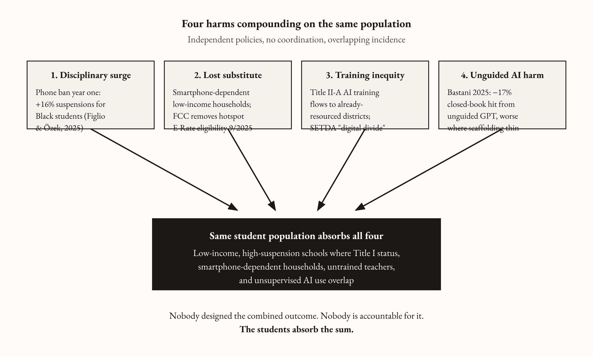
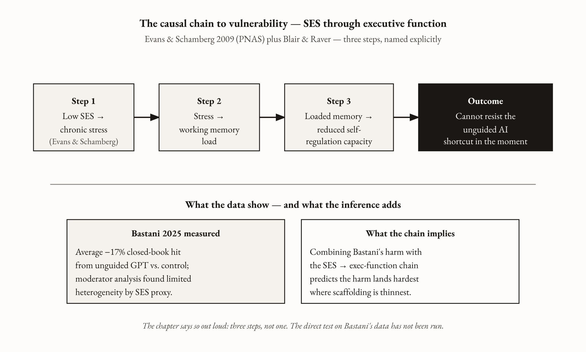
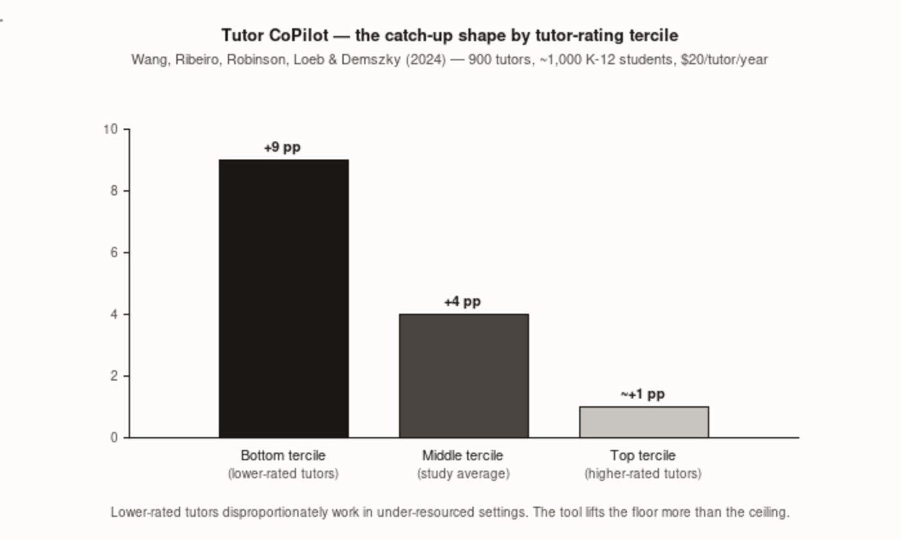

# The Equity Argument

*On why every failure in this book lands hardest on the students who can least afford it — and what the evidence says to do about it*

---

She is a twelfth grader in a high-suspension school in a Florida district. It is the fall of 2024, the first year of the bell-to-bell phone ban, and she has her phone. She knows she has her phone. The rule is new and the enforcement is uneven and she has had it out twice today, and the second time was the conversation that ended with the vice principal and the hallway and the paperwork. She is seventeen. She is six months from graduation. She is now sitting in the office instead of the statistics class where, in this particular window of this particular year, her teacher was doing something that would have been on the test.

The phone ban produced real gains. The research is clear on this. Chapter 1 showed it. By year two, test scores were up and the disciplinary surge had resolved. But the disciplinary surge was not distributed evenly across the first year, and it did not fall in a random place. David Figlio and Umut Özek's NBER working paper documented roughly a sixteen percent short-term increase in suspensions for Black students in the first year of this district's ban, concentrated in male students, dissipating as the test-score gains arrived. White and Hispanic students showed near-zero change. The benefits came for everyone. The costs came first, and they came for specific people.

She is one of the specific people.

What makes this a story about AI and teacher training rather than a story about phones and discipline is the sentence underneath it. She was not the student most likely to have a trained AI-using teacher. She was not the student most likely to have a home broadband connection after the school day ended. She was not the student most likely to encounter a generative AI tool with a scaffolded curriculum around it rather than as an unsupervised shortcut on a homework assignment. She was not the student most likely to be in the school whose teachers received the most professional development dollars. In every distribution this book has documented across eleven chapters, she is at the bottom — not by accident, not by coincidence, but as the predictable result of facially neutral policies landing on an unequal field.

This chapter names that pattern. Then it refuses the easy conclusion.

*Figure 11.01 — Four harms compounding on the same population*

---

## Four harms, landing together

There are four specific harm vectors running through this book. Each is documented on its own. The equity chapter's job is to put all four in the same room and name the population they share.

The first is the disciplinary surge. The sixteen percent figure from Figlio and Özek is the conservative read; the heterogeneity analysis concentrated it among Black male students at considerably higher rates. [*verify: confirm the race × sex subgroup breakdown against the published heterogeneity tables; fall back to "sixteen percent for Black students overall, concentrated in male students" if the sex-specific number does not appear in the working paper.*] The Department of Education's Office for Civil Rights data show that Black students are suspended at roughly three times the rate of white students for comparable infractions, a pattern the GAO confirmed at national scale in 2018. A new enforcement category, applied through the same disciplinary apparatus, produces the same disparity at higher volume. The phone ban did not create this distribution. It interacted with it. And for the twelfth grader sitting in the office during the semester that matters, *year two arriving better* is not the same as *year one arriving without damage.* Some things cannot be recovered at eighteen.

The second is the internet that was the phone. The Pew Research Center's most recent measurement finds that about a third of adults in households earning under $30,000 a year are smartphone-dependent — they have a phone, no home broadband subscription. The comparable figure for households over $100,000 is four percent. Common Sense Media puts the K-12 homework gap at roughly fifteen to sixteen million students. For one in four students from low-income households, the phone is not a distraction device. It is a hotspot. [*verify: "one in four students" slides between population universes — Pew's adult under-$30K is ~33%; K-12 Dive's no-home-internet for low-income households with children is 22%; CSM's homework gap is 15-16M students. Recommend pinning to the K-12 Dive 22% figure (correct student population) or rewording.*] The school's 1:1 Chromebook does not connect to the internet without a connection, and the phone was the connection. The ban removes the distraction from school hours. It also removes the household's path to the internet at 3:00 p.m. Then, on September 30, 2025, the FCC's Order on Reconsideration removed off-premises Wi-Fi hotspots and school-bus Wi-Fi from E-Rate eligibility. Districts and libraries had requested $42.6 million for hotspots and $15.3 million for bus Wi-Fi in FY2025; 1,762 libraries had applied. The state legislatures took the device. The FCC took the substitute. Nobody was coordinating. The students in the overlap are the ones for whom the device was infrastructure rather than convenience.

The gradient by income is the part the policy debate keeps eliding. The Pew measurements line up the dependence by household-income band, and the shape of the dependence is monotonic.

| Household income | Smartphone-dependent (no home broadband) | Has home broadband |
|---|---|---|
| Under $30,000 | ~28% (Pew 2024 adult sample; ~33% in earlier waves) | ~57% |
| $30,000–$74,999 | ~12% | ~78% |
| $75,000–$99,999 | ~7% | ~89% |
| $100,000 and above | ~4% | ~96% |

The phone is not a distraction device in the under-$30K column. It is the household's connection to the internet. The bell-to-bell ban removes the device from school hours; the September 30, 2025 FCC Order on Reconsideration removed the hotspot and school-bus Wi-Fi substitute from E-Rate eligibility in the same policy window.

The third is training inequity stacked on teacher-quality inequity. The SETDA report on Title II-A spending, published in November 2025 from surveys of twenty-four state education agencies and seventy-six local education agencies, found that over sixty percent of the federal stream was spent on professional development — and that only nine states formally prioritized it for educator technology and AI training. Fewer than forty percent of districts used any of the stream for technology-related professional learning at all. SETDA has a name for what this produces: the *digital design divide* — the gap between districts whose teachers get the planning time and coaching infrastructure to actually use AI in lessons and the districts that buy the device and call it done. The gap correlates with district resources. This arrives not on a flat field but on top of an existing teacher-quality distribution that decades of research — Dan Goldhaber and colleagues in Washington State, Charles Clotfelter, Helen Ladd, and Jacob Vigdor in statewide North Carolina end-of-course data — have established is already tilted against disadvantaged students. The teachers most likely to receive AI training were already, on average, the more experienced, more credentialed, lower-turnover practitioners. The teachers least likely to receive it were the less experienced, the higher-turnover, the more burned out. New inequality compounding old inequality. This is not an edge case. It is the structure.

The fourth is cognitive offloading in the rooms where scaffolding was thinnest. Hamsa Bastani and colleagues' 2024 PNAS paper on roughly a thousand Turkish high school students is the cleanest causal evidence we have on what happens when a generative AI tool is deployed without structure. Three arms: control, GPT without guidance, GPT Tutor with pedagogical scaffolding. The unscaffolded GPT arm produced a seventeen percent *decrement* in independent exam performance relative to control — students who had used the tool freely did worse on the test than students who hadn't used it at all. The scaffolded GPT Tutor arm produced gains of one hundred twenty-seven percent on the practice measures. Bastani's own pre-registered moderator analysis found limited statistically significant heterogeneity in the unassisted harm by student characteristics — meaning the paper does not directly show that the harm falls harder on low-income students. I want to be precise about what I am inferring, and I want to name the inference as an inference, because the equity chapter cannot afford to overstate what the data show.

The chain of inference looks like this. Bastani shows an average harm from unguided access. A separate line of research — Evans and Schamberg's 2009 PNAS paper on childhood poverty and working memory, Blair and Raver's program of work on poverty, chronic stress, and the development of executive function — establishes that the self-regulatory systems that would allow a student to resist the in-tool shortcut are, on average, more developed in children who grew up in lower-stress households. A third line — cognitive science on how fluent, frictionless answers produce the feeling of learning without the underlying schema construction — identifies the mechanism by which the shortcut is harmful. The three legs together produce the inference: the student least equipped to resist the unguided tool is the student whose executive function has been most strained by chronic stress. The inference is sound. It is three steps, not one. The chapter says so out loud so the reader can examine each link rather than take the conclusion on faith.

*Figure 11.02 — The causal chain to vulnerability: SES through executive function*

Four harms. Not the same harm, not from the same actor, not coordinated by anyone. Landing on overlapping populations. Compounding. *Compounding* is not metaphor here; it is the empirical pattern of independent harms summing on a population whose capacity to absorb them was already below the mean before any of them arrived. This is the structural shape of every harm this book has documented. Nobody designed the combined outcome. Nobody is accountable for it. The students absorb the sum.

---

## The easy argument the evidence won't support

Having documented the compounding harm, the easy move is to argue that AI is widening gaps and should therefore be deployed less in low-income schools. The evidence will not support this move. The same body of research that documents the harm of AI-without-training documents the benefit of AI-with-training — and shows, consistently, that the benefit is largest precisely where the baseline was lowest.

The in-domain proof is the Wang, Ribeiro, Robinson, Loeb, and Demszky Tutor CoPilot cluster RCT, the one I want to describe one more time because its equity implications are the clearest version of the book's central argument. Nine hundred tutors, over a thousand K-12 students, the FEV Tutor platform, March through May 2024 in a Title I district. Tutor CoPilot monitored the live tutoring session and offered real-time suggestions to the tutor — probing questions, scaffolds, hints drawn from expert practice — while the student saw only the tutor. The cost was twenty dollars per tutor per year. The average gain in topic mastery: four percentage points. The gain for students paired with lower-rated tutors: nine percentage points.

Lower-rated tutors disproportionately work in under-resourced settings. They are the less-experienced, less-credentialed practitioners that programs running on thin margins can afford. The Tutor CoPilot finding is the clearest available demonstration of what happens when you pair AI with the practitioner at the bottom of the skill distribution rather than the top. The tool levels the floor.

*Figure 11.03 — Tutor CoPilot: the catch-up shape by tutor-rating tercile*

The same shape appears in the customer-support literature. Brynjolfsson, Li, and Raymond's *Generative AI at Work* — 5,179 agents, a year of staggered rollout, published in the *Quarterly Journal of Economics* — found an average fourteen percent productivity gain, approximately thirty-four percent for the bottom quartile of pre-AI performance, near zero at the top. The AI was not helping the expert. The AI was doing for the new hire what five years of experience had done for the top performer — surfacing the right move, in the moment, before she had built the intuition to find it herself.

The same shape again in Kang Lan and Ruijie Ban's 2025 meta-analysis of precision-agriculture technology adoption: eighty-five empirical studies, 1,472 farm observations, gains concentrated in farms operating below the efficiency frontier with near-zero returns to farms already at the top. The Fiechter, Schnitkey, and Langemeier panel of 570 Kansas farms over twenty-one years found it in a single sentence: *less efficient farms gain the most from precision agriculture technology.* Three professions, one shape. The tool lifts the bottom. The tool has almost nothing to offer the people who were already at the frontier.

The same shape appears in three independent literatures, each with its own data, its own outcome variable, its own measurement instrument. Treat the consistency as the finding.

| Domain | Sample | Gain at the bottom (below frontier) | Gain at the top (already at frontier) |
|---|---|---|---|
| Tutoring (Wang, Ribeiro, Robinson, Loeb & Demszky 2024 — Tutor CoPilot RCT) | 900 tutors, ~1,000 K-12 students, Title I district | +9 percentage points in mastery for students with lower-rated tutors | Near zero for students with higher-rated tutors |
| Customer service (Brynjolfsson, Li & Raymond 2023 — *Generative AI at Work*) | 5,179 agents, year of staggered rollout, QJE | ~34% productivity gain for bottom-quartile pre-AI performers | Near zero for top-quartile performers |
| Precision agriculture (Lan & Ban 2025 meta-analysis; Fiechter et al. Kansas panel) | 85 empirical studies; 1,472 farm observations; 570 Kansas farms over 21 years | Gains concentrated in farms operating below the efficiency frontier | Near-zero returns for farms already at the top |

Three professions, one shape. The tool lifts the bottom. It has almost nothing to offer the people who were already at the frontier.

This is the finding the equity argument requires. Not that AI is good for disadvantaged students in the abstract. Not that AI is a free equalizer. That a specific deployment pattern — trained practitioner using AI as instrument, with the largest gains going to the practitioner furthest from the frontier — fits the evidence across multiple independent literatures. The inference to teaching follows the same logic the book has been making from Chapter 5 onward. The teacher who would gain the most from sustained AI training is the teacher in the under-resourced school. The student who would gain the most from her trained, AI-supported practice is the student in her classroom.

The harm from AI-without-training falls disproportionately on disadvantaged students, for the reasons §1 documented. The benefit from AI-with-training falls disproportionately on the same students, because the catch-up effect is a property of how far below the frontier you started. Both distributions, harm and benefit, point to the same investment: trained teachers in high-need schools, funded first. The equity argument is not against AI. It is against the version of AI deployment — device-first, training-optional, teacher-as-afterthought — that produces the harms and forfeits the gains.

---

## The critical literature, taken seriously

There is a serious scholarly tradition arguing that AI in schools will widen gaps rather than narrow them, and I want to engage it on its own terms rather than dismiss it, because some of it is right about important things.

The Brookings Institution has been the most consistent voice in this register. The U.S. Commission on Civil Rights' November 2024 report on AI in K-12 education concluded that AI "has the potential to reinforce patterns of discrimination and disparate impact faster, more efficiently, and in a way that is less transparent than previously seen." The Stanford Center for Racial Justice's June 2024 analysis identifies a specific predictive-analytics risk: models trained to minimize prediction errors overall may over-identify Black and Hispanic students as "at-risk" and route them toward lower-expectation interventions. Safiya Noble's *Algorithms of Oppression,* Ruha Benjamin's *Race After Technology,* Cathy O'Neil's *Weapons of Math Destruction* — this tradition has a decade of documented cases where algorithmic systems encoded historical bias into operational decisions, with disparate impact on exactly the students this chapter is concerned with. Adaptive learning systems trained on disengagement signals can route low-engagement students to easier content rather than to better instruction. "Personalization" at scale, without pedagogical scrutiny, becomes tracking — another way of lowering expectations for students whose prior patterns of disengagement were themselves the product of inadequate instruction and unequal conditions.

The chapter's response is not that this literature is wrong. The chapter's response is that this literature is documenting precisely the failure mode of AI-without-trained-teachers, and that it therefore supplies the strongest available argument *for* the AI+1 deployment pattern this book defends. The bias story is what happens when the model is the decision-maker. When the trained teacher is between the model and the student — making the judgment call about whether the AI's suggestion fits this student on this day, catching the moment where the tool would nudge toward the lower track, choosing the probing question over the generic praise the model would otherwise default to — the teacher is the bias-mitigation mechanism. The AI+1 model puts the human judgment in that position explicitly. What the critical literature describes as the harm of deployment-by-algorithm is not an argument against deployment-by-trained-teacher. It is the clearest possible argument for one.

This is a substantive wager. Whether trained-teacher oversight can reliably catch the bias the model would otherwise enact is not a settled empirical question. The mechanism is identified. The replication across classroom contexts is incomplete. I will not pretend the wager is more settled than it is. What I will say is that the alternative the critical literature implicitly proposes — no AI in low-income schools, or AI only in monitored and restricted forms — forfeits the gains the catch-up evidence says those schools would receive. The bias risk is real and deserves a serious response. A serious response is trained teachers equipped to catch what the model gets wrong. A serious response is not declining to send the tool to the classrooms where its gains would be largest.

The other serious counter-position is the model that sells AI as the replacement for the trained teacher altogether. Alpha School, the private Texas school built around what it calls "2-Hour Learning," and the Unbound Academy charter expansion that opened in Arizona in fall 2025 after rejections in Pennsylvania, Utah, Arkansas, North Carolina, and Texas, represent the loudest 2025 version of this model. [*verify: confirmed rejections are PA, UT, AR, NC — Texas rejection not surfaced in available reporting; either source Texas or remove from the list.*] The marketing claim: students master core academics in two hours of AI-assisted instruction per day, with the balance devoted to passion projects, with reported performance in the top one to two percent nationwide.

Dan Meyer — the former Desmos chief academic officer, one of the more careful EdTech critics working today — has published the most thorough reading of Alpha's numbers. His conclusion: the marketing conflates the AI tool with the elite human infrastructure surrounding it. The five-to-one staff-to-student ratio of engaged, trained guides. The motivated, selected families. The tuition well above $40,000 at the founding campus. The student body that did not arrive randomly. The replicable component of the Alpha bundle is small. The marketing claim is that the replicable component is the AI. Scott Alexander's review of Alpha's published MAP score data found gains that were real but substantially less dramatic than the marketing numbers, confounded by selection effects severe enough that the causal claim cannot be verified from what has been published.

The state-level charter rejections — Pennsylvania, Utah, Arkansas, North Carolina, Texas — cited in most cases the absence of measurable academic goals tied to state assessments and the lack of independent research on the instructional model. Arizona approved on a four-to-three vote with reduced enrollment caps. The pattern in the rejections is not hostility to AI. It is the ordinary rigor a charter authorizer brings to a model whose marketing has outrun its evidence.

The equity reading of Alpha is the inverse of its sales pitch. Alpha is not evidence that the book's argument is wrong. Alpha is the case study of the model the book argues against: AI presented as teacher-replacement, offered at private-school tuition or through selective charter slots, with the actual lift coming from human infrastructure that is being misattributed to the algorithm. The under-resourced public school gets neither the $40,000 tuition nor the five-to-one ratio. What it gets, if it replicates the Alpha model, is the AI without the surrounding human infrastructure — which is, in the Bastani data, the arm that produced a seventeen-percent harm. Alpha is selling the first model. The evidence supports the second. The two are not the same thing, and they should not be presented as the same thing to the school districts trying to figure out how to spend limited resources wisely.

---

## The central claim, stated plainly

Every problem this book has documented concentrates at the bottom of the distribution. The year-one disciplinary surge fell on Black male students. The double subtraction of device plus substitute fell on smartphone-dependent households. The AI training gap fell on the schools with the highest turnover and the thinnest professional development budgets, on top of a teacher-quality distribution already tilted against disadvantaged students. The cognitive-offloading harm fell where self-regulation has been most strained by poverty and chronic stress. Nobody engineered the combined outcome. Nobody had to. An unequal field absorbs neutral policies unequally, and the sum of four unequal absorptions is a deeper inequality than any one of them produced alone.

The same bottom of the distribution is where the gains would be largest if the investment is made correctly. The Tutor CoPilot gap — four points average, nine points for students with lower-rated tutors — is the equity argument in a single finding. The Brynjolfsson distribution — fourteen percent average, thirty-four percent for the bottom quartile — is the same finding in a different profession. The Kansas farm panel is the same finding in a third. The consistent shape across independent literatures is that AI augmentation returns the largest gains to the operators who started furthest below the frontier, and those operators' students are the students who were already most disadvantaged.

The central claim of this chapter is not that AI is good for low-income students. It is that the trained teacher using AI as an instrument is the variable that determines whether the harm compounds or the gain arrives, and that the students who most need the gain are in the classrooms where the teacher is least likely to have received the training that would produce it. The policy that fits the evidence is not less AI in under-resourced schools. It is the training infrastructure described in Chapter 8, allocated first to the schools where the baseline is lowest and the catch-up effect will therefore be largest.

The harms compound at the bottom. So do the gains. The decision about which one happens is a budget decision. It is sitting on your desk.

---

## What this means Monday morning

Five things a Title I principal or low-income-district leader can do this week. None require federal action or state legislation. All require a decision.

*Run the catch-up math.* Pull two numbers: your current per-teacher AI professional-development spend, and your annual Title II-A allocation. The SETDA data say most districts spend less than five percent of the Title II-A stream on technology and AI professional development, and only nine states even prioritize it. Your district almost certainly has headroom you have not used. The audit is a one-week exercise. The conversation it enables — *we have the technical authority to redirect this stream toward sustained AI coaching in our highest-need schools, and we are currently not exercising it* — is the conversation that has to happen before anything else changes.

*Saturate three buildings first.* The instinct in equitable resource allocation is to spread thin. The catch-up evidence says the opposite: gains are largest where the baseline is weakest, provided the dose clears the threshold. The Yoon finding is unambiguous — professional development below fourteen contact hours produces no detectable practice change. Pick three Title I buildings. Calculate the cost of a tutor teacher in each — one practitioner, one section of load coverage, the rest of her time in structured coaching cycles with her colleagues on AI-supported practice. The cost is one teacher salary per building per year. Compare that number to your last phone-pouch contract. Compare it to the last hardware refresh. The trade is your decision this fiscal year.

*Audit the AI dividend.* The Walton Family Foundation–Gallup survey data find that teachers using AI weekly save roughly six hours per week in administrative and preparation time. That dividend exists where teachers have been trained well enough to use the tools fluently. In your district, find out: where is the dividend going? If it is concentrated in the schools whose teachers already had the most preparation, the dividend is regressive — it is compounding the advantage of the schools that were already better resourced. What would it cost to extend it to the three buildings where it is currently zero? That question is the budget question the audit produces.

*Address the home-broadband gap before the phone ban deepens it.* Pull the ACS five-year estimates for home broadband penetration in your district, broken out by school attendance zone. Identify the families cut off by the FCC's E-Rate rescission. Decide whether the district will provide an alternative — supervised after-school technology access, a partnership with the public library system, an evening-hours computer lab. If yes, name the cost. If no, name the equity consequence. The decision that does the most damage is the one that gets made silently, by default, because no one in the budget conversation was asked to weigh it.

*Write the educational-purposes exemption with your teachers.* If the state phone ban is in effect, the exemption the legislature handed back to classroom teachers is the policy surface where their judgment will operate — and where the quality of that judgment, which is a function of their training, will determine whether the exemption helps students or not. Convene a working group that includes the AI-fluent teachers you already have. Draft an operational definition specific enough that two teachers in different buildings would reach the same defensible answer on the same case. Pilot it for one semester. Revise it. The training is the precondition. The exemption is where the training does its work.

None of these is Washington's decision. None is the state legislature's. All of them are yours. The cohort of trained teachers the country needs will not be assembled by a federal initiative. It will be assembled by district leaders making these trades, building by building, until the cohort exists. The buildings where the trades matter most are the ones where the baseline is lowest. The catch-up evidence says those are also the buildings where the trades pay off the most.

---

## The chapter's turn

The four harms named at the start are not arguments against AI in education. They are arguments against AI-without-the-trained-teacher in education, applied to the population for whom the distinction matters most. The three converging literatures — tutoring, customer service, agriculture — are not arguments that AI will automatically equalize. They are arguments that a specific deployment pattern produces its largest gains at the bottom of the distribution, where the gap between where the practitioner started and where the frontier sits is largest.

The harm and the benefit point in the same direction. Both are determined by the same variable. The harm is what happens when the trained teacher is absent. The benefit is what happens when she is present. The students at the bottom of the distribution bear the most of the first and have the most to gain from the second. The policy that fits the evidence is the one that puts trained teachers in those classrooms first — not as an equity gesture, not as supplementary funding around the edges, but as the primary deployment pattern, the place where the training investment has the highest return, the logical starting point for anyone who has read this evidence and taken it seriously.

The twelfth grader in the office missed her statistics class. She will take the test next week anyway. Whether she has a teacher who has been trained to use the tools her students are using, or a teacher who is navigating the same tool landscape her students are navigating, alone, without support, with an August vendor demo as her only preparation — that is a distribution question, not a technology question. The technology is already in the room. The question is who is in the room with it.

---

## What the research leaves open

Whether AI deployment is widening or narrowing K-12 achievement gaps overall is empirically open. The existing PISA evidence predates the post-2022 generative-AI era. PISA 2025 will be the first round to include digital learning as a domain; PISA 2029 will include AI literacy. The prediction this chapter makes — AI plus training narrows gaps, AI without training widens them — is a prediction the next two PISA rounds will test. [*verify: PISA 2025 release date once OECD's release calendar is updated.*]

Whether the Tutor CoPilot heterogeneity result replicates in full classroom settings, across subjects, with different demographic populations, is genuinely open. The cluster RCT is rigorous within its frame. Replication outside the frame is the obvious next research priority. If the nine-percentage-point gain for lower-rated tutors does not replicate, the in-domain pillar of the equity argument weakens and the case rests more heavily on the cross-profession evidence, which is strong but is a generalization step.

Whether trained-teacher oversight can reliably catch the bias a model would otherwise enact — the chapter's deepest empirical wager — has not been adequately tested. The mechanism is identified. The research program to test it has not been built. A serious investigation of teacher AI literacy as bias-detection practice, with downstream measurement of which biases get caught and which slip through, is the most important piece of research this chapter's argument requires and does not yet have. Until it is run, the chapter is making the strongest case the existing evidence supports, while being honest that a central pillar of that case rests on a mechanism the field has not yet measured at the scale the claim requires.

## Still puzzling

The Bastani RCT data exist. The SES proxies required to run a moderator analysis on the unguided-GPT harm by household income exist. No major foundation or federal funder, in the 2024–2026 window, appears to have commissioned the analysis. The question — does the Bastani harm fall harder on low-income students, and by how much — is consequential for every resource allocation in this book's last three chapters. It is answerable with the data already collected. It has not been answered. Why not is a question about research priorities and funder incentives that this chapter cannot answer. It is a question someone should be asking.

---

## References

**Phone-ban heterogeneity / disciplinary disparities**

- Figlio, D., & Özek, U. (2025). Bell-to-Bell Bans and the Heterogeneous Costs of Eliminating Smartphones from Schools. *NBER Working Paper 34388.* [https://www.nber.org/papers/w34388](https://www.nber.org/papers/w34388)
- U.S. Government Accountability Office (2018). *Discipline Disparities for Black Students, Boys, and Students with Disabilities.* GAO-18-258. [https://www.gao.gov/products/gao-18-258](https://www.gao.gov/products/gao-18-258)

**Connectivity / broadband gap**

- Pew Research Center (2024). *Mobile Fact Sheet.* [https://www.pewresearch.org/internet/fact-sheet/mobile/](https://www.pewresearch.org/internet/fact-sheet/mobile/)
- Common Sense Media. *Closing the K-12 Digital Divide / Homework Gap research.* [https://www.commonsensemedia.org/research](https://www.commonsensemedia.org/research)
- FCC 25-63 Order on Reconsideration (September 30, 2025). [https://docs.fcc.gov/public/attachments/FCC-25-63A1.pdf](https://docs.fcc.gov/public/attachments/FCC-25-63A1.pdf)

**Training / teacher-quality distribution**

- State Educational Technology Directors Association (SETDA, November 2025). *Improving Professional Learning Systems to Better Support Today's Educators.* [https://www.setda.org](https://www.setda.org)
- Goldhaber, D., Lavery, L., & Theobald, R. (2015). Uneven Playing Field? Assessing the Teacher Quality Gap Between Advantaged and Disadvantaged Students. *Educational Researcher*, 44(5), 293–307. [https://journals.sagepub.com/doi/10.3102/0013189X15592622](https://journals.sagepub.com/doi/10.3102/0013189X15592622)
- Clotfelter, C. T., Ladd, H. F., & Vigdor, J. L. (2010). Teacher Credentials and Student Achievement in High School: A Cross-Subject Analysis with Student Fixed Effects. *Journal of Human Resources*, 45(3), 655–681. (Statewide North Carolina end-of-course data.) [https://muse.jhu.edu/article/383569](https://muse.jhu.edu/article/383569)

**Cognitive offloading and poverty / executive function**

- Bastani, H., Bastani, O., Sungu, A., Ge, H., Kabakcı, Ö., & Mariman, R. (2025). Generative AI without guardrails can harm learning. *PNAS*, 122(26), e2422633122. [https://www.pnas.org/doi/10.1073/pnas.2422633122](https://www.pnas.org/doi/10.1073/pnas.2422633122)
- Evans, G. W., & Schamberg, M. A. (2009). Childhood poverty, chronic stress, and adult working memory. *PNAS*, 106(16), 6545–6549. [https://www.pnas.org/doi/10.1073/pnas.0811910106](https://www.pnas.org/doi/10.1073/pnas.0811910106)
- Blair, C., & Raver, C. C. (2015). School readiness and self-regulation: A developmental psychobiological approach. *Annual Review of Psychology*, 66, 711–731. [https://www.annualreviews.org/doi/10.1146/annurev-psych-010814-015221](https://www.annualreviews.org/doi/10.1146/annurev-psych-010814-015221)

**Catch-up / cross-profession evidence**

- Wang, R. E., Ribeiro, A. T., Robinson, C. D., Loeb, S., & Demszky, D. (2024). Tutor CoPilot: A Human-AI Approach for Scaling Real-Time Expertise. arXiv:2410.03017. [https://arxiv.org/abs/2410.03017](https://arxiv.org/abs/2410.03017)
- Brynjolfsson, E., Li, D., & Raymond, L. (2023). Generative AI at Work. *NBER Working Paper 31161.* [https://www.nber.org/papers/w31161](https://www.nber.org/papers/w31161)
- Lan, K., & Ban, R. (2025). Precision agriculture technologies meta-analysis. *Sustainability*. [https://www.mdpi.com/journal/sustainability](https://www.mdpi.com/journal/sustainability)
- Fiechter, C. M., Brewer, B. E., Ifft, J. E., & Boehlje, M. (2025). Farm Efficiency and Precision Agriculture Technology. *Journal of Agricultural and Applied Economics.* [https://www.cambridge.org/core/journals/journal-of-agricultural-and-applied-economics](https://www.cambridge.org/core/journals/journal-of-agricultural-and-applied-economics)
- Di Pietro, G., & Castaño Muñoz, J. (2025). Technology and disadvantaged students: a meta-analysis (Cohen's *d* = 0.202 for technology effects on disadvantaged students). *Computers & Education.* [https://www.sciencedirect.com/journal/computers-and-education](https://www.sciencedirect.com/journal/computers-and-education)

**Critical literature on AI bias / algorithmic harm**

- U.S. Commission on Civil Rights (November 2024). *The Civil Rights Implications of the Federal Use of Facial Recognition Technology and Artificial Intelligence in K-12 Education.* [https://www.usccr.gov](https://www.usccr.gov)
- Stanford Center for Racial Justice (June 2024). *AI in Education: Civil Rights Considerations.* [https://law.stanford.edu/projects/stanford-center-for-racial-justice/](https://law.stanford.edu/projects/stanford-center-for-racial-justice/)
- Noble, S. U. (2018). *Algorithms of Oppression: How Search Engines Reinforce Racism.* NYU Press.
- Benjamin, R. (2019). *Race After Technology: Abolitionist Tools for the New Jim Code.* Polity.
- O'Neil, C. (2016). *Weapons of Math Destruction.* Crown.

**Alpha School / Unbound counter-evidence**

- Meyer, D. (2025). Reading the Alpha School numbers. [https://dydan.substack.com](https://dydan.substack.com)
- Alexander, S. (2025). Notes on Alpha School MAP scores. [https://www.astralcodexten.com](https://www.astralcodexten.com)
