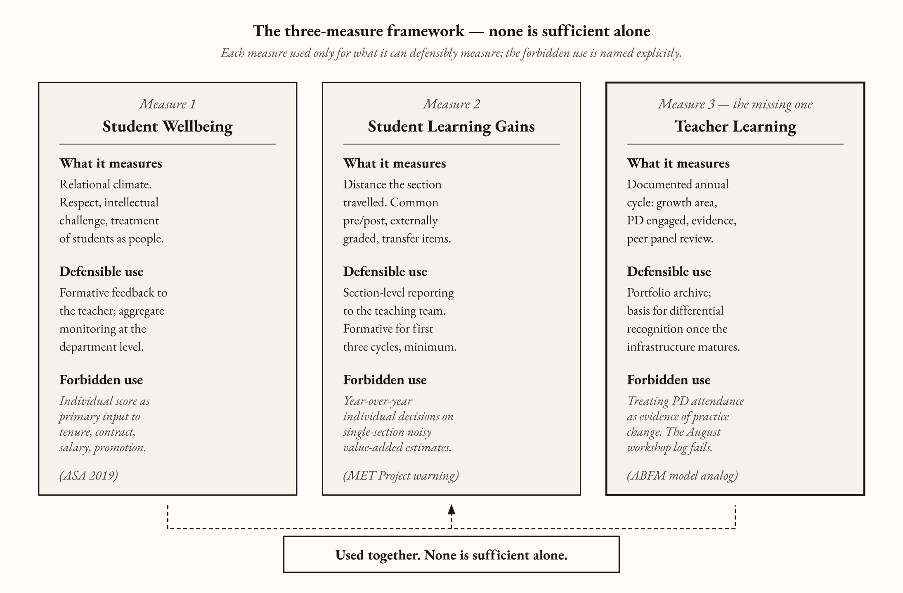

# Appendix B — The Three-Measure Evaluation Framework

*A practical implementation guide for the superintendent, school board, and HR director who want to add student learning gains and teacher learning measures alongside the satisfaction survey they already run — without provoking a contract renegotiation that takes three years.*

---

## Who this appendix is for

This appendix is written for the district leader who has read Chapter 10 and has the formal authority to act on it: superintendents and their cabinets, school board members and their counsels, district human-resources directors, and the principals who run buildings inside whatever framework these officers approve. The audience is American, K–12, working inside the operational realities of a U.S. school district — a negotiated collective-bargaining agreement, a state-mandated educator-evaluation framework (most likely Charlotte Danielson's *Framework for Teaching* or the Marzano Focused Teacher Evaluation Model or a locally-adapted hybrid), a Title II-A allocation that mostly funds workshops, and an annual evaluation cycle that delivers a single composite score to each teacher's personnel file. You probably did not design the system you are operating inside. You can, in most cases, change how it is used without rewriting it.

## The argument in one paragraph

The instrument American education uses to make tenure and contract decisions — the student satisfaction survey — measures something real, but not the thing it is being used to measure. The correlation between student ratings and student learning, in the most methodologically careful synthesis ([Uttl, White, and Gonzalez Morales 2017](https://www.sciencedirect.com/science/article/pii/S0191491X16300323)), is approximately zero. The instrument is biased against women and faculty of color in ways large enough to invert rankings in identical courses ([Boring, Ottoboni, and Stark 2016](https://www.scienceopen.com/document?vid=818d8ec0-5908-47d8-86b4-5dc38f04b23e)). The U.S. Air Force Academy's natural experiment ([Carrell and West 2010](https://www.journals.uchicago.edu/doi/10.1086/653808)) demonstrated that the same instrument systematically promotes instructors who produce comfort over learning and dismisses the ones producing it. The American Sociological Association recommended in 2019 against using the instrument as the primary basis for personnel decisions. Three measures, used together, replace the single instrument: student wellbeing (the existing survey, used for what it can defensibly measure), student learning gains (pre-post common assessment, externally graded, reported at section level), and teacher learning and improvement (an annual documented cycle modeled on the medical Maintenance of Certification structure). The third measure is the one nobody currently takes. Its absence is why the trained AI+1 teacher this book argues for cannot, today, be rewarded by the system she works inside.

## The framework

Three measures. None is sufficient alone. Each is used only for what it can defensibly measure. The forbidden use for each is named explicitly, because the failure mode of the current system is exactly the use the literature does not support.

*Figure B.1 — The three-measure framework: none is sufficient alone.*

### Measure 1 — Student Wellbeing

The instrument you almost certainly already have is some version of the IDEA student perception survey, the ETS Student Instructional Report II, or a locally-administered Likert-scale instrument the district built in the 1990s and has been administering ever since. Keep it. The instrument is psychometrically defensible at what it reliably measures, which is whether students felt respected, intellectually challenged without being humiliated, and treated as people rather than as enrollment units. That dimension matters. [Hattie's synthesis of meta-analyses](https://www.visiblelearningmetax.com) places teacher-student relationships at *d* ≈ 0.72 and psychological safety at *d* ≈ 0.44. The relational climate of a classroom is real, and the student-perception instrument partially captures it.

What changes is the use. Two narrower purposes remain, and one — the one the current system makes its primary use — has to stop.

The first purpose is *formative feedback to the teacher.* Send the results — including the open-ended comments preserved verbatim, not aggregated into a numeric rollup — directly to the instructor. Let her decide what to do with them. If she has a coaching relationship through which to act on the information (and the third measure builds that infrastructure deliberately), the instrument becomes a professional development tool. This is the use [Kraft, Blazar, and Hogan 2018](https://scholar.harvard.edu/files/mkraft/files/kraft_blazar_hogan_2018_teacher_coaching.pdf) identify as the high-leverage one across sixty causal studies of coaching: structured reflection on real student response, with a peer practitioner to debug the next cycle. The instrument fits this use because the user is the teacher and the consequences are her own.

The second purpose is *aggregate, department-level monitoring.* Pool the results above the level of the individual instructor — by department, by grade band, by school. The question at the aggregate level is not *is this woman a worse teacher than this man* (the answer to which is, as Boring and Stark documented at the population scale across 23,001 evaluations, contaminated by gender bias large enough to invert rankings) but *is this department generally a place students feel respected and intellectually supported.* The gender and racial biases partly wash out at the aggregate level. The signal that remains is interpretable.

The forbidden use is the one most American districts currently make: individual scores as the primary input to contract renewal, tenure, salary, or promotion. The [ASA 2019 statement](https://www.asanet.org/wp-content/uploads/asa_statement_on_student_evaluations_of_teaching_feb132020.pdf) — the position of the professional society of the discipline whose members built the SET literature — is unambiguous on this point. Continuing to use the instrument this way in 2026 is doing so against the recommendation of the professional society that knows the evidence best, in the face of independently replicated bias data across multiple countries, and against a coherent legal-exposure trend that has been accumulating since Boring and Stark published. The institutional inertia required to stop is, by this point, less than the legal exposure of continuing.

The instrument selection for Measure 1 is therefore almost entirely a policy decision, not a procurement decision. If you already administer a student-perception survey, you have what you need. If you are buying a new one, the criterion is *which instrument best surfaces the relational signal you intend to use for formative feedback,* not *which instrument best predicts learning.* No instrument in this category predicts learning. The Carrell-West reversal explains why: comfort and learning diverge regularly, and the instrument cannot distinguish *this teacher was ineffective* from *this teacher was making me learn something I did not yet know I would need.*

### Measure 2 — Student Learning Gains

This is the measure most American districts do not have at all, and the one where the design choices matter most because the failure mode is the most familiar: high-stakes accountability testing that teaches to the test, narrows the curriculum, and produces a generation of students who can execute the specific problem types on the assessment without the foundational understanding that transfers to anything else. The Carrell-West finding is the explicit warning. The instructors who drilled to the Calc I final produced students who failed Calc II. A pre-post system with a shallow post-test reproduces that pathology at scale.

The structural design that survives the Carrell-West warning has six features, each of which exists because removing it produces a specific failure mode the literature has documented.

*Figure B.2 — Six design features for Measure 2, paired with the failure mode each prevents.*

*Pre and post administration on common, externally-constructed items.* The same instrument given at the start of the course and at the end. *Common* means every section of the same course uses the same items, so that gains are comparable across sections. *Externally-constructed* means the items are not written by the instructor whose gain score is being measured, because if they were, the instructor would optimize her teaching to her own items rather than to the underlying understanding the items are supposed to sample.

*External grading.* Not graded by the section's own instructor. The district can do this with cross-grading (Mrs. Patel's students' post-tests graded by Mr. Okafor, Mr. Okafor's by Mrs. Patel) or with a small central scoring panel paid by the hour during the assessment window. Either works. Self-grading does not. The incentive to inflate gain scores through lenient marking is identical to the incentive to inflate course grades through lenient marking that [Stroebe 2020](https://doi.org/10.1080/01973533.2020.1756817) documents, and the countermeasure is identical: take the marking out of the instructor's hands.

*Section-level reporting.* The unit is the section, not the individual student and not the individual teacher's career composite. A specific teacher's value-added estimate has confidence intervals wide enough that a teacher labeled "bottom five percent" in one year can be average the next year purely by statistical noise — this is the qualifier [Chetty, Friedman, and Rockoff 2014](https://eml.berkeley.edu/~saez/course/chettyetal_2014a.pdf) named explicitly even as their population-level findings established that teacher effects on lifetime earnings are real and large. The Measures of Effective Teaching project ([Kane, McCaffrey, Miller, and Staiger 2013](https://files.eric.ed.gov/fulltext/ED540959.pdf)) confirmed the same point: even the best multi-measure composite has measurement error large enough to differentiate top quartiles from bottom quartiles, not large enough for the year-to-year individual personnel decisions districts attempted to make from it in the value-added era. Section-level reporting respects the noise. Individual year-over-year reporting pretends the noise is not there.

*Pre-test as the ability control.* The gain — the distance the section traveled — is what is reported, not the raw post-test score. A section that began with stronger students does not receive credit for what those students already knew. A section that began behind does not get penalized for the starting place.

*Transfer items, not just fluency items, on the post-test.* This is the Carrell-West countermeasure. Include items the teacher cannot drill toward — application problems the student has not seen the format of, items that require synthesis across the course's content. Where possible, validate the post-test against performance in the subsequent course. If the students who scored well on the post-test of Algebra I also did well in Algebra II, the post-test is measuring something that transfers. If they did not, the post-test is measuring fluency on the items themselves and the gain score is the wrong number to optimize.

*No individual personnel stakes attached, at least for the first three years.* This is the Finnish principle. [FINEEC](https://karvi.fi/en), the Finnish Education Evaluation Centre, runs national assessments on a sample basis rather than census basis, with no individual-student or individual-teacher stakes, used to inform practice rather than punish individuals. The model is operationally workable at national scale. It has held in Finland for the better part of two decades. The U.S. version of this principle, at the district level, is that the learning-gains measure is reported, archived, used for formative reflection by the teaching team, but not — initially — connected to contract renewal, salary, or tenure. The reason is partly political (the high-stakes testing era produced exactly the political backlash that any new accountability measure will trigger if it arrives stakes-attached) and partly empirical (the measurement error in any one section's gain is too large to defend personnel decisions on a single year of single-section data).

The instrument selection for Measure 2 depends on what the district already has. For tested subjects in tested grades — mathematics and ELA in grades 3 through 8, plus high school end-of-course exams — the state assessment infrastructure can be repurposed as the post-test if the state allows it. For untested subjects and grades, the district has to build the assessment with the teaching faculty, which is hard work and is also the substantive curriculum conversation the department should be having anyway. The pilot recommendation below starts where the work is easiest: a single department with multiple sections of a common-curriculum course.

### Measure 3 — Teacher Learning and Improvement

This is the measure nobody currently takes. Its absence is why everything else in this book is hard to operationalize. You cannot reward teachers for improving if you do not measure whether they are improving. You cannot pay differential salary for an AI+1 credential if you have no instrument capable of distinguishing the teacher who has developed the capability from the teacher who attended the same workshop and has not. You cannot defend a coaching investment to the school board if you have no audit trail proving the coaching produced practice change. The third measure is the precondition for all of it.

The model is the American Board of Family Medicine's [Maintenance of Certification cycle](https://www.theabfm.org/continue-certification/5-year-cycle/). Five years. Sixty certification points in self-assessment and performance improvement. Two hundred CME credits across the cycle. Twenty-five quarterly knowledge-assessment questions written by content experts who update them as the field changes. The questions are low-stakes per question, embedded in normal practice, designed to keep the practitioner's knowledge current against a field that is moving — not a half-day exam every five years that the practitioner crams for and forgets. The structure is the opposite, in every dimension, of what most American teachers experience as the audit of their professional learning.

The third measure, ported into teaching, is a documented annual or biennial cycle with four components.

*Figure B.3 — The Measure 3 annual cycle, modelled on Maintenance of Certification.*

*An identified growth area.* The teacher names, at the start of the cycle, the specific area she intends to grow her practice in. For most teachers in 2026 this will reasonably include AI-specific practice — using a tool well in her subject and grade, designing assignments where the fluency the AI provides is not the assessment, integrating formative AI tools into her existing routines. The growth area is not generic ("become a better teacher"). It is specific ("develop a defensible practice for using AI in the formative-feedback step of my seventh-grade writing workshop") and connected to the third-measure documentation downstream.

*Professional development engaged with.* What did the teacher do — coursework, coaching cycles, study groups, peer observation, conference participation, independent reading — that is connected to the growth area. The unit here is not the seat hour. It is the documented engagement with sustained content on the named growth area. Chapter 13 of this book is the no-cost version of the answer for AI specifically: HarvardX, MITx, Stanford Online, Carnegie Mellon equivalents are free or near-free, and a one-page memo from the superintendent's office naming what counts as fulfilling the requirement closes the recognition gap by Wednesday.

*Evidence of practice change.* This is the load-bearing component, and the one most current systems have no infrastructure for. The teacher produces a portfolio: classroom observation by a peer coach (the Finnish *tutoropettaja* model adapted to a U.S. building, described in Chapter 8), teacher-produced artifacts (lesson plans, assignment redesigns, formative routines), video of the changed practice where the teacher is willing and the technical infrastructure exists, student work that displays the new practice's effect, the teacher's own narrative reflection on what changed and why. The components are flexible. The discipline is that *something* documenting the practice change has to be produced, reviewed, and archived.

*Peer panel review.* The review mechanism is the same one districts already use for [National Board Certification](https://www.nbpts.org) renewals — a panel of credentialed peers from the same subject area, using a structured rubric, providing written feedback to the teacher and a defensible determination to the district. Most districts already have this infrastructure for the small fraction of teachers (roughly three percent of the workforce nationally) who pursue NBPTS certification. Scaling it to all teachers requires capacity, but it does not require invention. The mechanism exists. The political problem is funding the peer time. The structural problem is identifying enough peer reviewers in the smaller subject areas. Both are tractable. Neither is solved by the procurement office buying a new vendor product.

The forbidden use for the third measure is treating attendance at professional development as evidence of practice change. The pediatrician across the street does not get to renew her board certification by showing up at the conference. She has to show that her practice changed and that her patients' outcomes are consistent with the change. The teacher's analog is the portfolio plus the peer panel. The August vendor workshop attendance log is the failure mode the third measure exists to replace, not the standard the third measure exists to enforce.

### The three measures as a unit

None of the three is sufficient alone. Used together, they replace the single instrument the field has been overusing — and they replace it in a way that designs against the [Carrell and West 2010](https://www.journals.uchicago.edu/doi/10.1086/653808) failure mode the current system reproduces. The teacher who pushes through productive struggle, refuses cognitive offloading, makes the room harder in the precisely calibrated way that produces transfer rather than fluency, will be rewarded under the three-measure system rather than penalized. The student-wellbeing instrument will report on her relational climate (which is not the same as her difficulty level). The learning-gains instrument will report on what her students actually know at the end of the year, including the items they could not have drilled toward. The growth instrument will report on whether she is on a trajectory — whether her practice is changing in response to evidence. The three measures, together, see the work the single instrument cannot see.

The instrument selection summarized:

| Measure | Instrument options that exist | Forbidden use |
|---|---|---|
| 1. Student Wellbeing | IDEA student perception survey, ETS SIR II, locally-built Likert instrument the district already runs | Individual scores as primary input to contract renewal, tenure, salary, or promotion (ASA 2019) |
| 2. Student Learning Gains | State assessment infrastructure where it exists; department-built common pre-post for untested grades and subjects; external grading by cross-section or by central panel | Individual-teacher year-over-year decisions on noisy single-section estimates (MET Project warning) |
| 3. Teacher Learning and Improvement | Annual or biennial documented cycle: growth area + PD engaged + evidence of practice change + peer panel review on the NBPTS renewal model | Treating PD attendance as evidence of practice change (the failure mode of the current system) |

## Adding the three measures to an existing evaluation framework

Most districts are not building from scratch. They are operating inside a state-mandated or locally-negotiated framework — most commonly some version of Charlotte Danielson's *Framework for Teaching* (twenty-two components across four domains, validated as one of the observation protocols in the MET project), the Marzano Focused Teacher Evaluation Model (twenty-three essential competencies, similar adoption history, similar measurement limits), or a hybrid the district built across two decades of negotiated revisions. The realistic question is not "should we replace the framework" — replacement is a multi-year contract negotiation that produces, in most cases, a slightly different version of the same framework — but "how do we add the three honest measures to what we already have, without provoking a renegotiation that takes three years."

The structural answer is that the three measures map cleanly onto domains most existing frameworks already include, with one addition that is genuinely new. The Danielson framework's Domain 2 (the classroom environment) and Domain 4 (professional responsibilities) include components that already partially track wellbeing and growth. The Marzano model's *planning and preparing* and *reflecting on teaching* segments do similar work. What is missing in both is a measure of what students actually learned and a measure of whether the teacher's practice changed in a documented way. The first is addable as an additional input weighted into existing domains. The second requires the genuinely new infrastructure the third measure builds.

The political move that makes this work is to *add* the three measures as supplementary inputs in the first cycle and let the existing framework continue to produce its composite score, with the three-measure data reported alongside as formative information. This is the same political path Tennessee took when it [built TVAAS value-added](https://team-tn.org/wp-content/uploads/2013/08/teamguidebooktvaas.pdf) into the TEAM evaluation framework in 2011 and ran it for fifteen years. The student-growth measure was added to the framework rather than replacing it. The framework absorbed the addition. Massachusetts did something analogous on the practice-goal side. Neither state has yet integrated both with comparable weight, which is the unfinished work this appendix is gesturing toward. The pilot recommendation below starts where the political friction is lowest — formative use, no personnel stakes, one school — and earns the right to expand only after the framework has demonstrated it can produce defensible information.

What the addition cannot do is leave the satisfaction survey untouched in its current role. The whole point of the framework revision is that the survey is being used for a purpose it cannot defensibly serve. The political move on that side is the explicit administrative letter described in Chapter 10's Monday-morning section: a written communication to the teaching staff, on the record, stating that individual student-evaluation scores will no longer be used as the primary basis for contract renewal or tenure decisions, with the ASA statement and the Boring-Stark evidence cited as the reason. The first district to publish this letter will be cited by the second. The letter is one signature.

## A worked implementation timeline

The timeline below assumes the superintendent finishes reading this appendix on a Sunday afternoon. The Monday referenced is the next morning. Specific enough that a district administrator could put it on a project plan.

*Figure B.4 — Implementation timeline: six tracks, Week 1 to Year 3+.*

### Week 1 (the Monday after)

Convene the cabinet — assistant superintendents for curriculum and instruction, HR director, general counsel, board chair if the board chair is operationally engaged. Distribute the appendix and Chapter 10. Frame the conversation as *change of use*, not *replacement of framework*. The instrument the district already has continues to be administered; what changes is how the data are used.

Pull the legal team into a parallel track: have counsel review the [ASA 2019 statement](https://www.asanet.org/wp-content/uploads/asa_statement_on_student_evaluations_of_teaching_feb132020.pdf), the Boring-Stark replicated bias evidence, and the district's current use of student-evaluation data in personnel decisions. The question for counsel is the comparative legal exposure of continuing to use a biased instrument that the relevant professional society has formally recommended against for personnel decisions, versus changing the use in writing. Counsel will, in most cases, prefer the change.

Identify the pilot school. The criterion is volunteer leadership — a principal who has read Chapter 10, wants to pilot the three-measure framework, and has a faculty that will engage rather than resist. One school. Not the whole district. Voluntary participation.

### Month 1

The superintendent issues two written communications, both on the record.

The first is an internal memo to teaching staff explaining that the district has read the SET evidence, will be changing the use of student-evaluation data, and will be piloting a three-measure framework at the named school during the upcoming academic year. The memo cites the ASA statement, the Uttl 2017 meta-analysis, the Boring-Stark bias evidence, and the Carrell-West reversal. The memo is specific about what is changing (individual evaluation scores out of the primary personnel-decision input; aggregate data still used for department-level monitoring; teacher-direct formative feedback preserved) and what is not changing yet (the existing evaluation framework remains the composite-score producer for the first year).

The second is an external communication to the board of education, drafted in coordination with board leadership, formally requesting board endorsement of the pilot. The endorsement is light — *the board endorses the superintendent's authority to pilot a three-measure evaluation approach at one school during the next academic year, with formative use only and no personnel-decision stakes attached during the pilot* — and the language is deliberately narrow because the political work of expansion is downstream.

In parallel, the pilot principal begins faculty engagement at the school. The pilot is opt-in at the teacher level for the first year. Teachers who participate get the three-measure information, used formatively for their own reflection and coaching cycles. Teachers who do not participate continue under the existing framework alone. Both groups are tracked.

The pilot principal and the district curriculum office begin work on the Measure 2 instrument for the pilot. The starting point is a single department with multiple sections of a common-curriculum course — most often mathematics or English in a grade band the district already tests. The common pre-test for the upcoming academic year is selected from existing assessment infrastructure (state assessment, Renaissance STAR, NWEA MAP, a department-built instrument that has been administered for years), with an explicit transfer-items audit conducted by the curriculum office. The department teachers participate in the audit. The conversation that produces the audit is the substantive curriculum conversation the department should have been having anyway.

### Month 3

The pilot school administers the Measure 1 instrument on the regular cycle, but routes the results through the new protocol: open-ended comments preserved verbatim, individual results sent only to the teacher for formative use, aggregate department-level results compiled by the building principal for climate monitoring.

The Measure 2 pre-test administration begins in the selected department. External grading by cross-section pairing is arranged: Mrs. Patel's pre-tests are scanned, anonymized, and routed to Mr. Okafor for scoring; Mr. Okafor's to Mrs. Patel; the cross-grading produces a defensible baseline that neither teacher graded in her own interest. The grading takes one prep period each. The conversation it produces — *what did your students know that mine did not, and what is in the curriculum that explains it* — is a faculty-development event in its own right.

The Measure 3 cycle launches at the pilot school. Each participating teacher identifies a growth area for the year, with the principal and any in-building coaches providing structured conversation about what counts as a tractable growth area. AI-specific practice is a defensible default growth area for most teachers in 2026, given that every teacher is making calls about generative AI in her classroom and most have had no structured support for doing so. The growth-area selection is documented on a one-page template the district HR office produces.

### Year 1

The pilot runs the full academic year. Three artifacts emerge by the end of the year, each by design.

*A Measure 2 gain report.* Section-level gains for every participating section, with the transfer-items subscore reported separately. The report is shared with the participating teachers, the building principal, and the district curriculum office. It is not yet attached to personnel decisions. It is the formative information the teaching team uses to debug what worked and what did not.

*A Measure 3 portfolio for each participating teacher.* Growth area named at the start of the year, PD engaged with documented, evidence-of-practice-change components compiled, peer panel review conducted in the spring with feedback returned to the teacher. The panel for the pilot can be small — three peers from the same subject area, internal to the district, using a rubric adapted from the NBPTS renewal model. The portfolio is the teacher's, archived in her personnel file as a professional record but not yet weighted into a salary or contract decision.

*A pilot synthesis report.* Produced by the district curriculum office and the building principal, this report describes what the pilot learned about each measure's operational viability, what the teachers said about each measure's usefulness, what the political and operational friction points were, and what the district recommends for expansion in Year 2. The report is presented to the board in a public session. The pilot is, by design, transparent. The board's continued endorsement of expansion depends on the report being defensible.

### Year 2 and beyond

Year 2 expands the pilot to a second school, applies what Year 1 learned, and continues running Year 1's school under the same protocol. The Measure 2 instrument is refined based on Year 1 transfer-items findings. The Measure 3 peer-panel mechanism is scaled. The Measure 1 protocol — formative use to teachers, aggregate use to department-level monitoring, no individual-score use in personnel decisions — is generalized district-wide if the Year 1 evidence supports it.

The integration of the three measures with personnel decisions is the work of Year 3 and later. The right sequence is: build the instruments first, prove they produce defensible information, generate the political consent of the teaching workforce by running them as formative for at least two full cycles, and only then negotiate how they enter the personnel-decision composite. Districts that try to attach personnel stakes to the new measures in Year 1 will, predictably, encounter the same political backlash the value-added testing era produced — which the existing evidence base also predicted, and which the slower sequencing exists specifically to avoid.

## Common implementation failure modes

Five failure modes show up in district pilots of new evaluation frameworks often enough that the structural fix for each is worth naming in advance.

*Figure B.5 — Five common failure modes, paired with the structural fixes that prevent them.*

*Failure mode one: the pilot becomes the new high-stakes instrument.* The district pilots Measure 2 with formative-use-only intent, and within eighteen months, board pressure or a new superintendent or a state-policy shift converts the gain scores into a personnel-decision input. The teaching workforce, having been promised formative use, experiences the conversion as a bait-and-switch. The political coalition that supported the pilot fractures. The structural fix is a written commitment, in the board-approved pilot charter, that the formative-use period extends for a named number of years and that conversion to personnel-decision use requires a specific board action with public notice. The commitment will be tested. The written form is the only thing that makes the test survivable.

*Failure mode two: the Measure 2 post-test gets drilled.* The instrument selected for the post-test turns out to be drillable, the gain scores rise across the second year, and a closer look reveals the instructional time has narrowed onto the specific item types on the assessment. This is the Carrell-West pathology reproduced. The structural fix is the transfer-items audit done before the assessment is selected, plus an annual review that includes performance in the subsequent course as a validity check. The audit is a curriculum conversation, not a procurement event. If the curriculum office cannot conduct the audit because the post-test was purchased from a vendor and the items are proprietary, the post-test is the wrong post-test. The validity check matters more than the vendor.

*Failure mode three: the Measure 3 peer panel becomes a paper exercise.* The district scales the peer-panel mechanism, but without funded peer time the reviews shrink to twenty minutes per portfolio, the rubric is applied perfunctorily, and the determination becomes pro-forma. The structural fix is to fund the peer time explicitly — substitute teacher coverage on the review day, or a stipend for the panel members — and to keep the panels small enough that the review can be substantive. The NBPTS renewal mechanism funds the peer time. The district analog has to do the same. Unfunded peer review is the failure mode the appendix exists to design against.

*Failure mode four: the teaching union reads the three measures as additive accountability.* The teaching workforce in most U.S. districts has experienced the last twenty years of evaluation reform as an unbroken sequence of new demands layered on top of old ones, with no corresponding reduction in workload and no corresponding compensation. A new three-measure framework, presented without the load-vs-payback argument Chapter 8's appendix companion makes about AI specifically, will be read as one more layer. The structural fix is to *subtract* something in the same announcement. Reducing the number of summative observation cycles per year, simplifying the existing framework's documentation burden, or removing the existing student-evaluation use from personnel decisions on the same memo that introduces Measures 2 and 3 — any of these counterbalances signal that the new measures are a substitution, not an addition. Without the subtraction, the measures will be experienced as load.

*Failure mode five: the framework promotes the wrong teachers because the gain measure is the only quantitative input.* The Measure 1 instrument is qualitative and the Measure 3 instrument is portfolio-based, and the natural administrative temptation is to weight the one quantitative measure (Measure 2 gains) disproportionately in any composite that produces a single score. This reproduces the value-added era pathology in a new costume. The structural fix is to keep the measures separate in the reporting — three independent scores, three independent narratives, no single composite — and to make personnel decisions on the integration rather than on the composite. The decision rule is, explicitly, that no single measure can produce a positive or negative determination on its own. The Carrell-West warning is the reason the rule has to exist. The teacher who pushes productive struggle may have lower Measure 1 scores than her drill-heavy colleague, higher Measure 2 transfer gains than the same colleague, and higher Measure 3 growth documentation than either. The integration sees her. The composite does not.

## What this appendix does NOT do

This appendix does not solve the state-licensure problem. The fifty states have fifty different educator-evaluation frameworks, most of them encoded in state statute and state-board regulation. The three-measure framework as described here is implementable at the district level, under the discretion most state frameworks already grant districts in how they operationalize the state requirements. But the integration of growth measurement with state-level licensure renewal — the analog of medical Maintenance of Certification, where the credentialing layer is tied to continued practice authorization — is a state-level project this appendix does not undertake. Chapter 8 makes the case for the integration. The path to it is state-by-state, and this appendix is district-by-district.

This appendix does not specify the AI+1 credential. Appendix C does that. The growth-measurement cycle described in Measure 3 is the infrastructure inside which an AI+1 credential would be issued and recognized, but the credential itself — the curriculum, the demonstrations, the accreditation, the renewal cycle — is the subject of the companion appendix.

This appendix does not solve the compensation problem. Differential pay for demonstrated AI+1 capability, or for any specialization, requires either a contract revision that opens the salary schedule to differential increments or a separate stipend mechanism that runs alongside the salary schedule. Both are negotiated. This appendix builds the measurement infrastructure the differential compensation would require, but the negotiated structure for spending against the measurement is the work of the bargaining table.

This appendix does not address the political-economy question of why the SET instrument persists despite the evidence against it. Chapter 10 names the question and the *Still puzzling* section identifies the absence of a clean answer. This appendix proceeds on the operational assumption that a district leader who wants to change the use can do so under existing authority, and that the demonstrated example is the most useful contribution to the larger political question.

This appendix does not pretend the three measures together are without measurement error. The MET project's $45 million investment across seven districts ([Kane et al. 2013](https://files.eric.ed.gov/fulltext/ED540959.pdf)) demonstrated that even the best composite of multiple measures has measurement error large enough that proponents wished it were not. The three measures here are better than the single instrument the field has been overusing. They are not perfect. The composite-versus-integration distinction in failure mode five is the structural acknowledgment that no measurement system in this domain is precise enough to substitute for human judgment on individual personnel decisions. The framework is intended to inform the judgment, not replace it.

## References and further reading

**Primary evidence — the SET literature and its critique**

- Uttl, B., White, C. A., & Gonzalez Morales, D. W. (2017). Meta-analysis of faculty's teaching effectiveness: Student evaluation of teaching ratings and student learning are not related. *Studies in Educational Evaluation*, 54, 22–42. [https://www.sciencedirect.com/science/article/pii/S0191491X16300323](https://www.sciencedirect.com/science/article/pii/S0191491X16300323)
- Uttl, B., & Cnudde, K. (2019). Conflict of interest explains the size of student evaluation of teaching and learning correlations in multisection studies: a meta-analysis. *PeerJ* 7:e7225. [https://peerj.com/articles/7225/](https://peerj.com/articles/7225/)
- Boring, A., Ottoboni, K., & Stark, P. B. (2016). Student evaluations of teaching (mostly) do not measure teaching effectiveness. *ScienceOpen Research*. [https://www.scienceopen.com/document?vid=818d8ec0-5908-47d8-86b4-5dc38f04b23e](https://www.scienceopen.com/document?vid=818d8ec0-5908-47d8-86b4-5dc38f04b23e)
- MacNell, L., Driscoll, A., & Hunt, A. N. (2015). What's in a name: Exposing gender bias in student ratings of teaching. *Innovative Higher Education*, 40, 291–303. [https://link.springer.com/article/10.1007/s10755-014-9313-4](https://link.springer.com/article/10.1007/s10755-014-9313-4)
- Stroebe, W. (2020). Student Evaluations of Teaching Encourages Poor Teaching and Contributes to Grade Inflation. *Basic and Applied Social Psychology*, 42(4), 276–294. [https://doi.org/10.1080/01973533.2020.1756817](https://doi.org/10.1080/01973533.2020.1756817)
- American Sociological Association. (2019). *Statement on Student Evaluations of Teaching.* [https://www.asanet.org/wp-content/uploads/asa_statement_on_student_evaluations_of_teaching_feb132020.pdf](https://www.asanet.org/wp-content/uploads/asa_statement_on_student_evaluations_of_teaching_feb132020.pdf)

**The reversal — comfort versus learning**

- Carrell, S. E., & West, J. E. (2010). Does Professor Quality Matter? Evidence from Random Assignment of Students to Professors. *Journal of Political Economy*, 118(3), 409–432. [https://www.journals.uchicago.edu/doi/10.1086/653808](https://www.journals.uchicago.edu/doi/10.1086/653808)

**Multi-measure frameworks the appendix draws on**

- Bill & Melinda Gates Foundation. *Measures of Effective Teaching (MET) Project.* Three-year multi-measure validation study. [https://usprogram.gatesfoundation.org](https://usprogram.gatesfoundation.org)
- Kane, T. J., McCaffrey, D. F., Miller, T., & Staiger, D. O. (2013). *Have We Identified Effective Teachers?* MET Project Research Paper. [https://files.eric.ed.gov/fulltext/ED540959.pdf](https://files.eric.ed.gov/fulltext/ED540959.pdf)
- Chetty, R., Friedman, J. N., & Rockoff, J. E. (2014). Measuring the Impacts of Teachers I and II. *American Economic Review*, 104(9). [https://eml.berkeley.edu/~saez/course/chettyetal_2014a.pdf](https://eml.berkeley.edu/~saez/course/chettyetal_2014a.pdf)
- Danielson, C. *Framework for Teaching.* [https://danielsongroup.org/framework/](https://danielsongroup.org/framework/)
- Marzano Center. *Focused Teacher Evaluation Model.* [https://www.marzanocenter.com/focused-teacher-evaluation-model/](https://www.marzanocenter.com/focused-teacher-evaluation-model/) [verify URL stability]

**Maintenance-of-Certification analog**

- American Board of Family Medicine. *Continue Certification — 5-Year Cycle.* [https://www.theabfm.org/continue-certification/5-year-cycle/](https://www.theabfm.org/continue-certification/5-year-cycle/)
- Accreditation Council for Continuing Medical Education (ACCME). *Standards for Integrity and Independence in Accredited Continuing Education.* [https://accme.org](https://accme.org)
- National Board for Professional Teaching Standards. *Maintenance of Certification.* [https://www.nbpts.org](https://www.nbpts.org)

**Coaching infrastructure the third measure assumes**

- Kraft, M. A., Blazar, D., & Hogan, D. (2018). The Effect of Teacher Coaching on Instruction and Achievement: A Meta-Analysis of the Causal Evidence. *Review of Educational Research*, 88(4), 547–588. [https://scholar.harvard.edu/files/mkraft/files/kraft_blazar_hogan_2018_teacher_coaching.pdf](https://scholar.harvard.edu/files/mkraft/files/kraft_blazar_hogan_2018_teacher_coaching.pdf)

**State frameworks that operate one of the three measures at scale**

- Tennessee Educator Acceleration Model (TEAM). [https://team-tn.org](https://team-tn.org) — the student-growth measure built into a statewide evaluation framework since 2011.
- Massachusetts Department of Elementary and Secondary Education, Educator Evaluation. [https://www.doe.mass.edu/edeval/](https://www.doe.mass.edu/edeval/) — the practice-goal measure built into the state framework, also since the early 2010s.
- Finnish Education Evaluation Centre (FINEEC / Karvi). [https://karvi.fi/en](https://karvi.fi/en) — sample-based national assessment system with no individual stakes, the international model for Measure 2's no-stakes structure.

---

## For the principal in the room reading this on a Tuesday morning

You are a building principal. You did not write the district's evaluation framework. You will not, in most cases, get to rewrite it. Your superintendent has not yet decided whether to take up Chapter 10's argument. The teaching staff in your building has been through enough evaluation reform that the announcement of one more would land as load rather than as opportunity. You want to act on what you have just read, but the formal authority to change the framework is not yours, and the political risk of acting outside your authority is real.

Here is what you can do this week, inside the authority you already have.

The student-perception data your district administers is already routed to your office for review before it goes anywhere else in most districts. Read it the way the appendix recommends instead of the way you have been reading it. Send the individual results to the teacher, with the open-ended comments preserved verbatim, framed as formative feedback she is free to act on as she sees fit. Pool the aggregate at the department level and use it for climate monitoring rather than ranking. Do not, in your own reports up to the district, weight individual scores as the primary input to your assessment of any teacher. Note the ASA recommendation in any written communication about the data. Your authority to do this is your authority to be a thoughtful reader of data you are already receiving. It does not require a framework revision.

Identify the two or three teachers in your building who are already doing the third measure on their own — the ones documenting their own growth, attending coaching, trying things and reflecting on what changed. Give them the principal's recognition for it. Acknowledge the work in your annual narrative comments. Subsidize, if you have any building discretionary funds, the cost of one credential pursuit per year. Bring those teachers into a Friday afternoon coffee with whichever colleagues are interested. The infrastructure starts as a culture, then becomes a procedure, then becomes a policy. You can move the culture without anyone's permission.

Begin, with one grade-level team or one department, the curriculum conversation that the Measure 2 instrument depends on. *What should our students know at the end of this year that they did not know at the start, and how would we know they know it?* The conversation does not require an assessment yet. It requires the team to articulate what they are teaching toward and what evidence would convince them they had succeeded. Two faculty meetings get you started. If the conversation produces a common pre-post you can pilot in the spring, you have built the Measure 2 prototype the district can scale. If it just produces a clearer department conversation, that is also progress.

Write a one-page memo to your superintendent describing what you have just done in your building, what you have observed, and what you would need from the district to extend it. Include the three pieces above, plus a specific recommendation: that the district issue, before the next contract window, a written communication to teaching staff changing the use of student-evaluation data along the lines the appendix describes, and that the district authorize a single-school pilot of the three-measure framework with formative-use-only stakes. Cite the ASA statement. Cite Chapter 10 if your superintendent has read it; the appendix if she has not. Offer your building as the pilot.

The single sharpest sentence in this appendix, if you are looking for one to put at the top of the memo: *You cannot reward teachers for improving if you do not measure whether they are improving, and the instrument the field has been using to make personnel decisions reliably measures something the literature now tells us is not the learning the institution is trying to produce.*

The framework is a multi-year project. The change of use is a one-page memo. The change of use is the start of the framework.

---

**Tags:** evaluation framework, three honest measures, SET reform, Carrell-West, Boring-Stark, ASA statement, Maintenance of Certification, peer panel review, district implementation guide, principal action plan

---

## Prompts

Each prompt asks for the structural commitment, not the cosmetic detail. Use these to redraw the figures for a different district, audience, or measure portfolio. The reference implementation is the version that ships with this appendix; the prompt is what to vary.

### Prompt B.1 — Three-measure framework overview

Draw three side-by-side columns, one per measure (Wellbeing, Learning Gains, Teacher Learning). Each column states three things: what it measures, the defensible use, and the forbidden use, in that fixed vertical order. Treat the third column as the load-bearing one — give it a heavier border or an italic eyebrow that names it the missing measure. At the foot, draw a small binding box centred under the columns, connected upward by dashed leader lines, with a single sentence asserting that the three are used together. No icons, no colour-coding by measure; the typographic hierarchy carries the structure. Warm grayscale only; EB Garamond throughout; viewBox 700×460. *Reference implementation: figure B.1 in this appendix.*

### Prompt B.2 — Design features paired with failure modes

Build a two-column matrix where the left column lists a numbered set of design features and the right column lists, row-for-row, the specific failure mode that arrives if the feature is removed. Each row is a horizontal pair connected by a short arrow from feature to failure. Beneath each failure, a brief italic citation names the source. Use warm grayscale panel tint for the feature column and white for the failure column so the eye reads feature-first. Lean on the rhetorical move *if this is removed, this returns* — the figure is a structural argument, not a list. EB Garamond throughout; viewBox 700×480. *Reference implementation: figure B.2 in this appendix.*

### Prompt B.3 — Cyclical annual cycle wheel

Render an annular wheel split into four equal quadrant wedges around a centred disc that labels the cycle name. Each wedge holds one of four sequential components with the same internal layout: numeral, short title, two-line gloss. Curved arrows along the outside of the wheel show clockwise flow between wedges, with the last arrow looping back to the first. Two faint year labels (Year N on the left, Year N+1 on the right, with short dashed leaders) make explicit that this is a loop, not a one-off. Use `d3.arc` with `padAngle` for the wedge geometry. Warm grayscale only; EB Garamond throughout; viewBox 700×460. *Reference implementation: figure B.3 in this appendix.*

### Prompt B.4 — Implementation swimlane

Draw a horizontal swimlane with six labelled lanes stacked top-to-bottom and five time stages running left-to-right. Each lane shows a sequence of milestones plotted at the stage at which they occur, connected by solid lines where the sequence is causal and dashed lines where the lane is in monitoring mode. Filled dots mean a written artifact exists at that milestone; open dots mean a milestone contingent on upstream completion. Use `scaleBand` for the lane tracks and `scalePoint` for the stage axis. Lane label cells go on the left at fixed width; the time axis sits above the lanes with stage names and subtitles. Warm grayscale only; EB Garamond throughout; viewBox 700×540 (height extended for swimlane). *Reference implementation: figure B.4 in this appendix.*

### Prompt B.5 — Failure modes matrix

Build a numbered two-column matrix mapping five recurring failure modes (left) to the specific structural fix that prevents each (right). Each row is a horizontal pair connected by a short arrow. The left column carries a warm grayscale panel tint; the right column is white. The fix column should be wordier than the failure column — it is doing the work — but kept to three short lines max. Treat the last row as the load-bearing one and draw its borders slightly thicker. The caption beneath says the fixes belong in the pilot charter before launch, not after a failure. Warm grayscale only; EB Garamond throughout; viewBox 700×460. *Reference implementation: figure B.5 in this appendix.*
