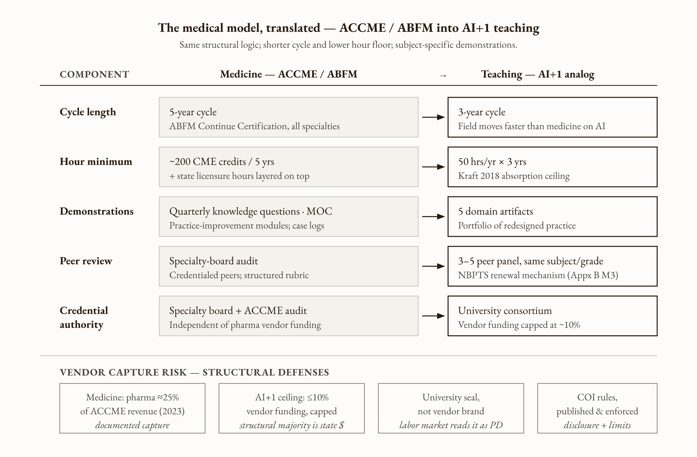

# Appendix C — The AI+1 Teacher Training Curriculum

*What sustained, subject-specific, grade-level-specific AI professional development looks like in practice — a minimum viable version a district can deploy this academic year, and a full version a state could fund within five.*

---

## Who this appendix is for

This appendix is written for two audiences operating at two different scales. The first is the district leader — superintendent, assistant superintendent for curriculum and instruction, professional-learning director — who has read Chapter 8 and Chapter 13 and wants to deploy a serious AI+1 training pathway for her teachers using only the personnel and budget she already has. The second is the state-level policy actor — state superintendent of public instruction, state board chair, governor's education adviser, philanthropic funder operating at state scale — who wants to fund the full Finnish DigiErko equivalent at U.S. scale and needs to know what the design looks like before she puts a legislative ask on a desk. The two audiences are not in conflict. The minimum viable version is the seed. The full version is what grows when the seed is funded.

## The argument in one paragraph

The American teacher in 2026 has received, on average, a two-and-a-half-hour vendor demonstration on generative AI and is expected to make professional judgment calls about a technology her students are using daily, evolving monthly, and embedded in every assignment. The medical profession built the infrastructure that solves this problem across fifty years: state-licensure clock hours updated as the field changes (the opioid-prescribing mandate, the suicide-screening mandate), an [Accreditation Council for Continuing Medical Education](https://accme.org) that audits ~247,000 activities a year against escalating competence levels, and Maintenance of Certification programs like the [American Board of Family Medicine's five-year cycle](https://www.theabfm.org/continue-certification/5-year-cycle/) that require demonstrated practice change rather than seat-time attendance. Finland built the teaching analog at one quarter the U.S. per-capita scale in roughly a decade: the *tutoropettaja* peer-coaching network targeting one tutor teacher per 220 students across all 2,500 basic schools, and the [DigiErko](https://uefconnect.uef.fi/en/digierko-learning-and-teaching-in-digital-environments/) sixty-credit post-master's specialization run by a consortium of three universities through December 2024. The AI+1 teacher training curriculum this appendix sketches is the U.S. teaching analog: a minimum viable district-level version assembled from free HarvardX content, peer study groups, and a one-signature recognition memo; and a full state-funded version that issues a university-credentialed AI+1 specialization on the DigiErko model. The asymmetric-load argument from Chapter 8's Fadel engagement is the precondition that makes the curriculum defensible — AI subtracts non-instructional task time before it adds new instructional demands, and the curriculum is funded by the time the subtraction frees up, not by additional hours layered on a saturated workday.

## The curriculum

*Figure C.1 — Five domains, one foundation*

Five domains. None is generic. Each is delivered in subject-specific and grade-band-specific versions, because the seventh-grade humanities teacher and the AP physics teacher and the K-2 phonics teacher use AI in their classrooms in ways that have almost nothing in common at the level of the actual instructional move. The domains describe what every AI+1 teacher needs to be competent at. The specific content under each domain is built by people who teach the subject at the grade.

### Domain 1 — AI fundamentals

The teacher needs to understand what a large language model is, what it is doing when it generates text, what its failure modes are, and what conceptual vocabulary lets her reason about its behavior rather than treat it as magic. This is the foundation layer. Without it, every downstream professional judgment about AI in her classroom rests on intuition, and intuition trained on consumer marketing is not a defensible epistemic basis for the call the educational exemption asks her to make.

The free content for this domain already exists. Chapter 13 catalogs the specific Harvard ecosystem offerings — three classes from the HKS open course *The Science and Implications of Generative AI* covering [Introduction to Generative AI](https://generative-ai-course.hks.harvard.edu/1-how-genai-works/class-1), [Prompt Engineering](https://generative-ai-course.hks.harvard.edu/2-using-genai/class-4), and [Beyond Chatbots: System Prompts, RAG](https://generative-ai-course.hks.harvard.edu/2-using-genai/class-5); the HKS *Slate* companion page on [The Basics of Generative AI](https://sites.google.com/g.harvard.edu/hksslate-genai/the-basics-of-generative-ai); the [CS50x AI week](https://cs50.harvard.edu/x/weeks/ai/) and [CS50 Extension School AI / Prompt Engineering week](https://cs50.harvard.edu/extension/2025/spring/weeks/10/) (free to audit on edX, paid verified certificate); the Derek Bok Center's [*Generative AI in Teaching and Learning* YouTube playlist](https://www.youtube.com/playlist?list=PL_kRkvxqHjkqjnhAdSdejAkyQf1TnPkNM) (curated faculty-practice videos, not a credentialed course); Harvard Business Publishing Education's [*Teaching with AI*](https://www.hbsp.harvard.edu/educator-training/teaching-with-ai) structured educator-training program (free with HBP Education registration); and CS50 Tech Talk one-off deep dives such as [*GPT-4: How does it work*](https://www.youtube.com/watch?v=vw-KWfKwvTQ) and [*Large Language Models and the End of Programming*](https://www.youtube.com/watch?v=JhCl-GeT4jw). The credentialed edX track maps cleanly to [CS50's Introduction to Computer Science](https://www.edx.org/cs50) and [CS50's Introduction to Artificial Intelligence with Python](https://www.edx.org/learn/artificial-intelligence/harvard-university-cs50-s-introduction-to-artificial-intelligence-with-python). [MIT OpenCourseWare](https://ocw.mit.edu/), [Stanford Online](https://online.stanford.edu/), and Carnegie Mellon publish parallel material. The content layer is a solved problem at the level of the field and at the level of the single highest-prestige credentialing institution in American higher education. The barrier is not content. Catalog stability should be re-verified at the time of district adoption against the [Harvard Online AI catalog](https://pll.harvard.edu/subject/artificial-intelligence).

The defensible deployment of this domain in the AI+1 curriculum is to require completion of a defined slate — five to eight courses, chosen by the district or state from the available catalog — as the foundation prerequisite for the subject-specific work in Domain 2. Completion is documented by certificate. The Chapter 13 fix — administrative recognition that the certificate counts toward existing PD hours — is the no-cost mechanism that converts the free content into recognized professional learning under the district's existing framework.

### Domain 2 — Subject-specific pedagogy

This is the domain that does not exist in any current free catalog because nobody has yet built it at scale. Math AI, ELA AI, science AI, social-studies AI, world-language AI, special-education AI, elementary literacy AI, secondary computer-science AI — each is a distinct track, with distinct content, taught by people who teach the subject at the grade and have figured out what works.

The content for the track is built around the moves that survive contact with the room. For elementary literacy, the track might cover: using AI to generate decodable-text passages at specific phonics scope-and-sequence levels; designing assignments where the AI is the writing partner but the student does the planning and the revision; recognizing the specific failure modes AI shows on early-reader text (reading-level miscalibration, inappropriate vocabulary substitution, plot-summary leakage from training data). For AP physics, the track might cover: using AI as a derivation partner that shows the algebraic steps; designing problem-set redesigns where the AI-assisted version targets transfer rather than fluency; recognizing where AI-generated derivations contain plausible-looking errors that students will not catch without instructor scaffolding. For special education, the track might cover: differentiating the same content at multiple cognitive-load levels, using AI to produce IEP-aligned materials at scale, the specific equity considerations the harm-vector chain from Chapter 11 makes salient.

The structural commitment is that no generic *teach with AI* course substitutes for any of these tracks. The [Charlotte Danielson and Carl Wieman traditions in subject-specific PD](https://danielsongroup.org/framework/) and the Pedagogical Content Knowledge literature ([Shulman 1986](https://www.tcrecord.org/Content.asp?ContentId=12000) [verify the canonical Shulman 1986 article]; [Hill, Rowan, and Ball 2005](https://journals.sagepub.com/doi/10.3102/00028312042002371) [verify the canonical Hill, Rowan, and Ball MKT paper] on mathematical knowledge for teaching) converge on the same finding: subject-specific pedagogy is the binding constraint on instructional quality, and generic pedagogy training does not substitute for it. The AI domain inherits this constraint. AI+1 capability in elementary literacy is not transferable to AP physics. The track structure is the design response to the constraint.

In the minimum viable version of the curriculum, the subject-specific track is delivered through monthly study groups of ten teachers — same school where possible, same subject and grade band always, sixty minutes per session, with a documentation template that captures what was tried, what changed, and what surprised the teacher. Chapter 13 describes this layer in detail. The Agua Fria Union High School District in Arizona built something close to this and walked it from worksheet generation up to deeper-learning experience design across two academic years [verify against the *Education Week* AI Teacher Leaders coverage, 2025]. In the full version, the subject-specific track is delivered through a university-credentialed specialization on the DigiErko model — the structural analog described in Chapter 8.

### Domain 3 — Cognitive offloading and the fluency trap

Every AI+1 teacher needs to be fluent in the specific cognitive-science finding that determines whether her use of AI in the classroom helps or harms learning. The [Bastani et al. 2025 PNAS finding](https://www.pnas.org/doi/10.1073/pnas.2422633122) is the load-bearing empirical anchor. Students given unguided access to AI improved 48 percent during practice and scored 17 percent below students who had never used AI when tested without it. The mechanism — cognitive offloading, the outsourcing of thinking to the tool that bypasses the productive struggle that builds durable memory — is consistent with three decades of independent cognitive-science work: the Bjorks' storage-versus-retrieval distinction, Sweller's cognitive load theory, the Schultz prediction-error account.

The Risko and Gilbert framework on cognitive offloading [verify the Risko & Gilbert canonical paper, likely 2016 *Trends in Cognitive Sciences*] gives the AI+1 teacher the conceptual vocabulary to reason about when offloading is appropriate (delegating to an external tool the work that is not part of the learning goal) and when it is corrosive (delegating the work that *is* the learning goal). Chapter 7 of this book develops the distinction in classroom-applicable form. The domain content is the teacher's training in making the call in real time — distinguishing the student who is using Claude to think harder from the student who is using Claude to avoid thinking. The platform cannot make this call. The trained teacher can.

The training in this domain is delivered through specific design exercises: assignment redesign in which the AI is permitted at one stage and prohibited at another; closed-book moments structured into the assessment cycle; oral follow-ups where the student has to defend an AI-assisted output; metacognitive prompts that ask the student to predict her own performance and then compare the prediction to the result. The exercises produce artifacts the teacher uses in her actual classroom. The portfolio she assembles is the evidence-of-practice-change input to the Appendix B Measure 3 cycle.

### Domain 4 — Equity in AI deployment

Every failure mode in this book compounds at the bottom of the distribution. The educational exemption works better in schools that have invested in teacher training, which are the wealthier schools. The cognitive offloading effect falls hardest on students who lack the self-regulation skills to resist it, who are disproportionately from low-income and high-stress households. The AI dividend accrues to teachers who received training; teachers in under-resourced schools who received no training save nothing. Chapter 11 develops the equity argument across all of these vectors.

The AI+1 teacher needs to be trained explicitly to see the harm-vector chain and to design against it. The domain content covers: the documented racial and class disparities in disciplinary costs of the phone-ban first year ([Figlio and Özek 2025](https://www.nber.org/papers/w34388) [verify NBER WP number 34388]); the [NCES smartphone-internet-access data](https://nces.ed.gov) on what a device removal does to low-income students; the catch-up effect documented in Tutor CoPilot ([Wang et al. 2024](https://arxiv.org/abs/2410.03017)) where AI-assisted tutoring produces the largest gains for students of lower-rated tutors; the parallel catch-up effect in precision agriculture ([Kansas Farm Efficiency Study](https://www.agmanager.info) [verify the canonical Kansas Farm Management Association precision-ag citation]) where less-efficient farms gain most from trained technology adoption. The pattern is consistent. Low-income students need more high-quality AI-supported teaching, not less. The training that produces it is the equity investment that matters.

The classroom-applicable competency in this domain is the teacher's ability to design her AI deployment for the floor rather than the ceiling. The fluent, self-regulated student will do reasonably well with most AI deployments. The student who is one or two years behind, whose home environment provides less academic scaffolding, whose self-regulation skills are still developing — that student is the design target. The AI+1 teacher who has been trained in Domain 4 builds for that student first.

### Domain 5 — Evaluation and assessment of learning under AI

The teacher needs to know how to tell, in her own classroom, whether her students are learning more with AI than they would without it. Appendix B describes the district-level framework for evaluating teachers. Domain 5 describes the classroom-level analog for evaluating learning. The teacher's instrument is necessarily different from the district's, because she is making the call in real time on twenty-eight specific students rather than on aggregate section-level gains.

The competency is the teacher's design of formative assessment that survives AI exposure. The Bastani warning applies. A formative assessment the student can complete fluently with AI tells the teacher nothing about whether the student has learned anything. The redesign that survives AI is the same redesign Chapter 12's vignette describes: closed-book moments, defended explanations, oral follow-ups, peer discussions where the student has to reason without the model in front of her, AI-assisted formative data triangulated against teacher observation and student work product. The Chapter 10 three-measure framework applies recursively at the classroom level: the teacher uses student wellbeing signals, student learning gains in her own section, and her own documented growth in her formative-assessment design as three independent inputs to the call she is making about whether her instruction is working.

The training in this domain produces the teacher who can defend, to a parent or to a department chair or to a peer panel, why she used AI in a specific lesson on a specific day and how she will know if it worked. The defensibility is the deliverable. The vendor-led August workshop does not produce it. The Domain 5 training is what produces it.

## The credential structure

*Figure C.2 — The medical model, translated*

The minimum viable version and the full version share the same logical structure. They differ in scale, in funding source, and in the legitimacy of the credential the participant earns.

The structural model is the ACCME / ABFM five-year cycle, translated for teaching. A documented cycle, hour minimums, demonstration components, peer review, and renewal tied to continued recognition.

*Hours.* The medical analog is two hundred CME credits across five years (the ABFM cycle) plus state-licensure hours layered on top. The teaching analog the appendix recommends is fifty contact hours per year averaged across a three-year initial cycle, with a clear distinction between the foundation hours (Domain 1, completed once) and the sustained hours (Domains 2 through 5, recurring annually). The fifty hours is the upper bound of what the [Kraft, Blazar, and Hogan 2018](https://scholar.harvard.edu/files/mkraft/files/kraft_blazar_hogan_2018_teacher_coaching.pdf) coaching meta-analysis suggests is structurally absorbable before diminishing returns set in. Above the threshold, structure matters more than dose. The fifty-hour figure is the structural ceiling, not the floor of additive expansion.

*Demonstrations.* Each domain requires demonstrated competence, not just attendance. The demonstration components are: completed coursework (Domain 1, certificate-bearing); a subject-specific assignment-redesign portfolio (Domain 2, peer-reviewed in the study group); a documented offloading-versus-engagement assignment with student-work evidence (Domain 3); an equity-focused lesson redesign with the floor-rather-than-ceiling design analysis (Domain 4); a formative-assessment defense — a written or oral case-conference defense of a specific instructional decision (Domain 5). The portfolio is the evidence. The peer panel is the audit.

*Peer panel review.* Modeled on the NBPTS renewal mechanism described in Appendix B's Measure 3. A panel of three to five credentialed peers from the same subject and grade band, using a structured rubric, providing written feedback and a defensible determination. The panel review at the end of each three-year cycle determines whether the credential is renewed. The mechanism exists in U.S. teaching at the NBPTS scale. The structural challenge is funding the peer time at the scale of all teachers rather than the three percent of the workforce currently NBPTS-credentialed.

*Renewal cycle.* Three years. The medical analog is five years; the teaching field is moving faster than the medical field in the AI dimension, and the shorter cycle keeps the credential current. The renewal requires demonstration that the practice has continued to change in response to the evolving tool landscape — not that the teacher passed an exam in 2026 and is still trading on that pass in 2029.

The credential itself — the document that hangs on the classroom wall, that goes on the resume, that the next district reads when the teacher applies for a job — must be university-issued, not vendor-issued. This is the structural commitment Chapter 8 identifies as the single most important defense against the failure mode that captured medical CME in the 1990s. The minimum viable version is delivered by a partner university — typically the state's flagship education school, or a regional comprehensive university with strong K-12 partnerships, or an established online program at an accredited institution. The full version is delivered by a consortium on the DigiErko model: the University of Eastern Finland, the University of Helsinki, and the University of Turku ran DigiErko jointly for seven years. The U.S. equivalent for a large state might be three or four research universities plus the state's regional comprehensives, with the credential issued under a consortium seal that the state explicitly recognizes as the AI+1 credential of record.

## The vendor capture problem, addressed structurally

The chapter 8 objection that the medical CME system has documented quality and capture problems — pharmaceutical funding accounting for roughly a quarter of [ACCME 2023](https://accme.org/wp-content/uploads/2024/08/2023-ACCME-Annual-Data-Report-1045_20240815.pdf) system revenue, conflict-of-interest disclosure contested for decades, many physicians describing their CME as performative compliance — is the most serious one this appendix has to engage. A parallel teaching system built without awareness of these failure modes would reproduce them. The edtech vendor money that would flow toward a teacher continuing-education system would distort it in exactly the way pharmaceutical money distorted medical CME in the 1990s. A district that lets a single edtech vendor certify its teachers as AI-trained is reproducing the worst pathology of the medical system, not the best.

The appendix specifies four structural commitments that have to be present from day one. Each addresses a specific failure mode the medical experience documents.

*Credentials are university-issued, not vendor-issued.* The credentialing authority must be an accredited higher-education institution, with the credential issued under the university's seal and subject to the university's quality controls. Vendor partnerships are permissible for content delivery in Domain 1 — the same way HarvardX partners with edX as a delivery platform — but the credential itself is issued by the university. The teacher's resume reads *AI+1 Certificate, University of [State], 2027*, not *Anthropic Certified Educator* or *Khanmigo Specialist*. The distinction is the difference between a credential the labor market reads as a professional qualification and a credential the labor market reads as a marketing asset.

*Independent accreditation oversees the credentialing process.* The state-level body — a state-board-of-education committee, a state-licensure body, or a new accrediting council established for the purpose — audits the universities issuing the credential against published standards. The model is the ACCME's role in medicine, with one structural improvement: the accrediting body has explicit teaching-side representation (working teachers, teaching-school faculty, K-12 administrators) rather than the predominantly physician-and-administrator composition of the ACCME. The accreditation is the audit of the audit. Without it, university programs drift toward whatever produces the most enrollments rather than whatever produces the most defensible practice change.

*Transparent conflict-of-interest rules from day one.* Every instructor in the credential program discloses every vendor relationship — paid speaking, consulting, equity, content licensing — at the start of every cohort. Disclosure is not enough; the disclosure regime has to include defined limits, like the medical-CME rule that direct vendor-employed instructors cannot teach accredited courses. The university programs that issue the credential operate under explicit conflict-of-interest policies, modeled on the strongest current medical-school COI policies, published on the program's website, and enforced through documented sanction. The political work of getting these policies in place is meaningful. The cost of not having them is the failure mode the medical experience demonstrates.

*Vendor funding is bounded and structurally segregated.* No vendor funds more than a defined percentage of any program's operating budget — the appendix recommends ten percent as a defensible upper bound, well below the twenty-five-percent ACCME figure that has produced documented capture in medicine. Vendor funding cannot be tied to specific content. The university's general fund and student tuition and state appropriation provide the structural majority of program funding. The structural majority is what insulates the credential from drift.

These four commitments are harder than copying the medical system. They are the only version of the project worth running. A teaching credential that becomes a vendor-certified marketing asset will not produce the AI+1 teacher this book is arguing for. It will produce a generation of teachers whose primary qualification is brand affiliation with whichever vendor sold the most workshops in 2027.

## The Fadel critique, honored

The minimum viable version of the curriculum is defensible specifically because of the asymmetric-load argument Chapter 8 develops in response to Charles Fadel's critique. Most expansions of the teacher job description over the past two decades — character education, social-emotional learning, digital citizenship, smartphone management, AR/VR — add load. AI, used on the right tasks, subtracts load on the non-instructional side before it adds new instructional demands. The 5.9 hours per week documented by [Gallup-Walton 2025](https://www.waltonfamilyfoundation.org/the-ai-dividend-new-survey-shows-ai-is-helping-teachers-reclaim-valuable-time) and the 31 percent reduction in lesson-preparation time documented by the [EEF ChatGPT randomized trial](https://educationendowmentfoundation.org.uk) are both on the non-teaching side of the ledger — exactly where the [OECD's 2021 *Making the Most of Teachers' Time*](https://www.oecd.org/content/dam/oecd/en/publications/reports/2021/01/making-the-most-of-teachers-time_e0e7a8ec/d005c027-en.pdf) report identifies the actual source of teacher saturation.

The case for AI-specific PD is not "add one more demand to an already saturated workday." It is "use the load reduction AI provides on administrative work to fund the time required to learn to use AI well on instructional work." The trade is internal to AI itself. The fifty-hour-per-year curriculum is structurally affordable because it is funded by the time the curriculum's deployment frees up.

The argument fails if districts capture the AI dividend as cost savings rather than capacity reinvestment. A district that responds to teachers saving six hours a week by cutting six teaching positions, or by expanding class sizes by ten percent, or by adding six hours of new compliance work, breaks the precondition. The minimum viable version of the curriculum requires the district to explicitly protect the reclaimed time as capacity rather than capturing it as savings. The administrative letter that recognizes HarvardX completion as PD hours (Chapter 13's no-cost fix) should be paired with a written commitment that the time freed up by AI tool adoption is protected for the credentialing work the curriculum requires. Without the protection, the curriculum is layered on a saturated workday and produces the failure mode the Fadel critique correctly predicts.

The variance finding in the [Teacher Knowledge Survey 2024](https://www.oecd.org/en/publications/results-from-the-teacher-knowledge-survey_7d1c1e60-en/united-states_9a456423-en.html) — the U.S. has the world's highest share of teachers at advanced general pedagogical knowledge (51 percent at Level 3) and an above-average share at the foundational level (20 percent at Level 1), with a 57-point interquartile range that is the largest in the comparison set — sharpens rather than weakens the case for the curriculum. The bottom quartile is the leverage point for the coaching layer (Domain 2 study groups, Domain 5 formative-assessment training). The top quartile is the cohort that builds the credential layer (the DigiErko-analog specialization, the peer-panel reviewers, the university-program faculty). The variance is the case for the tiered structure the appendix is recommending.

*Figure C.3 — The seed and what grows from it*

## The minimum viable version — deployable Q1 of next academic year

A small district with no new budget, no new vendor contracts, no state-level investment, and no legislative window can deploy the minimum viable AI+1 curriculum starting the Monday after the superintendent finishes reading this appendix. The components are all in Chapter 13 and Chapter 8. The appendix integrates them into a curriculum framework.

Six teachers per cohort. One school. One academic year. The cohort meets monthly for sixty minutes — the same PLC structure most districts already maintain on paper. Same subject and grade band where possible; same school always. The substitute-teacher cost for the meetings, if they cannot be run in existing common planning time, is the only marginal expenditure.

Months one through three of the academic year: Domain 1 (AI fundamentals). Each teacher completes a defined slate of HarvardX or MITx or Stanford Online courses on her own schedule, with the cohort meetings used to debug what was learned and how it applies. The district issues the Chapter 13 administrative letter recognizing the certificates as PD hours under existing policy.

Months four through eight: Domains 2, 3, 4, and 5 in rotation. Each cohort meeting is anchored to a domain and produces one artifact: an assignment redesign (Domain 2), a closed-book or oral-follow-up redesign (Domain 3), an equity-focused lesson plan (Domain 4), a formative-assessment defense (Domain 5). The artifacts accumulate into the teacher's portfolio across the year. The cohort serves as the peer-review mechanism — each artifact reviewed by two other cohort members using a structured template the district HR office produces.

Months nine and ten: peer panel review. The cohort meets twice in the spring, each time reviewing two teachers' full portfolios using the structured rubric. The principal participates as a credentialed reviewer if she has completed the curriculum herself (which she should, as the Chapter 8 building-leader recommendation makes clear). The determination is recorded in the teacher's personnel file as a third-measure portfolio (Appendix B Measure 3), and the certificate is issued under the building principal's seal. The certificate is not the university-issued credential. It is the building-level version that demonstrates the work was done.

That is the minimum viable version. It is implementable inside one academic year with no new funding, no state-level investment, no vendor contracts. The certificate it issues is not the AI+1 credential of record that the full version produces — but the portfolio the cohort builds is the same portfolio the full version's peer panel would review, and the practice change it documents is the practice change the third-measure framework rewards. A district that runs the minimum viable version for two cycles produces a cohort of teachers with documented practice change, a body of artifacts the district can show to its accrediting partner when the full version becomes available, and a building-level demonstration that the structure works. The minimum version is the seed.

## The full version — five years to a state-level program

The full version of the curriculum is what a state-level investment could fund within five years. The structural model is Finland's tutoropettaja network plus DigiErko, scaled to U.S. state size and adapted to U.S. governance structures. The funding ask is meaningful but not astronomical: Finland funded its tutor-teacher network with an initial allocation of 7.5 million euros in 2016 [verify exact figure and date against Opetushallitus's *Faktaa Express 4A/2020*], scaling to roughly 23 million euros across the government period. A U.S. state of comparable population to Finland would need a proportional allocation; a larger U.S. state would need correspondingly more. The full state-level program at U.S. scale is in the range of a hundred million dollars per year for a state the size of California or Texas, an order of magnitude less than what the same state spends on educational technology procurement in a single year.

The components of the full version, mapped year by year.

*Year 1 — design and consortium formation.* The state convenes a consortium of three to five universities — typically including the state flagship's school of education, one or two regional research universities, and the state's strongest teacher-preparation comprehensive — to design the AI+1 credential program jointly. The state funds the design year explicitly. The product of Year 1 is the published credential standard, the curriculum framework, the demonstration components, the peer-panel rubric, the accreditation structure, and the conflict-of-interest policies described earlier. The standard is published for comment, revised, and adopted by the state board of education as the AI+1 credential of record for state recognition purposes.

*Year 2 — pilot cohort.* The consortium delivers the first cohort — approximately 100 to 200 teachers, drawn from across the state, with weighted representation from low-income districts and from the subject and grade bands where the demand for AI-trained teachers is largest. The cohort runs the full three-year cycle the credential structure requires. The state subsidizes the tuition, the substitute-teacher coverage for in-service hours, and the peer-panel time. The teachers selected for the pilot cohort are the seed for the tutoropettaja network — they will be the in-building coaches for the cohorts that follow.

*Years 3 through 5 — scaling and the tutor-teacher network.* The pilot cohort completes the credential at the end of Year 4. They return to their buildings as the state-recognized AI+1 specialists. The state funds the tutoropettaja network on the Finnish ratio, adapted to U.S. context: one tutor teacher per building rather than per 220 students (the Finnish ratio is high; a U.S. ratio that reaches every building in the state is the operational target). The cost of the tutor-teacher network is one section of load coverage per building — roughly $15,000 to $25,000 per building per year in most U.S. labor markets. The state funds the network as a formula appropriation to districts, with the requirement that the released time goes to AI+1 coaching rather than to other duties.

Years 3 through 5 also scale the credential cohorts. The consortium delivers approximately 500 new participants per year by Year 5, building toward the long-run steady-state of producing 1,000 credentialed AI+1 teachers per year per state. The math, at steady state, is that a state with 100,000 teachers reaches 10 percent AI+1 credentialing in a decade, 25 percent in fifteen years, and a critical-mass workforce within twenty. The Finnish DigiErko reached its targeted cohort size in seven years. The U.S. analog at state scale is a decade-plus project. The legislative window required is the initial five-year authorization plus the operational commitment to sustain it across three election cycles.

The full version's deliverables are: a published state credential standard, a university consortium issuing the credential under quality controls the state has approved, a tutor-teacher network in every building that funds the in-building coaching the Kraft meta-analysis identifies as the effective intervention, an accreditation body that audits the credential against the published standard, and a recognized state credential that the labor market reads as a professional qualification and that the district's salary schedule can reference for differential compensation. The credential connects, through Appendix B's Measure 3, to the evaluation framework that rewards demonstrated practice change. The two appendices, together, build the infrastructure the rest of the book has been arguing for.

*Figure C.4 — Ten-month MVP pacing*

## A worked implementation timeline

### Week 1 (the Monday after, for the minimum viable version)

The superintendent issues two memos in the same week. The first is the Chapter 13 administrative letter recognizing the defined slate of HarvardX (or MITx, or Stanford Online) AI courses as fulfilling professional-development hours under existing district policy. The second authorizes the pilot AI+1 cohort at the named school for the upcoming academic year, with the curriculum structure described above, the substitute-teacher coverage approved, and the building principal designated as the cohort lead.

The principal of the pilot school identifies the six volunteer teachers. Selection criteria: same school always; same subject and grade band where possible; mix of self-described AI fluency levels so the cohort spans the range; explicit voluntariness. The principal sends the cohort the Domain 1 course slate, the cohort meeting schedule, and the documentation template.

### Month 1

The cohort meets for the first time. The agenda is the structural orientation — the curriculum framework, the artifact portfolio expected, the peer-review mechanism, the relationship to the district's evaluation framework if Appendix B is being piloted in parallel. The first cohort meeting is also the first faculty-development event the building has run on the substantive content of AI in the specific subject and grade band, and the conversation that begins in the meeting often continues informally for weeks.

The teachers begin Domain 1 coursework on their own schedules. The expectation is two to three hours per week of asynchronous coursework, completed by the end of Month 3.

### Month 3

Each teacher has completed at least three of the defined-slate courses. The cohort meeting for the month is structured as a debug session — what did the courses teach that survived contact with the room, what did not, what specific moves are participants trying, what is failing. The principal participates as a learner alongside the cohort. The artifact for the month is a one-page reflection from each participant on what she has tried so far and what she plans to try next.

### Months 4 through 8

The cohort cycles through Domains 2, 3, 4, and 5, with one domain anchoring each monthly meeting and an artifact produced per domain. The Domain 2 artifact is a subject-specific assignment redesign. The Domain 3 artifact is an offloading-versus-engagement assignment with student-work evidence. The Domain 4 artifact is an equity-focused lesson redesign. The Domain 5 artifact is a formative-assessment defense. Each artifact is peer-reviewed by two other cohort members using a structured template before the next meeting.

### Months 9 and 10

The cohort meets twice in the spring for portfolio review. The first session reviews three portfolios in depth, using the structured rubric and providing written feedback. The second session reviews the remaining three. The principal participates as a reviewer. The determinations are recorded in each teacher's personnel file as a Measure 3 (Appendix B) portfolio. The building-level certificate is issued by the principal at the end of the cycle.

### Year 1 close

The district produces a synthesis report documenting what the pilot cohort accomplished, what the cost was (substantively close to zero in marginal funding; the actual cost is the teacher time, which is the asymmetric-load argument's load side), and what the recommendation is for Year 2. The board receives the report. The recommendation is the expansion to a second cohort at a second school, plus the recruitment of the first cohort's strongest participants as cohort leads for the second-year cohorts.

*Figure C.5 — Five years to a state-level program*

### State-level timeline (the full version)

The state-level timeline follows the Year 1 through Year 5 sequence described in the full-version section above. The legislative ask is the initial five-year authorization for the design year plus the four scaling years. The political window required is one full legislative session for the authorization, plus sustained executive-branch commitment across two election cycles. The minimum viable district-level versions running in the meantime are the proof of concept the legislative ask cites in the appropriations hearing.

## Common implementation failure modes

Four failure modes show up often enough to design against in advance.

*Failure mode one: the credential becomes a vendor brand.* A single edtech vendor — Anthropic, OpenAI, Khan, Microsoft, Google — funds enough of the program's content development that the credential becomes effectively a vendor certification with university branding. The structural fix is the four commitments above: university-issued credential, independent accreditation, transparent COI rules, bounded vendor funding. Operationally, the fix is the appropriations line item that funds the university's general-fund share of the program directly rather than relying on philanthropic-or-vendor matching. The state has to put real money in. The vendor money is supplementary or it is corrupting.

*Failure mode two: the subject-specific tracks collapse into a generic track.* The university faculty member assigned to design the elementary literacy track and the AP physics track is the same person, and the operational pressure to scale the program produces a generic *teach with AI* track that is recognizable by anyone who has attended any vendor workshop. The structural fix is to fund subject-specific faculty time explicitly — the credential's design budget allocates per-track funding, the track is built by people who teach the subject, and the program is barred from collapsing tracks for operational convenience. The PCK literature is the citation that defends the structural commitment.

*Failure mode three: the peer-panel mechanism fails to scale.* The pilot runs the peer panels well because the participants are volunteers and the panels are small. The expansion to all teachers reveals that the credential issues faster than the credentialed-peer-reviewer cohort grows, and the panels become understaffed and perfunctory. The structural fix is the explicit funding of peer-reviewer time as part of the credential's renewal cycle: every credentialed AI+1 teacher is expected to serve on three peer panels per year as part of her own renewal, with funded release time. The model is the medical specialty board mechanism, where credentialed practitioners are the reviewers for the next cohort and the service is part of the credential's professional obligation.

*Failure mode four: the district captures the AI dividend as cost savings and the curriculum's load argument breaks.* The teachers complete the curriculum, their classrooms produce the documented practice change, the administrative time savings materialize at the predicted scale — and the district, facing budget pressure, captures the savings by increasing class sizes or reducing support staff or assigning new compliance work to the freed-up hours. The teachers who completed the curriculum experience the conversion as a betrayal. Future cohorts decline to volunteer. The structural fix is the written commitment, in the program authorization and in the district's adoption letter, that the time freed up by AI tool adoption is protected for the credentialing work the curriculum requires. The commitment will be tested. The written form is the only thing that makes it survivable.

## What this appendix does NOT do

This appendix does not specify the precise content of any subject-specific track. The Domain 2 description above gives examples of what the elementary literacy track and the AP physics track might cover. The actual content has to be built by faculty who teach those subjects, with input from working teachers in the field, using a process the consortium designs in Year 1 of the full version. The appendix is a curriculum framework, not a curriculum.

This appendix does not solve the labor-market signaling problem at scale. The credential the full version produces is, by design, university-issued and state-recognized, so it reads as a professional qualification in the local labor market. Whether it transfers across state lines depends on whether other states recognize the credential or build parallel ones — and the interstate-recognition problem is a separate piece of work this appendix does not address. The state-by-state patchwork that complicates teacher licensure in the U.S. complicates the AI+1 credential in the same way. The Finnish DigiErko did not have this problem because Finland has one credential system. The U.S. equivalent requires either interstate compact agreements (the model the [National Association of State Directors of Teacher Education and Certification](https://www.nasdtec.net) has used for traditional teacher-licensure portability) or a federal recognition mechanism the appendix does not assume will exist.

This appendix does not address pre-service teacher preparation. The Singapore [NIE](https://www.ntu.edu.sg/nie) model embeds AI competencies into initial teacher-education programs. The U.S. analog — incorporating AI+1 competencies into the standard teacher-preparation curriculum so that new teachers enter the profession AI-fluent — is a separate piece of work that the schools of education in the consortium would naturally take up in parallel. The appendix is focused on in-service teachers because the in-service workforce is the immediate operational problem. The pre-service work is the long-run structural problem.

This appendix does not pretend the full version is fundable everywhere within five years. State politics vary. The five-year timeline assumes a state with sustained executive-branch commitment to teaching workforce investment and a legislative coalition willing to authorize the initial appropriation. States without that commitment will run the minimum viable district-level version, scaled across willing districts, until a state-level coalition develops. The Finnish DigiErko was funded because Finland decided as a nation that teacher development was a public good worth state investment. The U.S. equivalent depends on whether comparable state-level commitments emerge. The appendix is honest about this. The minimum viable version is the version that does not depend on the political commitment.

## References and further reading

**The medical analog the curriculum's structure rests on**

- ACCME. (2024). *2023 Annual Data Report.* Accreditation Council for Continuing Medical Education. [https://accme.org/wp-content/uploads/2024/08/2023-ACCME-Annual-Data-Report-1045_20240815.pdf](https://accme.org/wp-content/uploads/2024/08/2023-ACCME-Annual-Data-Report-1045_20240815.pdf)
- American Board of Family Medicine. *Continue Certification — 5-Year Cycle.* [https://www.theabfm.org/continue-certification/5-year-cycle/](https://www.theabfm.org/continue-certification/5-year-cycle/)
- Federation of State Medical Boards. (2026). *Continuing Medical Education Board-by-Board Overview.* [https://www.fsmb.org/siteassets/advocacy/key-issues/continuing-medical-education-by-state.pdf](https://www.fsmb.org/siteassets/advocacy/key-issues/continuing-medical-education-by-state.pdf)

**Finland's tutoropettaja and DigiErko — the international analog**

- Finnish National Agency for Education (Opetushallitus). *Exploring Finnish Digital Education.* [https://www.oph.fi/en/exploring-finnish-digital-education](https://www.oph.fi/en/exploring-finnish-digital-education)
- Opetushallitus. *Faktaa Express 4A/2020: Perusopetuksen tutoropettajatoiminta Suomessa 2017–2019.* [https://www.oph.fi/fi/tilastot-ja-julkaisut/julkaisut/faktaa-express-4a2020-perusopetuksen-tutoropettajatoiminta-suomessa](https://www.oph.fi/fi/tilastot-ja-julkaisut/julkaisut/faktaa-express-4a2020-perusopetuksen-tutoropettajatoiminta-suomessa)
- University of Eastern Finland. *DigiErko — Learning and Teaching in Digital Environments.* [https://uefconnect.uef.fi/en/digierko-learning-and-teaching-in-digital-environments/](https://uefconnect.uef.fi/en/digierko-learning-and-teaching-in-digital-environments/)

**Khanmigo Puerto Rico — the U.S. case study**

- Digital Promise. (2024, September). *Estudia Khanmigo: An equity-focused pilot exploration of an AI-powered tutor in Puerto Rico.* [https://digitalpromise.org/wp-content/uploads/2024/09/SRM-Gates-Khanmigo-Report-Final.pdf](https://digitalpromise.org/wp-content/uploads/2024/09/SRM-Gates-Khanmigo-Report-Final.pdf)

**The free content layer the minimum viable version uses**

- HarvardX catalog on edX. [https://www.edx.org/school/harvardx](https://www.edx.org/school/harvardx) [verify current AI-relevant offerings at adoption]
- MIT OpenCourseWare. [https://ocw.mit.edu/](https://ocw.mit.edu/)
- Stanford Online. [https://online.stanford.edu/](https://online.stanford.edu/)
- CS50 / CS50x (Harvard). [https://cs50.harvard.edu/](https://cs50.harvard.edu/)

**The evidence base on what coaching does and why workshops do not**

- Kraft, M. A., Blazar, D., & Hogan, D. (2018). The Effect of Teacher Coaching on Instruction and Achievement. *Review of Educational Research*, 88(4), 547–588. [https://scholar.harvard.edu/files/mkraft/files/kraft_blazar_hogan_2018_teacher_coaching.pdf](https://scholar.harvard.edu/files/mkraft/files/kraft_blazar_hogan_2018_teacher_coaching.pdf)
- Yoon, K. S., Duncan, T., Lee, S. W.-Y., Scarloss, B., & Shapley, K. (2007). *Reviewing the evidence on how teacher professional development affects student achievement.* REL 2007–No. 033. [https://files.eric.ed.gov/fulltext/ED498548.pdf](https://files.eric.ed.gov/fulltext/ED498548.pdf)
- Desimone, L. M. (2009). Improving impact studies of teachers' professional development. *Educational Researcher*, 38(3), 181–199. [https://doi.org/10.3102/0013189X08331140](https://doi.org/10.3102/0013189X08331140)
- Darling-Hammond, L., Hyler, M. E., & Gardner, M. (2017). *Effective Teacher Professional Development.* Learning Policy Institute. [https://learningpolicyinstitute.org/sites/default/files/product-files/Effective_Teacher_Professional_Development_REPORT.pdf](https://learningpolicyinstitute.org/sites/default/files/product-files/Effective_Teacher_Professional_Development_REPORT.pdf)

**The cognitive-offloading literature Domain 3 trains against**

- Bastani, H., Bastani, O., Sungu, A., Ge, H., Kabakcı, Ö., & Mariman, R. (2025). Generative AI without guardrails can harm learning. *PNAS*, 122(26): e2422633122. [https://www.pnas.org/doi/10.1073/pnas.2422633122](https://www.pnas.org/doi/10.1073/pnas.2422633122)
- Risko, E. F., & Gilbert, S. J. Cognitive offloading. *Trends in Cognitive Sciences.* [verify Risko & Gilbert canonical citation, likely 2016]

**The PCK literature Domain 2 inherits**

- Shulman, L. S. (1986). Those who understand: Knowledge growth in teaching. *Educational Researcher*, 15(2), 4–14. [verify canonical Shulman 1986 article]
- Hill, H. C., Rowan, B., & Ball, D. L. (2005). Effects of teachers' mathematical knowledge for teaching on student achievement. *American Educational Research Journal*, 42(2), 371–406. [https://journals.sagepub.com/doi/10.3102/00028312042002371](https://journals.sagepub.com/doi/10.3102/00028312042002371) [verify URL]

**The dividend evidence the curriculum's load argument rests on**

- Walton Family Foundation & Gallup. (2025). *Teaching for Tomorrow: Unlocking Six Weeks a Year With AI.* [https://static.waltonfamilyfoundation.org/df/fb/eba12807470a9402d7433cc47dba/teaching-for-tomorrow-unlocking-six-weeks-a-year-with-ai-report.pdf](https://static.waltonfamilyfoundation.org/df/fb/eba12807470a9402d7433cc47dba/teaching-for-tomorrow-unlocking-six-weeks-a-year-with-ai-report.pdf)
- Education Endowment Foundation. (2024). *Using ChatGPT in Lesson Preparation: Randomised Controlled Trial.* [https://educationendowmentfoundation.org.uk](https://educationendowmentfoundation.org.uk)
- OECD. (2021). *Making the Most of Teachers' Time.* Education Policy Perspectives No. 29. [https://www.oecd.org/content/dam/oecd/en/publications/reports/2021/01/making-the-most-of-teachers-time_e0e7a8ec/d005c027-en.pdf](https://www.oecd.org/content/dam/oecd/en/publications/reports/2021/01/making-the-most-of-teachers-time_e0e7a8ec/d005c027-en.pdf)
- OECD. (2026). *Results from the Teacher Knowledge Survey.* [https://www.oecd.org/content/dam/oecd/en/publications/reports/2026/04/results-from-the-teacher-knowledge-survey_eebdcc11/5542e88a-en.pdf](https://www.oecd.org/content/dam/oecd/en/publications/reports/2026/04/results-from-the-teacher-knowledge-survey_eebdcc11/5542e88a-en.pdf)

**The Title II-A funding stream the minimum viable version uses**

- SETDA. (2025, November). *Improving Professional Learning Systems to Better Support Today's Educators.* [https://www.setda.org/wp-content/uploads/2025/11/Improving-Professional-Learning-Systems-to-Better-Support-Todays-Educators-2.pdf](https://www.setda.org/wp-content/uploads/2025/11/Improving-Professional-Learning-Systems-to-Better-Support-Todays-Educators-2.pdf)
- U.S. Department of Education. *Supporting Effective Instruction State Grants (Title II, Part A).* [https://www.ed.gov/grants-and-programs/formula-grants/school-improvement-grants/supporting-effective-instruction-state-grants-title-ii-part](https://www.ed.gov/grants-and-programs/formula-grants/school-improvement-grants/supporting-effective-instruction-state-grants-title-ii-part)

---

## For the principal in the room reading this on a Tuesday morning

You are a building principal. You have a faculty of forty teachers, a budget that does not stretch to vendor workshops at the scale your district has been buying them, and a Title II-A allocation that mostly flows through to district-level professional-development decisions you do not control. You have read Chapter 13 of this book and Chapter 8 and now this appendix, and you can see the shape of the AI+1 curriculum the full version would build. You want to act on it. The full version is years away from your building. Here is what the minimum viable version looks like, in your school, starting Monday.

Find six volunteers from your faculty. Same subject and grade band where possible — two seventh-grade humanities teachers, two eighth-grade math teachers, two science teachers from any grade — or, if the building is too small for that, six teachers across grades who are willing to be in a cohort together for a year. The selection criterion is voluntariness. The teachers who want to do this work are the ones who will do it. The teachers who do not want to do it will not do it well, and you have no leverage to make them, and you should not try.

Send the cohort the defined slate of HarvardX or MITx or Stanford Online AI courses Chapter 13 identifies. Ask them to complete three to five courses over the next three months at their own pace. Recognize the certificates as PD hours under your existing district policy, or — if your district has not yet issued the Chapter 13 administrative letter — recognize them under your own building-level authority for whatever continuing-education credits your district lets you award at the building level. The recognition is what converts the free content into recognized work.

Schedule sixty minutes a month of cohort meeting time. If your PLC structure already has the time, use it. If not, find an afternoon a month — a faculty meeting that gets restructured, a release period that gets coordinated, a Friday session before a long weekend. Make the meetings substantive: each meeting has a domain, an artifact expected by the next meeting, and a peer-review structure where two cohort members review each other's artifacts before the next meeting. The artifacts accumulate into each teacher's portfolio across the year.

In the spring, run the peer-panel review yourself with the cohort participants. Each teacher's portfolio gets twenty to thirty minutes of substantive review, using the rubric you adapted from the NBPTS renewal mechanism. Provide written feedback. Issue a building-level certificate. Note the completion in the teacher's personnel file as a third-measure portfolio (Appendix B).

That is the minimum viable version, in your building, for one academic year, at substantively zero marginal cost beyond the substitute-teacher coverage for the meetings. You have just produced a cohort of six AI+1 teachers in your building, with documented practice change, with a portfolio you can show to the district and to your accreditor and to the next state-level program when it exists. You have demonstrated that the work is doable inside the constraints you actually operate under.

The single sharpest sentence in this appendix, if you are looking for one to put at the top of the memo you send to your superintendent: *The content is free, the structure exists in medicine, the international model has been validated by Finland, and the only missing piece is a university-issued credential the labor market will read — which is the work of the full version, while the minimum viable version is the work you can start on Monday.*

The full version requires a state legislative window. The minimum version requires six volunteers and a one-page memo. Start with the six volunteers.

---

**Tags:** AI+1 curriculum, DigiErko, ACCME analog, tutoropettaja, peer panel review, vendor capture, university-issued credential, subject-specific pedagogy, minimum viable PD, Chapter 8 implementation guide, Chapter 13 scaling, asymmetric load

